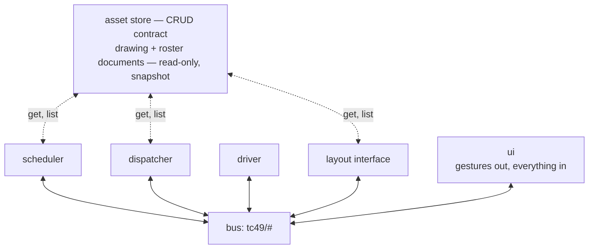

# System

The app is organized as completely independent components. Although an
implementation detail, a (Docker) container is a good mental model for a
component. The current ones are the asset store, the scheduler, the
dispatcher, the driver, the layout interface and the UI; the hardware
translators under the layout interface already join them
([ADR-0043](adr/0043-the-layout-interface-is-a-core-app-and-hardware-hangs-under-it-by-address.md)),
and others will. This page defines the contracts they meet over.

Communication is by MQTT events and REST requests exclusively. Each component
declares the events and requests it responds to and emits. An event addressed
to a component does not include the source, in the topic or in the payload:
that information is irrelevant, and may not be disclosed, so no undesired
dependency on it can arise. Exceptions to this rule may arrive and will need
special handling; none is known today.

Events are generic, never particular to one component. A hardware translator
gets no events of its own, only things like power on or off, or a locomotive's
speed and direction — events any of a million hardware solutions could respond
to, including ones not yet invented. The simulator simulates a subset of the
app's features and adds no requirement of its own to any contract
([ADR-0030](adr/0030-the-physical-railroad-is-the-normative-binding.md),
[ADR-0047](adr/0047-the-dispatcher-grants-on-events-and-the-boundary-leaves-the-contract.md)).

For example, the **dispatcher** accepts the `request_submitted` topic from the
`ui`, the `scheduler`, and any other scheduler introduced later, without any
change to its implementation.

To implement one component you need this page and at most one internals doc
([dispatcher/INTERNALS.md](dispatcher/INTERNALS.md) for the dispatcher).
Nothing here requires another component's internals. Terminology follows
[CONTEXT.md](../CONTEXT.md). The contract decisions are recorded in
[ADR-0008](adr/0008-bus-contract-is-the-mqtt-safe-intersection.md),
[ADR-0009](adr/0009-layout-interface-owns-time.md), and
[ADR-0010](adr/0010-asset-store-serves-coarse-read-only-documents.md).

## Overview

- **Scheduler** — the one writer of requests. It composes a person's gestures
  into requests, and submits a timetable whole at the start of a run, in the
  file's order.
- **Dispatcher** — admits requests, chooses routes, and grants moves without
  deadlock ([DISPATCH.md](dispatcher/DISPATCH.md),
  [SAFETY.md](dispatcher/SAFETY.md)).
- **Driver** — turns each granted move into the command that moves the train.
  In the end state it reads the aspect it is handed and decides how fast
  ([ADR-0025](adr/0025-a-signal-is-what-the-dispatcher-tells-the-driver.md)).
- **Layout interface** — the seam to whatever runs the track. Sensor
  readings come out; turnout and throttle commands go in. A simulator
  implements it in milestone 1, a hardware adapter later.
- **Asset store** — serves the drawing a layout derives from and the
  railroad's roster. It is not on the bus, because it answers queries and the
  bus does not.
- **UI** — the panel, and a throttle later. It watches the bus and writes
  **gestures** on the seven browser-writable topics of the inventory below. A
  gesture is not a request: it names a train and where to put it, and the
  scheduler composes the request
  ([ADR-0036](adr/0036-the-scheduler-is-an-app-the-panel-is-a-view.md)).

These are **roles, not implementations**. Each names a boundary that different
implementations can sit behind unchanged. The simulator and a hardware adapter
publish the same layout topics, and a future scheduling UI or freight
generator publishes the same schedule topics as the milestone-1 scheduler.

One turn of the machine (ADR-0047):

1. The scheduler submits a request — the timetable at the start of a run, a
   person's gesture whenever it lands.
2. The dispatcher admits it and sweeps: it chooses routes and publishes
   granted moves, `align` before each, so the route is set before anything
   moves.
3. The driver turns each grant it sees into a `move`.
4. The layout interface executes it and reports occupancy: the head into the
   next block, then the tail off the last one.
5. The vacate releases the origin block and the transit, ends the move, and
   the sweep it triggers grants whatever that freed.

The trace tap watches all of it.

## The bus

Components talk to each other by publishing JSON events on named topics and
subscribing to the topics they care about. In milestone 1 the bus is a Python
object inside one process. MQTT replaces it later.

That swap only works if nothing depends on behaviour MQTT does not have, so
the bus promises only what MQTT also promises, even where the in-process
version could easily do more
([ADR-0008](adr/0008-bus-contract-is-the-mqtt-safe-intersection.md)).

The bus promises:

- **Order from one publisher** — events that one writer sends on one topic
  are delivered in the order it sent them. Nothing more is promised: no order
  between two writers, and none between two topics. Each topic has a single
  writer, below. MQTT promises no more either, and rather less than it looks:
  a broker keeps a topic ordered per publisher and per QoS while it is
  configured to, and not across that publisher's reconnect or a
  retransmission with more than one message in flight.
- **Fan-out** — every subscriber whose subscription matches the topic gets the
  event, independently of the others.
- **At-least-once delivery** — the bus may deliver the same event twice, so a
  consumer must handle a repeat without changing its answer.
- **State topics keep their last value** — a subscriber that connects late is
  given the most recent value published on a state topic. MQTT calls these
  retained messages.
- **MQTT topic names** — levels separated by `/`, with `+` and `#` as
  wildcards in a subscription.

The bus does not offer the following. Each would be easy to add in process,
and is left out because code that came to depend on it would break the day
MQTT arrives:

- no request that returns an answer,
- no confirmation that an event was delivered,
- no ordering between one topic and another,
- no replay of past events to a late subscriber, apart from the last value on
  a state topic,
- no queue that grows without limit.

A component that needs an answer to a question does not use the bus. The asset
store answers questions, and exists for that reason.

**A state topic does not depend on that order.** A state topic keeps the last
message published on it, so a pair the wire hands over backwards would leave
the *older* value standing for good — the track reading dead while it is
live, or a signal showing aspects the railroad has moved on from. Every state
payload therefore carries a **stamp**, `at`, the run clock's reading when the
value was published, and every consumer of one keeps the later stamp and
ignores the earlier, whoever published it: equal replaces, and an unstamped
value is accepted and clears the held stamp so that ordering restarts from
the next stamped one. Nothing is raised either way.

The **binding stamps, not the app**: the thing that publishes reads the clock,
so no app component reads one (ADR-0009), and an `at` a caller supplied is
replaced by the one publishing it. No event payload carries a stamp and none
needs one — a detector reports a level, so a repeat re-asserts what a consumer
holds, and a request is keyed by a unique id, so duplicates drop.

`at` orders messages **within one session and says nothing across a restart**.
The clock is seconds since the session started and resets to zero every run,
so a stamp carried out of the last session would beat every genuine report the
new one makes for as long as the old run was long. The durable file stores
`at` beside the value; the bus re-stamps what it loads with this session's
clock, which makes the restored picture the oldest thing known and lets the
first real report supersede it (ADR-0030).

**Four rules govern the topics listed in the next section.**

1. **Single writer.** For the events a component emits and its state topics,
   the component the topic names is the only writer — `layout`, `schedule` or
   `dispatch`, a component rather than a particular process. With a single
   writer, that writer's own order is the topic's order, and a reader can see
   which component is responsible for a topic by reading the topic's name.

   A topic that carries **requests to** its component is the other way
   around: one responder, any number of writers — that is what it is for.
   Two browser tabs both send gestures, and the scheduler and a page both
   submit requests. Several writers may publish on an event topic, as long
   as no consumer depends on which of them published first. They must not
   publish on a state topic. A state topic keeps only the last message, and
   a publisher has to supply the whole value, so a writer that knows about
   one train replaces what another knew about the rest
   ([ADR-0035](adr/0035-a-topic-has-one-writing-role.md)).
2. **A topic is either an event topic or a state topic, never both.** An event
   topic reports something that happened, and is never replayed. A state topic
   holds a current value, of which only the last one published survives. Every
   topic is declared as one or the other, and a state topic says so in its name
   (`tc49/<component>/state/<name>[/<address>…]`). The mark is where it is
   rather than where the name ends, because a name may go on past it: a device
   row carries its address as trailing levels
   ([ADR-0043](adr/0043-the-layout-interface-is-a-core-app-and-hardware-hangs-under-it-by-address.md)),
   and `tc49/layout/state/wanted/point/<system>/<addr>` is a state topic like
   any other.
3. **Prefix-filter consumption.** Each consumer subscribes with a small fixed
   set of prefix filters under `tc49/`, written with `+` and `#`, rather than
   naming individual topics.
4. **Any source.** The bus does not authenticate a publisher: a topic's name
   says who answers it, not who can write it. A request addressed to a
   component discloses its source nowhere — not in the topic, not in the
   payload — so a responder never reads, infers, or depends on who sent one.
   A consumer therefore validates
   every payload it reads and never raises on one — a payload proves nothing
   about its sender
   ([ADR-0034](adr/0034-the-bridge-enforces-the-topic-the-dispatcher-the-payload.md),
   [ADR-0035](adr/0035-a-topic-has-one-writing-role.md)). What a failed read
   is worth is the consumer's own rule: an answer where the payload carries an
   id, a drop where it does not, and `state/power` failing towards `off`
   ([#181](https://github.com/rails49/control/issues/181)).

**The inventory is open.** A new topic, a new *optional* field on an existing
payload, or a new value in an enum whose readers declare a fallback
(CONTEXT.md) is a compatible change: one communication issue
(docs/agents/issue-tracker.md), and a consumer built before it keeps working,
because a consumer ignores fields it does not recognize. Removing, renaming
or repurposing a field or a topic, or making an optional field required,
breaks consumers and needs the stronger argument. A field can leave and come
back the same way: `at` was dropped from the request and returns, if it does,
as one communication issue once its requirements are understood — a different
field from the stamp every state payload carries, which says when a value was
published rather than when a request wants its train to run. An added
field still changes the trace, so recorded fixtures regenerate — a cost each
addition pays, not breakage.

**How milestone 1 implements the bus.** One thread and one queue. `publish()`
adds the event to the queue and returns. A loop takes events off the front and
delivers each one to its subscribers, in the order they subscribed. An event
published inside a handler goes to the back of the queue, so it is delivered
after everything already waiting.

Delivery order therefore depends only on the order of publishes and
subscribes, which is what makes a replayed run produce a byte-identical trace
([ARCHITECTURE.md](ARCHITECTURE.md#tests)). It also means an event published
while another is being handled is never delivered before that handling has
finished: MQTT would never deliver it any sooner.

**The last value of a state topic survives a restart.** Given a file, the bus
loads it at startup and rewrites it whenever any `tc49/*/state/*` value
changes. It writes a temporary file in the same directory and renames it over
the target, so an interrupted write leaves the previous file intact. What it
loads is re-stamped with the new session's clock, per the stamp above: the
file keeps the `at` it was written with, and the read is what puts the
restored value on this session's timeline.

This belongs to the bus rather than to any app, because it is what an MQTT
broker does with retained messages. An app that restarts finds its own last
value waiting on its own state topic, exactly as it will from the broker in
milestone 2. Whether to use that value is each app's own decision, and they
differ: the dispatcher takes back its train placement and the scheduler its
facing, the dispatcher's queue is not restored, and no request id ever
resumes ([ADR-0033](adr/0033-a-request-id-is-unique-not-meaningful.md)). Given
no file the bus keeps no values, so `bench` and `sweep` are unaffected.

**Reaching the bus from a browser.** Until the bus is a real broker, a browser
connects to a WebSocket relay ([ui/PANEL.md](ui/PANEL.md#implementation)).
Every `tc49/#` event is sent to every client as one JSON frame,
`{"topic": …, "payload": …}`.

A client may publish only on the seven browser-writable topics —
`tc49/schedule/request_wanted`, `tc49/schedule/reversal_wanted`,
`tc49/dispatch/run_wanted`, `tc49/dispatch/placement_wanted`,
`tc49/dispatch/cancel_wanted`, `tc49/layout/mode_wanted` and
`tc49/layout/throttle_wanted` — and each
frame it sends is published as the event its topic names. That list is not
written down twice: it is every row of the inventory below that carries the
browser mark, which is also what a broker will grant a page once the relay is
gone.

**A client names the railroad it wants in the socket path**,
`ws://host:port/<railroad>`. A browser reaches it as `/live/<railroad>`, and
the proxy in front removes the `/live` prefix ([DEPLOY.md](DEPLOY.md)). A
client hears that one railroad and no other. The relay outlives the railroad
it relays. Naming one it is not currently running starts that one, and closes
any client still connected to the previous one. Naming one that does not exist
returns an error frame and closes the connection, leaving the running railroad
alone. The path is not a topic, so none of this changes what a client may
publish.

**A browser cannot publish a request.** `tc49/dispatch/request_submitted` is
refused like any other topic that is not one of the five above. A browser
publishes gestures and the scheduler turns them into requests, so "only the
scheduler writes requests" is something the relay checks rather than an
intention
([ADR-0036](adr/0036-the-scheduler-is-an-app-the-panel-is-a-view.md)). Any
other frame — a topic not on the list, or JSON that is not
`{topic, payload}` — is answered with an `{"error": …}` frame and never
reaches the bus.

The relay adds no topics and no payload fields. A frame is exactly the event
it carries, so the inventory below is its whole schema. When MQTT arrives the
browser speaks MQTT over WebSocket to the broker and the relay is deleted.

**On connect the relay sends the last value of every state topic**, before any
new event and in the same frame format. These are the frames the client would
have received had it been connected earlier. This is the last-value delivery
the bus already promises a late subscriber, and what a broker gives a client
as soon as it subscribes; a relay that left it out would promise less than the
bus it stands in for. The relay is not composing a description of the run
([ADR-0032](adr/0032-a-joining-client-is-served-the-runs-retained-state.md)).

**The relay checks the topic and never the payload.** A broker enforces which
topics a client may publish on, so that check survives the relay's deletion. A
broker does not check payloads, so payload checking belongs where it will
still be after the relay is gone: the dispatcher, when it admits a request.
The dispatcher never raises an exception on anything that arrives from the bus
([ADR-0034](adr/0034-the-bridge-enforces-the-topic-the-dispatcher-the-payload.md)).

## Event inventory

A topic is named `tc49/<component>/<leaf>`: `layout`, `schedule` or
`dispatch`. The component comes first because it is the component that
**declares** the topic — the events it emits, and the requests it responds
to. Naming topics this way means rule 1 can be checked by reading the name,
`tc49/layout/*` keeps its meaning when hardware replaces the simulator, and a
UI that wants everything the dispatcher says subscribes to `tc49/dispatch/#`.

A leaf names something that has happened, in the past tense. The two
commands, `align` and `move`, are the exception: they are imperative, because
a command is sent before what it asks for happens. They sit under `layout`
because the layout interface is what responds to them; setting the route is
still the dispatcher's job, and moving locomotives the driver's, which is who
sends each — a fact the names no longer carry (rule 4,
[ADR-0022](adr/0022-a-symbol-carries-its-hardware-address.md)).

**A row marked `browser` is one any page may publish on.** The list of
topics a client may publish on is read off this table's mark rather than
written down a second time, so marking a row widens the browser's write
surface the day the mark lands, and the mark is the same permission a
broker's ACL will carry once the relay is gone
([ADR-0034](adr/0034-the-bridge-enforces-the-topic-the-dispatcher-the-payload.md)).
Today the mark sits on exactly the seven gesture rows. The throttle a person
drives with ([#207](https://github.com/rails49/control/issues/207)) is the
last two of them, under `layout`, which is the component that responds to
them. Whether a row carries the mark is an ACL decision, made when the row
lands.

**Writer** is the component the name already states for everything a
component emits. On a request row it is `any`: one responder, any number of
writers (rule 1), and `any (browser)` is the mark above.

| Topic | Kind | Writer | Meaning |
| --- | --- | --- | --- |
| `tc49/layout/block_occupied` | event | layout | a detector saw a block fill |
| `tc49/layout/block_vacated` | event | layout | a detector saw a block empty |
| `tc49/layout/state/power` | state | layout | whether a train may move at all ([ADR-0041](adr/0041-the-layout-says-whether-a-train-may-move-and-the-run-holds-when-it-may-not.md)) |
| `tc49/layout/align` | command | any | set the route: throw these points |
| `tc49/layout/move` | command | any | take the train across, this fast |
| `tc49/layout/mode_wanted` | event | any (browser) | a train is driven automatically, or by a person |
| `tc49/layout/throttle_wanted` | event | any (browser) | how fast a person is driving a train |
| `tc49/layout/state/mode` | state | layout | who drives each train |
| `tc49/schedule/request_wanted` | event | any (browser) | a gesture: the request minus the id and depart the scheduler owns |
| `tc49/schedule/reversal_wanted` | event | any (browser) | turn a train around where it stands |
| `tc49/schedule/state/exhausted` | state | scheduler | the timetable has run dry |
| `tc49/schedule/state/facing` | state | scheduler | the run each train would make across its block |
| `tc49/dispatch/request_submitted` | event | any | a request, composed and released |
| `tc49/dispatch/run_wanted` | event | any (browser) | hold the run or release it |
| `tc49/dispatch/placement_wanted` | event | any (browser) | where a train actually is ([ADR-0039](adr/0039-a-train-may-be-off-the-layout.md)) |
| `tc49/dispatch/cancel_wanted` | event | any (browser) | end a train's request without arriving ([ADR-0049](adr/0049-a-request-ends-by-cancellation-as-well-as-by-arrival.md)) |
| `tc49/dispatch/request_admitted` | event | dispatcher | admission accepted it, with what survived pruning |
| `tc49/dispatch/request_rejected` | event | dispatcher | admission refused it, and why |
| `tc49/dispatch/request_completed` | event | dispatcher | the train arrived |
| `tc49/dispatch/request_cancelled` | event | dispatcher | the request ended without arriving, and why |
| `tc49/dispatch/route_chosen` | event | dispatcher | the route a launch fixed |
| `tc49/dispatch/move_granted` | event | dispatcher | one transit authorised |
| `tc49/dispatch/grant_refused` | event | dispatcher | a grant blocked, and by what |
| `tc49/dispatch/lock_granted` | event | dispatcher | resources claimed for a train |
| `tc49/dispatch/lock_released` | event | dispatcher | resources released |
| `tc49/dispatch/train_placed` | event | dispatcher | a placement accepted, the standing lock moved with it |
| `tc49/dispatch/train_removed` | event | dispatcher | a train taken off the layout |
| `tc49/dispatch/state/run` | state | dispatcher | held or running ([ADR-0037](adr/0037-the-run-is-held-or-running-and-held-blocks-commitment.md)) |
| `tc49/dispatch/state/aspects` | state | dispatcher | every signalled end's aspect |
| `tc49/dispatch/state/allocation` | state | dispatcher | the run's whole picture |
| `tc49/dispatch/state/disputed` | state | dispatcher | where the detectors contradict the placement ([#153](https://github.com/rails49/control/issues/153)) |

| Consumer | Filter(s) |
| --- | --- |
| Scheduler | `tc49/dispatch/#` **and** `tc49/schedule/#` |
| Dispatcher | `tc49/layout/#` **and** `tc49/dispatch/#` |
| Driver | `tc49/dispatch/move_granted` |
| Layout interface | `tc49/layout/align`, `tc49/layout/move` **and** `tc49/dispatch/train_placed` / `train_removed` |
| Trace tap | `tc49/#` |

Two things the inventory has to keep true:

- **A leaf name is unique across all topics.** The trace records the leaf
  alone in its `event` field, so two topics sharing a leaf could not be told
  apart there.
- **A consumer subscribes by prefix filter, not by list** (rule 3), and
  ignores what a filter brings that it does not answer. A component's own
  filter now matches its own announcements: the dispatcher's `tc49/layout/#`
  brings it the two commands, its `tc49/dispatch/#` everything it publishes
  itself, and the scheduler's `tc49/dispatch/#` brings `request_submitted`,
  its own included. Ignoring an unrecognized leaf is rule 4 doing its
  ordinary work. The layout interface is the one exception to the
  prefix-filter shape and stays the only one. It acts on its two commands
  and on the two placement facts; a `tc49/layout/#` filter would hand it
  back its own sensors, and subscribing to the whole of `dispatch` would
  mean discarding most of what it heard.

**What a payload carries.** Events are tied together by the request id, and
no event repeats what another has already said. An event in a request's life
carries the id and only what is *new*: `request_rejected` leaves out `depart`
and `dest`, which a reader can take from `request_submitted`, while
`request_admitted` carries the surviving ends and `pruned`, which are new.

`lock_granted` and `lock_released` carry `train` rather than the id, because
the utilization metric groups by resource. `request_completed` carries no
latency: the dispatcher has no clock to measure one, so metrics works it out
from the time stamps the trace carries. `grant_refused` carries one
`{resource, holder}` entry for each candidate route that was blocked, which is
one entry when a fixed route advances and up to `k` at a launch. That is what
lets the stall report of
[BENCHMARKS.md](bench/BENCHMARKS.md#termination) be derived from the trace
rather than stored.

### Payload schemas

Every payload is a JSON object. The listings give each topic's fields in the
trace's canonical key order, which `tc49.lib.inventory` fixes. Every **state**
topic's payload leads with `at`, the stamp the bus above describes, and no
event payload carries one; it is stated once here rather than repeated on
every state row below. Every field is
**required unless marked *optional***; an enum's values are the field's whole
vocabulary, and which way an unreadable one falls is declared with it
(CONTEXT.md). Names are strings throughout: a **train** as the roster names
it, a **block** as the layout names it, a **block end** as `<block>.<A|B>`,
and a **transit** either qualified as `<connection>.<transit>` or split into
its two names, as each topic states.

#### `layout`

- `tc49/layout/block_occupied`, `tc49/layout/block_vacated` — `block`: the
  block a detector reported on. Anonymous: no train field, because a detector
  cannot name one. A detector reports a **level**, so a repeated reading
  re-asserts what a consumer already holds and at-least-once delivery needs
  no counter; the physical order is occupied then vacated, the head into the
  next block before the tail clears the last
  ([ADR-0047](adr/0047-the-dispatcher-grants-on-events-and-the-boundary-leaves-the-contract.md)).
- `tc49/layout/state/power` — `power`: enum `on`, `stopped` or `off`. An
  unreadable payload reads as `off`: dropping it would mean *not* holding the
  run, over track whose state could not be read.
- `tc49/layout/align` — `connection`; `transit`: bare name within the
  connection; `points`: list of `{addr, position}`, `position` enum `closed`
  or `thrown`; `[]` where nothing needs throwing.
- `tc49/layout/move` — `train`; `connection`; `transit`: bare name, the
  grant's qualified transit split; `into`: the block entered; `speed`: a
  magnitude, `0.0` … `1.0`, the fraction of that locomotive's maximum to run
  this move at. Not a decoder step and not a scale speed, and unsigned —
  which way the train goes along the track is the layout interface's, which
  holds the geometry and the way round the locomotive stands
  ([ADR-0025](adr/0025-a-signal-is-what-the-dispatcher-tells-the-driver.md)).
- `tc49/layout/mode_wanted` — browser-writable — `train`: the train to hand
  over or take back, or `null` for **every** train; `mode`: enum `automatic`
  or `manual`; any other value is dropped, and so is the whole gesture, the
  train's mode staying where it was.
- `tc49/layout/throttle_wanted` — browser-writable — `train`; `speed`: a
  number in −1.0 … 1.0, the fraction of that train's maximum, `0.0` being
  stop, signed for which way the train runs along its own length — positive
  nose-first. Which locomotive the speed reaches, and which way round it
  stands, is `layout`'s, which reads the roster.
- `tc49/layout/state/mode` — `modes`: map of train to enum `automatic` or
  `manual`. `automatic` is the resting value, so a train the map does not
  name is `automatic` and an unreadable entry leaves that train without a
  mode rather than being read as one.

#### `schedule`

The seven browser-writable rows — the two here, the three under `dispatch`
and the two under `layout` above — are where rule 4 bites hardest: each
payload is read defensively, and one that fails the read is dropped.

- `tc49/schedule/request_wanted` — browser-writable — `train`; `dest`: list,
  each entry a block or a block end, a bare block meaning either end.
- `tc49/schedule/reversal_wanted` — browser-writable — `train`.
- `tc49/schedule/state/exhausted` — `exhausted`: boolean, `true` once the
  last timetable request has gone out.
- `tc49/schedule/state/facing` — `facing`: map of train to the run it would
  make across its block, `<block>.A-to-B` or `<block>.B-to-A`; a train facing
  `<block>.A-to-B` would depart through that block's B end (CONTEXT.md,
  **Facing**). The bare end letter this value once carried is refused rather
  than read, a state file written by an older build losing that train's
  facing rather than turning it round.

#### `dispatch`

- `tc49/dispatch/request_submitted` — `id`: opaque unique string
  ([ADR-0033](adr/0033-a-request-id-is-unique-not-meaningful.md)); `train`;
  `depart`: the block end the train departs through; `dest`: list of arrival
  block ends, at least one.
- `tc49/dispatch/run_wanted` — browser-writable — `run`: enum `held` or
  `running`; any other value is dropped. The ordinary-shutdown drain adds
  `draining` ([#123](https://github.com/rails49/control/issues/123)).
- `tc49/dispatch/placement_wanted` — browser-writable — `train`; `block`:
  block name, or `null` for off the layout. The key's presence is
  load-bearing: a payload without `block` fails the read, while an explicit
  `null` is a positive statement
  ([ADR-0039](adr/0039-a-train-may-be-off-the-layout.md)).
- `tc49/dispatch/cancel_wanted` — browser-writable — `train`. The gesture
  names no request: it ends whatever that train has, pending or active, and
  a train with nothing in flight is dropped like any other gesture the
  dispatcher cannot act on
  ([ADR-0049](adr/0049-a-request-ends-by-cancellation-as-well-as-by-arrival.md)).
- `tc49/dispatch/request_admitted` — `id`; `dest`: the arrival ends that
  survived pruning; `pruned`: list of `{end, reason}`, `reason` one of
  `no_fit`, `no_entry`, `unreachable`.
- `tc49/dispatch/request_rejected` — `id`; `reason`: enum `malformed`,
  `unknown_train`, `unknown_block`, `no_origin`, `wrong_origin`, `no_fit`,
  `no_entry`, `unreachable` — the set is `tc49.lib.rejection`, and the UI's
  copy of it is generated.
- `tc49/dispatch/request_completed` — `id`.
- `tc49/dispatch/request_cancelled` — `id`; `reason`: enum `revoked`,
  `removed`, `displaced` — the set is `tc49.lib.cancellation`. `revoked` is
  the gesture that names the request's own end, and the other two are the
  two directions of a placement that retired it.
- `tc49/dispatch/route_chosen` — `id`; `route`: list alternating block and
  transit names, starting and ending on a block, a single block for the
  degenerate already-there case; `k_tried`: integer, candidate routes
  examined, `0` for the degenerate case.
- `tc49/dispatch/move_granted` — `id`; `train`; `transit`: qualified
  `<connection>.<transit>`; `into`: the block entered; `aspect`: enum `stop`,
  `caution` or `clear`
  ([ADR-0025](adr/0025-a-signal-is-what-the-dispatcher-tells-the-driver.md)).
- `tc49/dispatch/grant_refused` — `id`; `reason`: enum `unsafe`, `held` or
  `transit_conflict`; `obstacles`: list of `{resource, holder}` — the block
  or transit that blocked a candidate, and the train holding it.
- `tc49/dispatch/lock_granted`, `tc49/dispatch/lock_released` — `train`;
  `resources`: list of blocks and transits.
- `tc49/dispatch/train_placed` — `train`; `block`.
- `tc49/dispatch/train_removed` — `train`.
- `tc49/dispatch/state/run` — `run`: enum `held` or `running`; a reader drops
  an unreadable value (CONTEXT.md). `draining` arrives with the drain
  ([#123](https://github.com/rails49/control/issues/123)).
- `tc49/dispatch/state/aspects` — `aspects`: map of signalled block end to
  aspect. An end nothing ever leaves does not appear.
- `tc49/dispatch/state/disputed` — `trains`: sorted list of trains standing
  in a block that reads clear; `blocks`: sorted list of blocks reading
  occupied with nothing claiming them. Both empty unless the run is held.
- `tc49/dispatch/state/allocation` — `trains`: map of train to standing
  block; `crossing`: map of crossing train to its transit; `locks`: map of
  resource to holding train; `requests`: list of
  `{id, train, depart, dest, route}` in admission order, `route` *optional*
  — present once the route is committed.

## Time

**The layout interface owns time**
([ADR-0009](adr/0009-layout-interface-owns-time.md),
[ADR-0047](adr/0047-the-dispatcher-grants-on-events-and-the-boundary-leaves-the-contract.md)):
the run clock advances on the events it publishes, and the app components
stay clock-free — the dispatcher grants on the events that arrive, never on
a beat, and never learns what time it is.

**Time is the scheduler's responsibility.** A schedule says "this train,
every workday at 7:00"; the scheduler posts the request that morning. The
dispatcher's contract carries no time, and a simulator that wants timed
submissions owns that timing itself, inside the `simulator` app
(ADR-0047). Milestone 1 needs none of it: a timetable goes in whole at the
start of a run, and the queue does the staggering.

**No event payload carries a timestamp.** Time on the record is observation:
the trace tap stamps each line with `time`, seconds since the session started
— simulated in batch, wall live — and no event, request or grant carries one,
so no app can read one or come to depend on it. A **state** payload carries
`at`, and does not breach that rule: it is stamped by the binding that
publishes rather than by an app, it says the order two values of one topic
were published in and nothing about the hour of the day, and it is read by
that comparison alone.

**The fast clock has no carrier.** It is the railroad's operating time: the
wall clock with a start time and a multiplier, both railroad configuration, so
anything that wants it derives it. Nothing in the control path reads it — it
feeds scheduling and scenery, never dispatch and never safety, so a train that
is late is late and nothing follows from it
([ADR-0047](adr/0047-the-dispatcher-grants-on-events-and-the-boundary-leaves-the-contract.md)).
Until a session clock derived from that configuration arrives, the UI shows
the last event's time.

## Asset store

The store holds the documents a run is built from, behind a CRUD contract
that says nothing about how they are kept
([ADR-0010](adr/0010-asset-store-serves-coarse-read-only-documents.md)). The
contract has two bindings. Components read through a Python library over the
YAML files of [DRAWING.md](store/DRAWING.md) and [LAYOUT.md](store/LAYOUT.md).
Authoring tools and the panel reach the same store over HTTP — `tc49 serve`,
`src/tc49/store/server.py`:

    GET  /drawings              list the railroads
    GET  /drawings/<name>       one drawing, whole
    PUT  /drawings/<name>       create or replace it
    POST /review                what a drawing means: the derived layout, explained
    GET  /rosters/<name>        one railroad's roster

Every route is a store operation, which is why the server lives in the store
rather than in an app of its own
([ADR-0013](adr/0013-apps-are-deployment-units.md)). `review` is the one
route that is not CRUD: it takes an unsaved document and answers what it
derives to, so the editor holds no second copy of the derivation
([ui/EDITOR.md](ui/EDITOR.md)). `delete` and the roster's `put` are not on
the HTTP face yet, and a scenario never is (below).

- **Three document types** — `drawing`, `roster` and `scenario` — each
  fetched and stored whole. Symbols, wires, trains and requests live inside a
  document and cannot be addressed on their own. A layout is **derived** from
  a drawing at `get` rather than being a document type of its own
  ([ADR-0015](adr/0015-drawing-is-the-source-of-truth.md)), so a railroad has
  one committed description and not two.
- **A scenario belongs to the harness and is not served over HTTP** —
  `tc49 bench` and `tc49 live --scenario` read one off disk through the
  library binding, and no browser can reach one
  ([#171](https://github.com/rails49/control/issues/171)). The two document
  types a run is built from are the other two.
- **A railroad owns its roster** — the trains it has, each with a name and a
  length, kept beside its drawing and under the same name
  ([ADR-0039](adr/0039-a-train-may-be-off-the-layout.md)). A railroad with no
  roster file owns no trains yet, which is the state a drawing made this
  morning is in. Being on the roster is what makes a train **known**, and a
  person's placement is what puts it on the rails. A train nothing places
  comes up **off the layout**. **The drawing and the roster are the whole of
  what a run is built from** (#171).
- **A name is the id** — `crossover-yard` for a railroad and its roster, and
  `crossover-yard/meet`, qualified by layout, for one of the harness's
  scenarios. The verbs are `get`, `put` (create or replace a whole document),
  `delete` and `list` (all railroads, or the scenarios of one). There is no
  partial update.
- **Components only read** — the scheduler, dispatcher, driver and layout
  interface call `get` and `list` and nothing else. Writing belongs to
  authoring tools. What is true during a run is on the bus and what happened
  is in the trace, so a scenario that changed when it was run would no longer
  be a fixture a benchmark could repeat.
- **Read once at startup** — assets do not change while a run lasts. The
  contract has no way to announce a change and the bus carries no
  asset-change event, so editing an asset means starting a new session. A
  change to the track plan partway through a run would invalidate routes the
  dispatcher had already committed to and locks it already held.
- **The store validates and consumers derive** — `get` never returns an
  invalid document. The store checks the schema, and the references a document
  makes: that a scenario's layout exists, that the blocks it names exist, and
  that a connection's endpoints are real block ends. It checks at whichever
  verb the document came in through. `put` rejects an invalid document, and
  the milestone-1 YAML binding runs the same validator at `get`, because its
  documents are hand-authored files that never passed through `put`. The
  layout derived from a drawing is validated too, which catches a bug in the
  derivation. A mistyped end is then reported when the document loads rather
  than as a `KeyError` partway through a run. Everything else is derived by
  the consumer: the conflict matrix by inversion
  ([ADR-0006](adr/0006-conflicts-declared-by-inversion.md)), terminal blocks,
  arrival-end expansion and fit pruning.

## Component footprints

Each component in terms of the contracts above: what it reads from the store,
what it subscribes to, what it publishes, and the responsibility that accounts
for exactly that much and no more.

### Scheduler

*Reads* the layout. *Subscribes* `tc49/dispatch/#` and `tc49/schedule/#` —
the gestures it responds to sit under its own name, and its own state topics
come back past it ignored. *Publishes*
`request_submitted` on the dispatcher's topic, and the `state/exhausted` and
`state/facing` last-value topics.

The scheduler is the **one writer of requests**. It has three sources: a
timetable, submitted whole at the start of a run in the file's order; a
person gesturing on the panel; and, later, a generator inventing traffic. Those are three
sources inside one scheduler, not three publishers
([ADR-0028](adr/0028-the-scheduler-knows-where-trains-stand.md),
[GOALS.md](GOALS.md#scheduling)). Which of them a run has is configuration
rather than a rule: `tc49 live` is given no timetable at all
([ADR-0036](adr/0036-the-scheduler-is-an-app-the-panel-is-a-view.md)).

From a timetable request the scheduler does one thing: it expands the arrival
ends, `to: [yard_e]` becoming `yard_e.A, yard_e.B`, which is *syntax* and
needs no layout. From a **gesture** it supplies the two fields the gesture
leaves out, the id and the departure end. It makes each request's **id** from
a single counter, in the timetable's order (`<train>-1`, `<train>-2`), which
is what byte-identical replay requires. The id means nothing to a consumer and
only has to be unique
([ADR-0033](adr/0033-a-request-id-is-unique-not-meaningful.md)). A run
carrying gestures makes no claim about that order, and a benchmark run
receives no gestures. The id is never derived from a clock.

It **holds facing**, which is scheduler state
([ADR-0019](adr/0019-facing-is-scheduler-state.md)). A train's facing starts
at the placement the dispatcher accepts for it, and a **drag's departure end
is read off it** rather than being it. The scheduler then carries it
forward from the end each `move_granted` was entered by, and from the
departure end of a committed route, and publishes it on a state topic that
every view reads to draw the train's direction arrow
([ADR-0032](adr/0032-a-joining-client-is-served-the-runs-retained-state.md)).
Keeping that up to date is why the scheduler reads the layout: `move_granted`
names a transit and the block entered but not the end entered through, so the
ends a transit joins have to come from somewhere.

It **checks nothing**. Every check of whether a request makes sense — whether
the departure end is consistent, the `no_fit` and `no_entry` pruning, whether
the destination can be reached — belongs to the dispatcher at admission, so
one component decides feasibility rather than two. A gesture naming a train
that is not idle is composed and submitted like any other, and is answered
`wrong_origin` or queued.

A gesture it cannot compose into a request it **drops**. A gesture is the
first thing a browser writes and carries no id, so there is nothing to address
an answer to, and the frame is already a line in the trace
([ADR-0034](adr/0034-the-bridge-enforces-the-topic-the-dispatcher-the-payload.md)).
Like the dispatcher, it never raises on a bus payload.

A request that ends by **cancellation** is dropped like one that ends by
arrival or by rejection: the request and its destination go, and nothing is
re-submitted
([ADR-0049](adr/0049-a-request-ends-by-cancellation-as-well-as-by-arrival.md)).
A destination that is still wanted is asked for again with `request_wanted` —
the gesture that ended it was a person's. Facing needs no case of its own:
`removed` is followed by `train_removed`, which already pops it, and
`displaced` by `train_placed`, which already recomputes it.

When the last timetable request has gone out it sets `exhausted`, which is
how milestone 1 knows the run is over. Where a **`state/facing` value survived
a restart** it adopts that value, and a train the value does not name — or
names in a spelling this build refuses — has no facing until it is placed.
That value is **read** like any other payload: rule 4 does not exempt the
moment a retained one is read, and a value that states no facing map at all
leaves the scheduler starting as a cold start does, with its seed and no
restored facing, rather than refusing to start.

### Dispatcher

*Reads* the layout and the railroad's **roster**: train lengths for the
admission fit check, and the whole of what makes a train **known**
([ADR-0039](adr/0039-a-train-may-be-off-the-layout.md)).

A run is built from a railroad, and nothing in a railroad places its trains
(#171), so a run comes up **held** with an **empty layout** and each train
arrives on a person's `placement_wanted`. The roster cannot come off the bus.
Sensors are anonymous, so the lock table the dispatcher recovers identity from
has to be seeded before the first sensor event, and `request_submitted`
carries no length.

Where a **`state/allocation` value survived a restart** the placement comes
from it instead. Its `trains` and `crossing` are adopted before the standing
locks are published. Lengths still come from the roster, and `locks` and
`requests` are not adopted at all, so the lock table is rebuilt with one block
per train and the queue comes back empty.

That value is **read** like any other payload: rule 4 does not exempt the
moment a retained one is read, and a value that states no picture at all
leaves the dispatcher starting as a cold start does — every train on its
document placement — rather than refusing to start. It is read a train at a
time, so a picture naming one train unreadably loses that train and keeps the
rest, exactly as a picture the document overrules does. A value that is there
and cannot be read still **holds** the run: what decides that is a value
being on the topic, never how much of it could be taken.

Placement is decided **one train at a time**. A train the picture does not
name starts where the document says. Where that is a block the picture already
stands another train in, the contested block goes to the train with nowhere
else to stand. The other falls back to its own starting block. Where that is
taken too, it comes up placed nowhere at all and is shown as a train with no
block ([ADR-0039](adr/0039-a-train-may-be-off-the-layout.md)).

*Subscribes* `tc49/layout/#` and `tc49/dispatch/#` — the request and the three
gestures it responds to sit under its own name, its own announcements come
back past it ignored, and the two commands on the layout filter pass by
unread. *Publishes* the eleven `tc49/dispatch/*` events, plus `state/run`,
`state/aspects`, `state/disputed` and `state/allocation`. The last of those is
its picture of the run, written out from the lock table whenever it changes,
so a client that joins an idle railroad has something to draw
([ADR-0032](adr/0032-a-joining-client-is-served-the-runs-retained-state.md)).

**The run is held or running**, on `state/run`. The dispatcher publishes it
from its constructor, so a client that joins is served a value rather than
left to read one out of an absence. A session starting fresh publishes
`running`. One that came up on a restored picture publishes `held`, because
that picture says where the last session believed the railroad was rather than
where it stands now.

A person moves it with `tc49/dispatch/run_wanted`. While it is `held` the dispatcher
**commits nothing**: a sensor still applies where it lands, and the sweep's
grant pass is what stops, so no route is chosen, no move granted and no lock
taken, while admission goes on accepting and queuing. A move already granted
still completes and releases its locks. A hold stops new commitments and does
not stop a train that is already moving, and nothing on the bus retracts a
`move` already sent. Every signalled end shows `stop` for as long as the hold
lasts. Releasing runs a sweep, so the press itself grants
([ADR-0037](adr/0037-the-run-is-held-or-running-and-held-blocks-commitment.md),
ADR-0047).

**The layout can hold it too.** A `tc49/layout/state/power` value that is
anything but `on` sets `run` to `held`, along the path a person's gesture
takes: nothing further is committed, and no signalled end goes on showing
`clear` over track with no power in it. Whether the value is `stopped` or
`off` makes no difference here.

Power returning to `on` releases nothing: a person releases the hold. A
`run_wanted` of `running` is **dropped** while power is anything else, because
releasing onto track with no power in it would strand the next train the way
the first was stranded. A hold is honoured whatever the power is doing
([ADR-0041](adr/0041-the-layout-says-whether-a-train-may-move-and-the-run-holds-when-it-may-not.md)).

**It alone reads `tc49/dispatch/placement_wanted`**, a person saying where a train
actually is. Only the dispatcher knows whether a block is free, so a second
reader would have to agree with it on every precondition. Two preconditions
hold whichever way the gesture points: the run is **held**, and the train is
known. A gesture that fails one of them is dropped without an answer, and is
in the trace. A request in flight was a third and is not one any more: the
placement **cancels** it first
([ADR-0049](adr/0049-a-request-ends-by-cancellation-as-well-as-by-arrival.md)),
so `request_cancelled` precedes `train_placed` or `train_removed` and both of
those always describe a train with no request. The reason says which direction
the gesture pointed — `displaced` into a block, `removed` off the layout.

A placement **does not defer** where a move is outstanding, as a
`cancel_wanted` does: the person is answering the move the sensors may never
answer, so the request retires at the gesture. A sensor that arrives for it
afterwards explains nothing and holds the run
([ADR-0048](adr/0048-an-unexplained-reading-holds-the-run.md)), which is what
a detector firing under a train somebody has moved by hand should do.

Naming a **block** puts the train there. The block has to exist, fit the
train, and be free of every claim: no lock on it, and not on a committed
route, which under `Incremental` are not the same set. Where the train stands
now is not a precondition at all. A train adopted with no placement is exactly
the one a person has to say something about, and it has no standing lock to
move, only one to take. Having accepted, the dispatcher moves the train's
standing lock and publishes `train_placed`. The scheduler reads that to carry
facing into the new block, and the layout interface to move the train under
it.

Naming **`block: null`** takes the train off the layout
([ADR-0039](adr/0039-a-train-may-be-off-the-layout.md)). It is one gesture
that works in both directions, because putting a locomotive on the track and
lifting it off are the same act with a different destination. The train leaves
`block_of`, whatever it held is released as one `lock_released`, and
`train_removed` says so. The scheduler drops its facing on it and the layout
interface forgets it.

This is not deletion: the train stays on the roster and can be placed again. A
train with a request in flight **is** lifted off, its request cancelled
`removed` on the way, so a derailment partway through a route ends with the
locomotive in a person's hand rather than with the hold released and the train
run on to a destination it is no longer heading for. The key is read for
**presence**: an explicit `null` says nowhere, and a frame that has lost the
field is refused rather than read as a `null`.

**It alone reads `tc49/dispatch/cancel_wanted`**, a person ending a train's
work without it arriving
([ADR-0049](adr/0049-a-request-ends-by-cancellation-as-well-as-by-arrival.md)).
The gesture names a train and no request — an id is the dispatcher's own — so
it ends whatever that train has, the active request and everything queued
behind it, and a train with nothing in flight is dropped like any other
gesture there is no id to answer. It needs **no held run**: cancelling ends
one train's work, and holding the whole railroad to do it would stop every
other train to let one go.

What a cancelled request held is released, **all of it but the block the train
stands in** — under `FullRoute` that is the whole route, every transit and
every block beyond the origin — as one `lock_released`, and the sweep that
follows hands it to whoever was waiting on it. The one thing a cancellation
cannot do at once is take a move back: where one is outstanding the request is
marked, granted nothing further, and retires as `request_cancelled` when
`block_vacated` says the move it was already making is over. A cancelled id
stays used for the session; no id ever resumes
([ADR-0033](adr/0033-a-request-id-is-unique-not-meaningful.md)).

**While held it publishes what the detectors dispute**, on `state/disputed`:
the trains its own placement stands in a block the layout reports clear, and
the blocks the layout reports occupied with nothing claiming them. At power-up
every detector reports at once and anonymously, which is the moment a restored
placement is least trustworthy. Naming the two contradictions means a person
checks a handful of trains rather than walking the whole railroad.

The set **resolves nothing**, because no sensor says *which* train it saw. A
person ends each entry with a `placement_wanted`, and the set empties as they
do. Only blocks the layout has actually reported on take part. **Silence is
not a clear reading**, so a binding that reports no occupancy at all disputes
nothing rather than disputing the whole railroad. A train the picture says is
crossing takes no part either, standing in no block. Releasing the hold with
entries outstanding is allowed, the person deciding rather than the check, and
it empties the set: once the run is running, the dispatcher's placement is
what its sensors have just told it
([#153](https://github.com/rails49/control/issues/153)).

It is also the **only component that checks a payload**. A browser can publish
anything on a topic it may write, and once the relay is deleted nothing stands
in front of it, so the dispatcher never raises on a bus payload. A request
naming a train or a block that does not exist is answered `unknown_train` or
`unknown_block`. One naming a train that is on the roster but stands on no
block is answered `no_origin`, off the layout being a place a train can be
([ADR-0039](adr/0039-a-train-may-be-off-the-layout.md)). One that carries a
readable id but is otherwise not a request is answered `malformed`. One with
no readable id is dropped, there being nothing to address an answer to, and it
is in the trace already because it was published
([ADR-0034](adr/0034-the-bridge-enforces-the-topic-the-dispatcher-the-payload.md)).

The rule covers what the **layout** publishes too, for a second reason. No
page writes those topics, but the binding is another process, and a bug in it
must not take the dispatcher down once the bus is no longer in one process.
The two observations fail in opposite directions. A `state/power` payload that
cannot be read counts as one of the "not `on`" cases and holds the run;
dropping it would mean *not* holding, over track whose state could not be
read. An occupancy frame that cannot be read is dropped: it is a reading
nobody made, so the block stays one the layout has said nothing about, and
silence is not a clear reading
([#181](https://github.com/rails49/control/issues/181)).

The dispatcher's semantics are [DISPATCH.md](dispatcher/DISPATCH.md) and
[SAFETY.md](dispatcher/SAFETY.md); its internals are
[dispatcher/INTERNALS.md](dispatcher/INTERNALS.md).

At this boundary it is **entirely asynchronous**. Requests arrive as events,
and everything that happens to a request is announced as an event:
`request_admitted`, `request_rejected` (at admission, or at the first attempt
to launch), `request_completed`, `request_cancelled`. The request id is what
ties the events
together and what identifies a duplicate, which is dropped. A request stating
a departure block its train is not standing in gets one of those answers,
`wrong_origin`, rather than raising, because the submitter may be a browser
([ADR-0021](adr/0021-a-bad-request-is-answered-not-raised.md)).

Sensor events are **applied where they land** (ADR-0047). A reading that
re-asserts the level the dispatcher already holds is an at-least-once repeat
and a no-op. A change either explains a granted move — `block_occupied`
records where the train arrived, `block_vacated` releases the origin block
and the transit, ends the move and completes the request — or explains
nothing, which **holds the run** (ADR-0048) and is the dispute check's
subject either way. The grant pass is a **sweep** over the
whole waiting set, run where the lock table or the waiting set changes: a
request admitted, a vacate, the run released. Every grant is `safe()`-checked
before it commits, so arrival order picks among safe options and never
reaches an unsafe state; under MQTT a sensor that arrives late delays a grant
rather than producing a wrong one.

The aspect of every signalled block end goes on the `state/aspects` state
topic, republished whenever any of them changes. Signal heads, the panel and a
person driving by eye all read it, not only the automated driver, and a
subscriber that connects late needs the whole picture rather than the next
change
([ADR-0025](adr/0025-a-signal-is-what-the-dispatcher-tells-the-driver.md)). An
end nothing ever leaves carries no signal and does not appear.

Each granted move is published as its own `move_granted` event, separate from
the `lock_granted` record: the move is what the driver acts on, and the record
of locks feeds the utilization metric. A `FullRoute` launch locks a whole
route in one grant while granting one move. At startup the dispatcher
publishes a `lock_granted` for the standing lock of every train its lock table
came up seeded with, because the trace has to carry the initial occupancy or
the utilization metric cannot see idle trains.

### Driver

*Reads* nothing. *Subscribes* `tc49/dispatch/move_granted`. *Publishes*
`move`.

The driver is a **translator that holds no state and knows nothing of the
layout**: for each granted move it immediately publishes `move`, which is the
grant restated as a command. Setting the route belongs to the dispatcher, which
publishes `align`
([ADR-0022](adr/0022-a-symbol-carries-its-hardware-address.md)), so a grant is
all the driver needs in order to act.

The grant carries the aspect, and turning it into the speed the command
states is the whole of the driver's judgement: `clear` is full speed, `caution`
a fraction of it, and the mapping is two numbers injected at construction
rather than a document or a schema
([ADR-0025](adr/0025-a-signal-is-what-the-dispatcher-tells-the-driver.md)).
`stop` is not in it — a grant showing it is no permission to move — so a grant
whose aspect the driver cannot price is dropped like any other it cannot act
on, there being no speed to fall back on that the dispatcher authorised. What
the driver publishes is a magnitude and never a direction, which is what keeps
it a pure function of the aspect: the grant payload and those two numbers are
between them every field `move` needs, so the driver holds no state and reads
no assets.

The grant is **read** and never trusted, exactly as a gesture is (rule 4): the
leaf names the dispatcher because the dispatcher emits it, and a name is not a
sender. A frame that cannot be read is **dropped** — the driver commands and
answers nothing, so there is nowhere to address a refusal to even where the
frame carries an id
([ADR-0034](adr/0034-the-bridge-enforces-the-topic-the-dispatcher-the-payload.md)),
and it is on the trace by virtue of having been published. Splitting the
qualified transit into the connection and the bare name the command states is
part of that read and the whole of what the driver does with a grant: a
transit missing either half names nothing to command with. Whether the halves
name anything on this railroad is the layout interface's question, which is
the one that holds the layout.

A **human driver** takes its place by reading the same grants as a display
and publishing nothing, sensors remaining the sole truth, and a component
that drives realistically later grows behind the same topic.

### Layout interface

*Reads* the layout. *Subscribes* `tc49/layout/align`, `tc49/layout/move` and
`tc49/dispatch/train_placed` / `train_removed`. *Publishes* the sensor
events and `state/power`.

The layout interface is where the system meets the track: **commands in,
observations out**, and it owns time. What it publishes is exactly what
hardware can produce: anonymous occupancy sensors and track power. It never
says which train it saw, because a detector cannot report that. The
dispatcher recovers identity from its own lock table. A block has **two
detectors, both inside the interface**: a train entering trips the far
block's first detector with its head and its second once it is fully in, so
the interface publishes `block_occupied` on the way in and `block_vacated`
for the block behind once the tail clears — occupied then vacated, the only
order the physical railroad can produce (ADR-0047).

Commands name a **transit** rather than a piece of hardware. An `align` names
a connection and a transit, and carries the points that transit needs as
address-and-position pairs, so an adapter throws what it is told and holds no
table of its own. Those pairs come from the layout, derived from the addresses
in the drawing
([ADR-0031](adr/0031-the-layout-carries-the-points-a-transit-needs.md)),
rather than being kept by an adapter. A `move` carries a `speed` as well, and
the interface is what gives that magnitude a sign: which way a train runs
along the track is the transit's near end composed with the way round the
locomotive stands, and both are facts this side of the boundary.

One **obligation** comes with them: the layout interface must not act on a
`move` before the `align` that names the same transit. The two commands have
two publishers and the bus promises no ordering between topics, so nothing
upstream can guarantee the route is set before the train moves. Starting a
train onto points that have not thrown is a collision, so the duty has to sit
somewhere, and this is the only component that sees both commands.

How the obligation is met is the binding's own business: under the
milestone-1 bus the `align` is delivered first, and a hardware adapter pairs
them.

A second obligation guards against a stale command: the layout interface
**acts on a `move` only if that train is standing at the transit's near end**
([ADR-0047](adr/0047-the-dispatcher-grants-on-events-and-the-boundary-leaves-the-contract.md)).
At-least-once delivery can repeat a `move` minutes late after a reconnect;
after arrival the train has left the near end, so the redelivery is a no-op
on state alone — no clock, no stamp, no agreement between apps. The same
check refuses a command overtaken by a hand's placement, and one naming a
train no longer on the layout.

Every payload the binding is handed is **read** and never trusted (rule 4):
the `move` it acts on, and the two placements it hears about below. A leaf
names the component that answers for it and not the process that published
this frame — the driver publishes `move` today, and under MQTT it is another
container — so a binding that raised on one would be taken down by whoever
published it, leaving the railroad running with nothing watching it. A frame
that cannot be read is **dropped**: the interface reports observations and
answers nothing, so a refusal would have nowhere to go
([ADR-0034](adr/0034-the-bridge-enforces-the-topic-the-dispatcher-the-payload.md)),
and the frame is on the trace by virtue of having been published. A command the
layout contradicts is dropped the same way: one naming a transit this
railroad does not hold, **or** one whose transit reaches neither end of the
block the command says the train is entering. Either way there is no track
from anywhere over that transit into that block, so the command names no near
end for the train to be standing at, and the layout is the one thing that can
say so. This is one rule about reading a transit and a block that arrived
together, and it holds wherever the pair is read: the scheduler keeps it on
`move_granted` too, where a transit crossing neither end of the block entered
leaves no end to face the train away from. `align` is read by whatever acts on
it, and the milestone-1 simulator throws no points, so it reads nothing off
that one and nothing on it can fail to be read.

**Manual driving.** A train is **automatic** or **manual**: taking it in a
throttle makes it manual and releasing it puts it back
([#207](https://github.com/rails49/control/issues/207)). Both gestures are
this component's — `mode_wanted` hands a train over or takes it back,
`train: null` handing over every train at once, and `throttle_wanted` is the
throttle being turned — because the device row a throttle ends at has one
writer and that writer is `layout` (rule 1), while a throttle is any number
of writers, two tabs being two of them. The layout interface applies a
`throttle_wanted` only while that train is manual and drops it otherwise, and
on the transition back to automatic it writes the speed the train's current
grant implies, which is `0.0` where there is none. It publishes `state/mode`,
which is where a view reads who is driving what.

Two things this does **not** change. The **driver** still turns a
`move_granted` for a manual train into a `move`, so the points still throw and
the transit is still armed; it never reads the mode and stays a pure function
of the aspect. The **dispatcher** never learns of it either: a manual train
still holds its block and may still be granted, a person is trusted to read
the signal, and both kinds of train move only on a route the dispatcher
allocated. *Manual* names who turns the throttle and nothing else; an operator
running a signal at stop is rogue operation the system does not model.

The three rows are **declared and not yet acted on**: nothing publishes or
subscribes to any of them, so the *Subscribes* and *Publishes* lines above are
what a binding does today, and a throttle to drive from is the UI's own work.

On the physical railroad the layout interface is the core app `layout`, and
hardware sits under it by address, as thin translators speaking a device-level
vocabulary on the bus
([ADR-0043](adr/0043-the-layout-interface-is-a-core-app-and-hardware-hangs-under-it-by-address.md)),
which is *Device vocabulary* below.
The control loop that carries out a `move` — throttle up, watch the detector,
stop — stays private hardware configuration.

The milestone-1 **simulator** is a discrete-event engine: on an accepted
`move` it schedules the two sensor events on fixed delays of its own, and it
owns pacing and termination — a batch run jumps the clock event to event and
stops when nothing is scheduled, nothing pending and no train rolling
([BENCHMARKS.md](bench/BENCHMARKS.md#termination)); live mode sleeps the same
spans and never terminates. That stop rule is milestone-1 pacing rather than
part of the bus contract, and a hardware adapter never terminates at all.

Sensor events report moves only. Initial occupancy is never published: the
dispatcher's standing locks come from its own placement, and the occupancy
topics are event topics, facts that happened, not state.

**Track power** is the one observation that is not a sensor. `state/power`
says whether a train may move at all: `on`, `stopped` or `off`. The binding
always publishes it from its constructor, so a joining client is served a
value rather than left to read one out of an absence
([ADR-0032](adr/0032-a-joining-client-is-served-the-runs-retained-state.md)).

`stopped` is an emergency stop and `off` is the supply removed. The difference
matters to the person recovering and not to the dispatcher, which holds the
run on either
([ADR-0041](adr/0041-the-layout-says-whether-a-train-may-move-and-the-run-holds-when-it-may-not.md)).
There is no command to change power. Today a person switches it on by hand,
and an emergency stop is a hardwired contact rather than a message. The
milestone-1 **simulator** publishes `on` and never changes it, simulated track
being always live (ADR-0030).

`train_placed` is the one thing besides a `move` that moves a train, and what
a binding does with it is its own business. The simulator stands in for a
train that would simply be where a hand left it, so it is told where the hand
put it. It is not a command, and nothing moves on it.

A reading no granted move accounts for **holds the run**
([ADR-0048](adr/0048-an-unexplained-reading-holds-the-run.md)). The dispatcher
recovers train identity from its lock table, so a `block_occupied` with
nothing claiming the block, or a `block_vacated` of a block it believes a
train stands in — a hand putting a locomotive down, a train pushed while the
power was off, a detector asserting on dirt — says the table has stopped
describing the steel, and the dispatcher stops committing over it, by the path
track power takes
([ADR-0041](adr/0041-the-layout-says-whether-a-train-may-move-and-the-run-holds-when-it-may-not.md)).
It guesses nothing: occupancy is anonymous, so there is no train to place. It
does not raise either, a payload never being a reason to leave the bus
(rule 4).

The **dispute check** is what the hold turns on, and it is this comparison
exactly: the block reading occupied with nothing claiming it, or the train
whose block reads clear, is named on `state/disputed` for a person to walk.
They place what they find and press GO; a block reading clear again releases
nothing, exactly as power returning releases nothing.

The simulator publishes no sensors for a placement, so nothing behind the
milestone-1 binding produces such a reading. The rule is written for the
layout that detects occupancy, which is the binding that decides
([ADR-0030](adr/0030-the-physical-railroad-is-the-normative-binding.md)).

#### Device vocabulary

What `layout` writes to the hardware under it: one retained state topic per
device, naming what that device should do. `layout` is the single writer of
every row (rule 1), and whatever recognises an address acts on it while
everything else ignores it — no ownership table exists anywhere, and an
address nothing answers to does no harm, as a packet nobody picks up does
([ADR-0043](adr/0043-the-layout-interface-is-a-core-app-and-hardware-hangs-under-it-by-address.md)).
The rows are `tc49.lib.inventory.DEVICE_TOPICS`.

| Topic | Payload | Values |
| --- | --- | --- |
| `tc49/layout/state/wanted/traction/<addr>` | `addr`, `speed` | `speed` a number in −1.0 … 1.0 |
| `tc49/layout/state/wanted/function/<addr>/<number>` | `addr`, `function`, `value` | `function` the function number as a string; `value` whatever the model's catalogue entry allows |
| `tc49/layout/state/wanted/point/<system>/<addr>` | `addr`, `position` | `position` `closed` or `thrown` |
| `tc49/layout/state/wanted/signal/<system>/<addr>` | `addr`, `aspect` | `aspect` `stop`, `caution` or `clear` |
| `tc49/layout/state/wanted/track` | `power` | `power` `on`, `stopped` or `off` |

The address is **trailing levels rather than a leaf**, so a row is named by the
topic above it and the payload repeats the address as `addr`, which is what
lets a trace line read on its own. The trace's `event` for one of these is that
key past `tc49/layout/state/` — `wanted/traction`, `wanted/point` — two levels
where every other row's name is one, because the observed half of the
vocabulary answers for the same devices and `point` alone would not say which
half a line records. These are the **desired** rows; observed state is written
by whatever the hardware reports it through, and a commanded position is never
echoed back as a measured one (ADR-0043).

**The two address rules differ, and the difference is physical.** A traction or
function address is **bare** — a decoder answers to the number it was
programmed with whoever sends the packet, and traction cannot be split across
systems
([ADR-0045](adr/0045-the-railroad-owns-cars-and-a-train-is-an-ordered-list-of-them.md)).
A point or signal address names **its system as its first level**, because
fixed wiring can be split across systems and two systems name the same turnout
differently (ADR-0043). So those two topics carry one level more than the
others, and a translator subscribes its own system.

**`track` carries no address.** Power districts are a hardware-level fact and
do not reach the bus: there is one railroad-wide desired power, and a
translator maps it onto however many districts its hardware has. The observed,
railroad-wide answer is `tc49/layout/state/power` above, and is unchanged.

**Speed is a fraction, never a decoder step.** The sign is direction along the
track and the magnitude is the fraction of that locomotive's maximum; `0.0` is
stop. Steps, speed tables and every wire protocol stay inside a translator
(ADR-0043).

Every row is state rather than command because that is what makes the extra hop
safe under at-least-once delivery: a replayed message carries the value that is
already current, and a translator coming up finds the retained value waiting
(ADR-0043).

### Asset store

*Serves* the CRUD contract above. It is not on the bus: it publishes nothing
and subscribes to nothing. That is why it exists as a second contract —
components need answers to queries, and the bus has no request and reply.

### Beyond milestone 1

The contracts above are what milestone 1 builds, and they are not final.
[GOALS.md](GOALS.md) describes the whole system. Two decisions still to come
will extend these contracts, and they are listed here so that no footprint
above is read as the last word. Two others have already landed: the scheduler
reads the layout and subscribes to `tc49/dispatch/#`, spent early on holding
facing rather than on a generator
([ADR-0036](adr/0036-the-scheduler-is-an-app-the-panel-is-a-view.md)), and
`move` carries a **speed**, which the driver derives from the aspect it was
already handed, while the layout interface keeps the throttle up, watch the
detector, stop loop where the braking curve and the detector geometry live
([ADR-0025](adr/0025-a-signal-is-what-the-dispatcher-tells-the-driver.md),
[#283](https://github.com/rails49/control/issues/283)).

| Growth | Why | Where |
| --- | --- | --- |
| The scheduler **invents traffic** | continual generated traffic has to name an idle train and a reachable destination, which is what it now reads the layout for; the dispatcher stays the single feasibility authority | [ADR-0028](adr/0028-the-scheduler-knows-where-trains-stand.md) |
| Transits **vary in length** on real steel | the simulator's fixed delays are its own stand-in for travel time, not the model's unit of time | [ADR-0047](adr/0047-the-dispatcher-grants-on-events-and-the-boundary-leaves-the-contract.md) |

Neither adds a component, a writer or a query, and neither did the speed:
each lands on a topic that already exists, or on a state topic under a
component that already writes there, so the single-writer rule, the split
between event and state topics, and the prefix-filter rule all stand
unchanged.

One earlier change did not manage this, and is worth naming because the same
claim was once made of it. Taking a person's gesture off a page added the `ui`
role, a topic and an inbound path, and rule 1 had to be restated in terms of
roles rather than components before two browser tabs were admitted at all
([ADR-0035](adr/0035-a-topic-has-one-writing-role.md); the role itself has
since dissolved into the browser-writable mark,
[#263](https://github.com/rails49/control/issues/263)). The split between
event and state topics came through untouched, and was what showed where the
problem was.

Locking two blocks ahead instead of one
([ADR-0026](adr/0026-two-blocks-ahead-is-full-speed.md)) is not in the table,
because it is not a contract change: it is a parameter of the incremental
strategy behind the seam of
[ADR-0005](adr/0005-seam-at-locking-strategy.md).

## The trace

The trace is a **tap on the bus**: a subscriber to `tc49/#` that writes one
JSONL line for each event delivered, in delivery order, which is deterministic
under the milestone-1 bus. There is no separate channel for tracing. The
events the trace records are the events the components exchange, so a UI later
subscribes to exactly what the trace has already shown to be enough.

Each line is flat: `{"time": …, "event": …, …payload}`. `event` is the
topic's leaf, which the inventory keeps unique. `time` is stamped by the tap
from the run clock as it records: float seconds since the session started,
simulated in batch and wall live (ADR-0047). It is the tap's own observation,
and not the `at` a state payload carries: the two are read off one clock and
a line shows both, `time` saying when the event was delivered and `at` when
the value was published. The keys are always in the same order — `time`,
`event`, then the event's fields in inventory order — which is what lets two
runs be compared byte for byte
([ARCHITECTURE.md](ARCHITECTURE.md#tests)).

A payload field the inventory does not list raises, which is a promise about
what the **apps** write. That strictness is the harness checking app
discipline against the inventory, not consumer behaviour — a consumer ignores
an unknown field (the openness rule) — and it holds while everything deploys
in lockstep. The tap becomes tolerant when apps deploy independently, or a
newer publisher would take an older tap down. On the topics a client writes, the tap records what
it was given: the inventory's fields in order, then anything else, and a
payload that is not an object under `payload`. That line is the whole record
of a frame the dispatcher drops
([ADR-0034](adr/0034-the-bridge-enforces-the-topic-the-dispatcher-the-payload.md)).

`metrics(trace)` depends on nothing but the trace, and **every metric is
derived from recorded events**. Makespan comes from the `request_admitted` and
`request_completed` stamps and latency from the same pair, utilization from
the span between `lock_granted` and `lock_released`, throughput from the
`move` commands per simulated minute, and the stall report from the last
`grant_refused` of each request that never completed. An event that stops
being published therefore breaks a metric and fails a test rather than going
unnoticed. The derivations live in [bench/METRICS.md](bench/METRICS.md).
