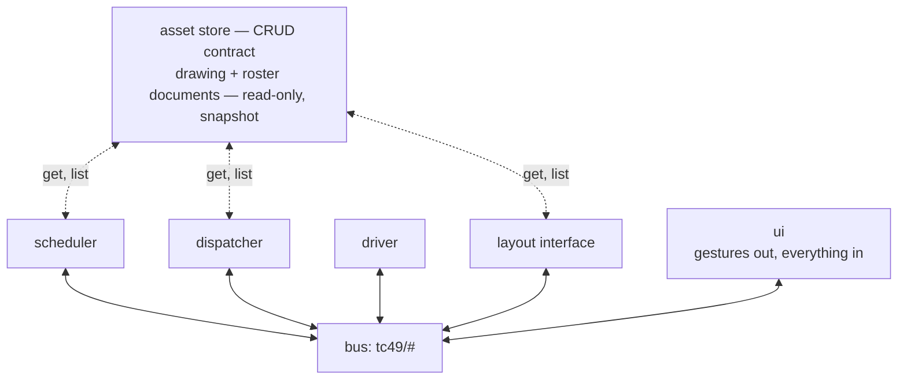

# System

The app is organized as completely independent components. Although an
implementation detail, a (Docker) container is a good mental model for a
component. The current ones are the asset store, the scheduler, the
dispatcher, the driver, the layout interface and the UI; the hardware
translators under the layout interface already join them
([ADR-0043](adr/0043-the-layout-interface-is-a-core-app-and-hardware-hangs-under-it-by-address.md)),
and others will. This page and [BUS.md](BUS.md) define the contracts they
meet over.

Communication is by MQTT events and REST requests exclusively. Each component
declares the events and requests it responds to and emits. An event addressed
to a component does not include the source, in the topic or in the payload:
that information is irrelevant, and may not be disclosed, so no undesired
dependency on it can arise. Exceptions to this rule may arrive and will need
special handling; none is known today.

Events are generic, never particular to one component. A hardware translator
gets no events of its own, only things like power on or off, or a locomotive's
speed and direction — events any of a million hardware solutions could respond
to, including ones not yet invented. The simulator simulates a subset of the
app's features and adds no requirement of its own to any contract
([ADR-0030](adr/0030-the-physical-railroad-is-the-normative-binding.md),
[ADR-0047](adr/0047-the-dispatcher-grants-on-events-and-the-boundary-leaves-the-contract.md)).

For example, the **dispatcher** accepts the `request_submitted` topic from the
`ui`, the `scheduler`, and any other scheduler introduced later, without any
change to its implementation.

To implement one component you need this page, [BUS.md](BUS.md) — the bus
contract, every topic and every payload — and at most one internals doc
([dispatcher/INTERNALS.md](dispatcher/INTERNALS.md) for the dispatcher).
Nothing here requires another component's internals. Terminology follows
[CONTEXT.md](../CONTEXT.md). The contract decisions are recorded in
[ADR-0008](adr/0008-bus-contract-is-the-mqtt-safe-intersection.md),
[ADR-0009](adr/0009-layout-interface-owns-time.md), and
[ADR-0010](adr/0010-asset-store-serves-coarse-read-only-documents.md).

## Overview

- **Scheduler** — the one writer of requests. It composes a person's gestures
  into requests, and submits a timetable whole at the start of a run, in the
  file's order.
- **Dispatcher** — admits requests, chooses routes, and grants moves without
  deadlock ([DISPATCH.md](dispatcher/DISPATCH.md),
  [SAFETY.md](dispatcher/SAFETY.md)).
- **Driver** — turns each granted move into the command that moves the train.
  In the end state it reads the aspect it is handed and decides how fast
  ([ADR-0025](adr/0025-a-signal-is-what-the-dispatcher-tells-the-driver.md)).
- **Layout interface** — the seam to whatever runs the track. Sensor
  readings come out; turnout and throttle commands go in. A simulator
  implements it in milestone 1, a hardware adapter later.
- **Asset store** — serves the drawing a layout derives from and the
  railroad's roster. It is not on the bus, because it answers queries and the
  bus does not.
- **UI** — the panel and the throttle a person drives from. It watches the bus
  and writes
  **gestures** on the browser-writable topics of the inventory
  ([BUS.md](BUS.md#event-inventory)). A gesture is not a request: it names a
  train and where to put it, and the scheduler composes the request
  ([ADR-0036](adr/0036-the-scheduler-is-an-app-the-panel-is-a-view.md)).

These are **roles, not implementations**. Each names a boundary that different
implementations can sit behind unchanged. The simulator and a hardware adapter
publish the same layout topics, and a future scheduling UI or freight
generator publishes the same schedule topics as the milestone-1 scheduler.

One turn of the machine (ADR-0047):

1. The scheduler submits a request — the timetable at the start of a run, a
   person's gesture whenever it lands.
2. The dispatcher admits it and sweeps: it chooses routes and publishes
   granted moves, `align` before each, so the route is set before anything
   moves.
3. The driver turns each grant it sees into a `move`.
4. The layout interface executes it and reports occupancy: the head into the
   next block, then the tail off the last one.
5. The vacate releases the origin block and the transit, ends the move, and
   the sweep it triggers grants whatever that freed.

The trace tap watches all of it.

## The bus

The bus contract is [BUS.md](BUS.md): what the bus promises and the four rules
that govern its topics, the event inventory and every payload schema, time and
the stamp that orders a state topic, and the device vocabulary the hardware
under the layout interface speaks. It is normative, and the footprints below
are written in its terms: a rule cited by number below is one of its four.

## Asset store

The store holds the documents a run is built from, behind a CRUD contract
that says nothing about how they are kept
([ADR-0010](adr/0010-asset-store-serves-coarse-read-only-documents.md)). The
contract has two bindings. Components read through a Python library over the
YAML files of [DRAWING.md](store/DRAWING.md) and [LAYOUT.md](store/LAYOUT.md).
Authoring tools and the panel reach the same store over HTTP — `tc49 serve`,
`src/tc49/store/server.py`:

    GET  /drawings              list the railroads
    GET  /drawings/<name>       one drawing, whole
    PUT  /drawings/<name>       create or replace it
    POST /review                what a drawing means: the derived layout, explained
    GET  /layouts/<name>        the layout that drawing derives to
    GET  /rosters/<name>        one railroad's roster, whole
    PUT  /rosters/<name>        create or replace it
    GET  /rosters/<name>/trains its trains, each with its length and functions
    GET  /catalogue             the models the installation knows, by name
    GET  /catalogue/<name>      one model, whole
    PUT  /catalogue/<name>      create or replace it
    GET  /backup                what backup can do here, and what it needs
    PUT  /backup                turn automated backup on or off
    POST /backup/commit         back the store up now, and attempt a push
    POST /backup/restore        put the store back as a backup held it
    POST /backup/repository     back up to an empty repository the person made

Every route is a store operation, which is why the server lives in the store
rather than in an app of its own
([ADR-0013](adr/0013-apps-are-deployment-units.md)). `review` is the one
route that is not CRUD: it takes an unsaved document and answers what it
derives to, so the editor holds no second copy of the derivation
([ui/EDITOR.md](ui/EDITOR.md)). `/rosters/<name>/trains` is the other
derivation the browser reads: what the run views read, and a path of its own
because `GET` and `PUT` on the document have to be inverses
([#388](https://github.com/rails49/control/issues/388)). `delete` is on no
route, for any document; a scenario is on none at all (below).

`/layouts/<name>` is the derivation **the apps** read. Each of the scheduler,
the dispatcher and the layout interface takes a `Layout` at construction, and
in its own process none of them can import the store to derive one
([ADR-0013](adr/0013-apps-are-deployment-units.md),
[ADR-0059](adr/0059-the-bus-is-a-broker-each-app-is-its-own-process-and-the-bridge-is-deleted.md)
decision 5), so the store serves the layout its drawing derives to, as the
document [LAYOUT.md](store/LAYOUT.md) describes. Read-only: a layout is
derived and never authored, and what an editor writes is the drawing
([ADR-0015](adr/0015-drawing-is-the-source-of-truth.md)). A railroad with no
drawing is a **404**; a drawing that is there and does not derive yet is a
**422** carrying the refusal, which is work in progress rather than a bad
request — the same fault the editor reads out of `review` and draws, said to
a caller that has nothing to run on. `src/tc49/lib/documents.py` is the
client: it reads this route, `/rosters/<name>` and `/catalogue` by name off a
base URL and answers a `Layout` and a `Roster`, retrying with backoff while
the store is not up. An app started before the store is an ordinary state and
not a fault, said on stderr and never absorbed
([ADR-0050](adr/0050-broken-hardware-is-reported-never-worked-around.md)),
which is what lets the deployment carry no `depends_on`.

**Every route is refused to a page on another origin.** A request carrying an
`Origin` header that is neither the server's own `Host` nor a loopback host —
a page served from the machine the store runs on, which is what vite's proxy
makes the app look like — is answered 403, and no
`Access-Control-*` header is sent on any reply. The app reaches these routes
on its own origin — through vite's proxy in development, through the proxy
that serves the page on a layout server — so nothing it does is a cross-origin
request. A request with no `Origin` is a native client and goes through: the
LAN is still the trust boundary and a browser is not on it
([ADR-0055](adr/0055-a-browser-is-not-on-the-lan-and-the-store-refuses-it.md),
[ADR-0057](adr/0057-one-origin-rule-and-both-faces-read-it.md),
[ADR-0042](adr/0042-the-edge-terminates-tls-and-the-lan-is-the-trust-boundary.md)).

- **Backup is git, driven and not owned**
  ([ADR-0053](adr/0053-backup-drives-git-and-does-not-own-it.md),
  [store/BACKUP.md](store/BACKUP.md)). The five routes above commit, push,
  restore and adopt; the app never runs `git init`, never makes a branch or a
  remote and never resolves a conflict, so a store that is not a repository is
  a normal state that says what it needs. It becomes one by **adopting** an
  empty repository the person made on github.com: `POST /backup/repository`
  takes its address, the store clones it and moves the clone's `.git` under
  the documents already there, which become the first backup
  ([#355](https://github.com/rails49/control/issues/355)). A repository that
  already holds anything is refused in words — that is a restore onto a new
  box, not this. The push goes out under a deploy key the store makes for
  itself where it was given somewhere to keep one (`tc49 serve --keys`);
  `GET /backup` shows the public half in `key` for the person to paste into
  that one repository's deploy keys, and `remote` says where the copy goes.
  `key` is null where there is none to push with — nowhere to keep one, and a
  private half this store cannot read, which `needs` tells apart in words
  ([#443](https://github.com/rails49/control/issues/443)).
  Every refusal — git's, and the one over a dirty tree — comes back inside a
  200 with `ok` false and git's own words in `said`, because each of them is
  a state of somebody's machine that the UI has to read out rather than a bad
  request.
  The switch is a document of the installation, `backup.yaml` in the store, so
  automated backup stays on across the restart that follows turning it on.
  `GET /backup` also answers how far behind the copy off the machine is, in
  `copy`: how many backups the remote has not been given, how long the oldest
  has been waiting and whether that is longer than a day. No route ever waits
  on the network — a push runs on the store's own timer, never on the thread
  serving a request — so an unreachable remote costs a save nothing.

- **Four document types** — `drawing`, `roster`, `scenario` and the
  catalogue's `model` — each fetched and stored whole. Symbols, wires, trains and requests live inside a
  document and cannot be addressed on their own. A layout is **derived** from
  a drawing at `get` rather than being a document type of its own
  ([ADR-0015](adr/0015-drawing-is-the-source-of-truth.md)), so a railroad has
  one committed description and not two.
- **A scenario belongs to the harness and is not served over HTTP** —
  `tc49 bench` and `bench/replay.py` read one off disk through the
  library binding, and no browser can reach one
  ([#171](https://github.com/rails49/control/issues/171)). The two document
  types a run is built from are the other two.
- **A railroad owns its roster** — the cars it has and the trains made up from
  them, kept beside its drawing and under the same name
  ([ADR-0039](adr/0039-a-train-may-be-off-the-layout.md)). A railroad with no
  roster file owns no trains yet, which is the state a drawing made this
  morning is in. Being on the roster is what makes a train **known**, and a
  person's placement is what puts it on the rails. A train nothing places
  comes up **off the layout**. **The drawing and the roster are the whole of
  what a run is built from** (#171). It is **writable over HTTP**, and that is
  what completes the flow the app exists for: draw a railroad, save it, make
  up a train and put it on. A train's entry names **either a car or a model**
  — `cars` holds identified stock, and ten identical hoppers are named by
  their model where they are used
  ([ADR-0061](adr/0061-stock-with-nothing-of-its-own-is-named-by-its-model.md)).
  A `PUT` is the whole document, so a roster arriving without a car is that
  car removed and there is no `DELETE`
  ([#388](https://github.com/rails49/control/issues/388)). A train names at least
  one entry: an empty `cars` list is refused, so a roster the store takes is
  always one `/rosters/<name>/trains` can answer
  ([#412](https://github.com/rails49/control/issues/412)).
- **The catalogue is the installation's, and it is writable over HTTP** — the
  models it knows, one document per model, named for itself and read by every
  railroad on the box: a model is what a product is, and a product does not
  become a different product on another layout
  ([ADR-0045](adr/0045-the-railroad-owns-cars-and-a-train-is-an-ordered-list-of-them.md)).
  One file per model is what keeps two entries independently editable and a
  backup's `git diff` readable. A car names a model and is complete only
  against one, so a box with no catalogue is a box where no roster can be
  written at all, and `PUT /catalogue/<name>` is what makes the first one
  ([#392](https://github.com/rails49/control/issues/392)). The routes answer
  the documents as written rather than the merged models a roster is read
  against, because what reads them is the screen that edits them. There is no
  `DELETE`: an unused model costs nothing, and one a car still names could not
  be removed anyway.
- **A name is the id** — `crossover-yard` for a railroad and its roster, and
  `crossover-yard/meet`, qualified by layout, for one of the harness's
  scenarios. The verbs are `get`, `put` (create or replace a whole document),
  `delete` and `list` (all railroads, or the scenarios of one). There is no
  partial update.
- **Components only read** — the scheduler, dispatcher, driver and layout
  interface call `get` and `list` and nothing else. Writing belongs to
  authoring tools. What is true during a run is on the bus and what happened
  is in the trace, so a scenario that changed when it was run would no longer
  be a fixture a benchmark could repeat.
- **Read once at startup** — assets do not change while a run lasts. The
  contract has no way to announce a change and the bus carries no
  asset-change event, so editing an asset means starting a new session. A
  change to the track plan partway through a run would invalidate routes the
  dispatcher had already committed to and locks it already held.
- **The store validates and consumers derive** — `get` never returns an
  invalid document. The store checks the schema, and the references a document
  makes: that a scenario's layout exists, that the blocks it names exist, and
  that a connection's endpoints are real block ends. It checks at whichever
  verb the document came in through. `put` rejects an invalid document, and
  the milestone-1 YAML binding runs the same validator at `get`, because its
  documents are hand-authored files that never passed through `put`. The
  layout derived from a drawing is validated too, which catches a bug in the
  derivation. A mistyped end is then reported when the document loads rather
  than as a `KeyError` partway through a run. Everything else is derived by
  the consumer: the conflict matrix by inversion
  ([ADR-0006](adr/0006-conflicts-declared-by-inversion.md)), terminal blocks,
  arrival-end expansion and fit pruning.

## Component footprints

Each component in terms of those contracts — [BUS.md](BUS.md) and the store
above: what it reads from the store, what it subscribes to, what it publishes,
and the responsibility that accounts for exactly that much and no more.

### Scheduler

*Reads* the layout. *Subscribes* `tc49/dispatch/#` and `tc49/schedule/#` —
the gestures it responds to sit under its own name, and its own state topics
come back past it ignored. *Publishes*
`request_submitted` on the dispatcher's topic, and the `state/exhausted` and
`state/facing` last-value topics.

The scheduler is the **one writer of requests**. It has three sources: a
timetable, submitted whole at the start of a run in the file's order; a
person gesturing on the panel; and, later, a generator inventing traffic. Those are three
sources inside one scheduler, not three publishers
([ADR-0028](adr/0028-the-scheduler-knows-where-trains-stand.md),
[GOALS.md](GOALS.md#scheduling)). Which of them a run has is configuration
rather than a rule: a run an operator drives has no timetable at all
([ADR-0036](adr/0036-the-scheduler-is-an-app-the-panel-is-a-view.md)).

From a timetable request the scheduler does one thing: it expands the arrival
ends, `to: [yard_e]` becoming `yard_e.A, yard_e.B`, which is *syntax* and
needs no layout. From a **gesture** it supplies the two fields the gesture
leaves out, the id and the departure end. It makes each request's **id** from
a single counter, in the timetable's order (`<train>-1`, `<train>-2`), which
is what a document's own order requires. The id means nothing to a consumer and
only has to be unique
([ADR-0033](adr/0033-a-request-id-is-unique-not-meaningful.md)). A run
carrying gestures makes no claim about that order — so a gesture's id takes
that same counter with a nonce the scheduler process mints once in between,
`<train>-<nonce>-<n>`, which is what keeps a restart of the scheduler alone
from re-minting an id the dispatcher is still holding. A benchmark run is one
of those: it replays its document as drags, and states the nonce rather than
minting one, which is what leaves its ids reproducible. The id is never
derived from a clock.

It **holds facing**, which is scheduler state
([ADR-0019](adr/0019-facing-is-scheduler-state.md)). A train's facing starts
at the placement the dispatcher accepts for it, and a **drag's departure end
is read off it** rather than being it. The scheduler then carries it
forward from the end each `move_granted` was entered by, and from the
departure end of a committed route, and publishes it on a state topic that
every view reads to draw the train's direction arrow
([ADR-0032](adr/0032-a-joining-client-is-served-the-runs-retained-state.md)).
Keeping that up to date is why the scheduler reads the layout: `move_granted`
names a transit and the block entered but not the end entered through, so the
ends a transit joins have to come from somewhere.

It **checks nothing**. Every check of whether a request makes sense — whether
the departure end is consistent, the `no_fit` and `no_entry` pruning, whether
the destination can be reached — belongs to the dispatcher at admission, so
one component decides feasibility rather than two. A gesture naming a train
that is not idle is composed and submitted like any other, and is answered
`wrong_origin` or queued.

A gesture it cannot compose into a request it **drops**. A gesture is the
first thing a browser writes and carries no id, so there is nothing to address
an answer to, and the frame is already a line in the trace
([ADR-0034](adr/0034-the-bridge-enforces-the-topic-the-dispatcher-the-payload.md)).
Like the dispatcher, it never raises on a bus payload.

A request that ends by **cancellation** is dropped like one that ends by
arrival or by rejection: the request and its destination go, and nothing is
re-submitted
([ADR-0049](adr/0049-a-request-ends-by-cancellation-as-well-as-by-arrival.md)).
A destination that is still wanted is asked for again with `request_wanted` —
the gesture that ended it was a person's. Facing needs no case of its own:
`removed` is followed by `train_removed`, which already pops it, and
`displaced` by `train_placed`, which already recomputes it.

When the last timetable request has gone out it sets `exhausted`, which is
how milestone 1 knows the run is over. Where a **`state/facing` value survived
a restart** it adopts that value, and a train the value does not name — or
names in a spelling this build refuses — has no facing until it is placed.
That value is **read** like any other payload: rule 4 does not exempt the
moment a retained one is read, and a value that states no facing map at all
leaves the scheduler starting as a cold start does, with its seed and no
restored facing, rather than refusing to start.

### Dispatcher

*Reads* the layout and the railroad's **roster**: train lengths for the
admission fit check, and the whole of what makes a train **known**
([ADR-0039](adr/0039-a-train-may-be-off-the-layout.md)).

A run is built from a railroad, and nothing in a railroad places its trains
(#171), so a run comes up **held** with an **empty layout** and each train
arrives on a person's `placement_wanted`. The roster cannot come off the bus.
Sensors are anonymous, so the lock table the dispatcher recovers identity from
has to be seeded before the first sensor event, and `request_submitted`
carries no length.

Where a **`state/allocation` value survived a restart** the placement comes
from it instead. Its `trains` and `crossing` are adopted before the standing
locks are published. Lengths still come from the roster, and `locks` and
`requests` are not adopted at all, so the lock table is rebuilt with one block
per train and the queue comes back empty.

That value is **read** like any other payload: rule 4 does not exempt the
moment a retained one is read, and a value that states no picture at all
leaves the dispatcher starting as a cold start does — every train on its
document placement — rather than refusing to start. It is read a train at a
time, so a picture naming one train unreadably loses that train and keeps the
rest, exactly as a picture the document overrules does. A value that is there
and cannot be read still **holds** the run: what decides that is a value
being on the topic, never how much of it could be taken.

Placement is decided **one train at a time**. A train the picture does not
name starts where the document says. Where that is a block the picture already
stands another train in, the contested block goes to the train with nowhere
else to stand. The other falls back to its own starting block. Where that is
taken too, it comes up placed nowhere at all and is shown as a train with no
block ([ADR-0039](adr/0039-a-train-may-be-off-the-layout.md)).

*Subscribes* `tc49/layout/#` and `tc49/dispatch/#` — the request and the three
gestures it responds to sit under its own name, its own announcements come
back past it ignored, and the two commands on the layout filter pass by
unread. *Publishes* the eleven `tc49/dispatch/*` events, plus `state/run`,
`state/aspects`, `state/disputed` and `state/allocation`. The last of those is
its picture of the run, written out from the lock table whenever it changes,
so a client that joins an idle railroad has something to draw
([ADR-0032](adr/0032-a-joining-client-is-served-the-runs-retained-state.md)).

**The run is held, running or draining**, on `state/run`. The dispatcher
publishes it from its constructor, so a client that joins is served a value
rather than left to read one out of an absence. A session starting fresh
publishes `running`. One that came up on a restored picture publishes `held`,
because that picture says where the last session believed the railroad was
rather than where it stands now.

A person moves it with `tc49/dispatch/run_wanted`. The three values differ by
what the dispatcher will commit, and all three **admit**:

| value | admits | launches | grants to a train already moving |
| --- | --- | --- | --- |
| `running` | yes | yes | yes |
| `draining` | yes | no | yes |
| `held` | yes | no | no |

While it is `held` the dispatcher **commits nothing**: a sensor still applies
where it lands, and the sweep's grant pass is what stops, so no route is
chosen, no move granted and no lock taken, while admission goes on accepting
and queuing. A move already granted still completes and releases its locks. A
hold stops new commitments and does not stop a train that is already moving,
and nothing on the bus retracts a `move` already sent. Every signalled end shows `stop` for as long as the hold
lasts. Releasing runs a sweep, so the press itself grants
([ADR-0037](adr/0037-the-run-is-held-or-running-and-held-blocks-commitment.md),
ADR-0047).

**`draining` is the ordinary shutdown**, and the gate it closes is on
launching rather than on admission: the trains already moving go on being
granted until each finishes its request, and nothing is launched behind them.
Every end one of them is leaving by goes on **showing its aspect**, where a
hold puts them all to `stop`: the answer to "may this train leave" is yes for
a train the drain is still granting, and a signal at stop over one that has
just been told to go would be the hold's lie the other way about.
The dispatcher writes `held` **itself** at the first moment no train is active
and none is crossing, and that transition is the drain's completion — what the
panel watches for before it cuts track power
([ADR-0051](adr/0051-the-panel-commands-track-power-and-the-operator-is-the-backstop.md)).
A drain over a railroad with nothing under way therefore reaches `held` in the
press that asked for it. `held` published while a drain is in progress
**abandons** it, at once and without waiting for a train to finish, and
`running` resumes launching; a drain that a train holds open forever is
escaped that way, by holding and then removing the train, which drops its
request ([#294](https://github.com/rails49/control/issues/294)).

**`moving` says whether anything would be stranded**, beside the run word and
orthogonal to it: true while any train is active or crossing, which is the
test the drain's completion already makes. `held` alone does not say it — the
dispatcher writes that word when a drain completes and a person's HOLD writes
the same word with trains still rolling — so the row carries both, and a
reader that wants to know the railroad is still reads `held` with `moving`
false. The row is published whenever either moves: a running run whose last
train arrives publishes `running` with `moving` false, and a value that
changes nothing publishes nothing. `layout` reads it before applying a plain
`off`, and the panel's OFF waits on it before cutting power
([ADR-0062](adr/0062-track-power-is-cut-only-when-nothing-is-moving-and-the-layout-checks.md)).

**The layout can hold it too.** A `tc49/layout/state/power` value that is
anything but `on` sets `run` to `held`, along the path a person's gesture
takes: nothing further is committed, and no signalled end goes on showing
`clear` over track with no power in it. Whether the value is `stopped` or
`off` makes no difference here.

Power returning to `on` releases nothing: a person releases the hold. A
`run_wanted` of `running` is **dropped** while power is anything else, because
releasing onto track with no power in it would strand the next train the way
the first was stranded, and a `run_wanted` of `draining` is dropped with it —
a drain grants the trains already under way, so over dead rails it asks for
what a release asks for. A hold is honoured whatever the power is doing
([ADR-0041](adr/0041-the-layout-says-whether-a-train-may-move-and-the-run-holds-when-it-may-not.md)).

**It alone reads `tc49/dispatch/placement_wanted`**, a person saying where a train
actually is. Only the dispatcher knows whether a block is free, so a second
reader would have to agree with it on every precondition. Two preconditions
hold whichever way the gesture points: the run is **held**, and the train is
known. A gesture that fails one of them is dropped without an answer, and is
in the trace. A request in flight was a third and is not one any more: the
placement **cancels** it first
([ADR-0049](adr/0049-a-request-ends-by-cancellation-as-well-as-by-arrival.md)),
so `request_cancelled` precedes `train_placed` or `train_removed` and both of
those always describe a train with no request. The reason says which direction
the gesture pointed — `displaced` into a block, `removed` off the layout.

A placement **does not defer** where a move is outstanding, as a
`cancel_wanted` does: the person is answering the move the sensors may never
answer, so the request retires at the gesture. A sensor that arrives for it
afterwards explains nothing and holds the run
([ADR-0048](adr/0048-an-unexplained-reading-holds-the-run.md)), which is what
a detector firing under a train somebody has moved by hand should do.

Naming a **block** puts the train there. The block has to exist, fit the
train, and be free of every claim: no lock on it, and not on a committed
route, which under `Incremental` are not the same set. Where the train stands
now is not a precondition at all. A train adopted with no placement is exactly
the one a person has to say something about, and it has no standing lock to
move, only one to take. Having accepted, the dispatcher moves the train's
standing lock and publishes `train_placed`. The scheduler reads that to carry
facing into the new block, and the layout interface to move the train under
it.

Naming **`block: null`** takes the train off the layout
([ADR-0039](adr/0039-a-train-may-be-off-the-layout.md)). It is one gesture
that works in both directions, because putting a locomotive on the track and
lifting it off are the same act with a different destination. The train leaves
`block_of`, whatever it held is released as one `lock_released`, and
`train_removed` says so. The scheduler drops its facing on it and the layout
interface forgets it.

This is not deletion: the train stays on the roster and can be placed again. A
train with a request in flight **is** lifted off, its request cancelled
`removed` on the way, so a derailment partway through a route ends with the
locomotive in a person's hand rather than with the hold released and the train
run on to a destination it is no longer heading for. The key is read for
**presence**: an explicit `null` says nowhere, and a frame that has lost the
field is refused rather than read as a `null`.

**It alone reads `tc49/dispatch/cancel_wanted`**, a person ending a train's
work without it arriving
([ADR-0049](adr/0049-a-request-ends-by-cancellation-as-well-as-by-arrival.md)).
The gesture names a train and no request — an id is the dispatcher's own — so
it ends whatever that train has, the active request and everything queued
behind it, and a train with nothing in flight is dropped like any other
gesture there is no id to answer. It needs **no held run**: cancelling ends
one train's work, and holding the whole railroad to do it would stop every
other train to let one go.

What a cancelled request held is released, **all of it but the block the train
stands in** — under `FullRoute` that is the whole route, every transit and
every block beyond the origin — as one `lock_released`, and the sweep that
follows hands it to whoever was waiting on it. The one thing a cancellation
cannot do at once is take a move back: where one is outstanding the request is
marked, granted nothing further, and retires as `request_cancelled` when
`block_vacated` says the move it was already making is over. A cancelled id
stays used for the session; no id ever resumes
([ADR-0033](adr/0033-a-request-id-is-unique-not-meaningful.md)).

**While held it publishes what the detectors dispute**, on `state/disputed`:
the trains its own placement stands in a block the layout reports clear, and
the blocks the layout reports occupied with nothing claiming them. At power-up
every detector reports at once and anonymously, which is the moment a restored
placement is least trustworthy. Naming the two contradictions means a person
checks a handful of trains rather than walking the whole railroad.

The set **resolves nothing**, because no sensor says *which* train it saw. A
person ends each entry with a `placement_wanted`, and the set empties as they
do. Only blocks the layout has actually reported on take part. **Silence is
not a clear reading**, so a binding that reports no occupancy at all disputes
nothing rather than disputing the whole railroad. A train the picture says is
crossing takes no part either, standing in no block. Releasing the hold with
entries outstanding is allowed, the person deciding rather than the check, and
it empties the set: once the run is running, the dispatcher's placement is
what its sensors have just told it
([#153](https://github.com/rails49/control/issues/153)).

It is also the **only component that checks a payload**. A browser can publish
anything at all, nothing standing between it and the broker, so the dispatcher
never raises on a bus payload. A request
naming a train or a block that does not exist is answered `unknown_train` or
`unknown_block`. One naming a train that is on the roster but stands on no
block is answered `no_origin`, off the layout being a place a train can be
([ADR-0039](adr/0039-a-train-may-be-off-the-layout.md)). One that carries a
readable id but is otherwise not a request is answered `malformed`. One with
no readable id is dropped, there being nothing to address an answer to, and it
is in the trace already because it was published
([ADR-0034](adr/0034-the-bridge-enforces-the-topic-the-dispatcher-the-payload.md)).

The rule covers what the **layout** publishes too, for a second reason. No
page writes those topics, but the binding is another process on the broker,
and a bug in it must not take the dispatcher down.
The two observations fail in opposite directions. A `state/power` payload that
cannot be read counts as one of the "not `on`" cases and holds the run;
dropping it would mean *not* holding, over track whose state could not be
read. An occupancy frame that cannot be read is dropped: it is a reading
nobody made, so the block stays one the layout has said nothing about, and
silence is not a clear reading
([#181](https://github.com/rails49/control/issues/181)).

The dispatcher's semantics are [DISPATCH.md](dispatcher/DISPATCH.md) and
[SAFETY.md](dispatcher/SAFETY.md); its internals are
[dispatcher/INTERNALS.md](dispatcher/INTERNALS.md).

At this boundary it is **entirely asynchronous**. Requests arrive as events,
and everything that happens to a request is announced as an event:
`request_admitted`, `request_rejected` (at admission, or at the first attempt
to launch), `request_completed`, `request_cancelled`. The request id is what
ties the events
together and what identifies a duplicate, which is dropped. A request stating
a departure block its train is not standing in gets one of those answers,
`wrong_origin`, rather than raising, because the submitter may be a browser
([ADR-0021](adr/0021-a-bad-request-is-answered-not-raised.md)).

Sensor events are **applied where they land** (ADR-0047). A reading that
re-asserts the level the dispatcher already holds is an at-least-once repeat
and a no-op. A change either explains a granted move — `block_occupied`
records where the train arrived, `block_vacated` releases the origin block
and the transit, ends the move and completes the request — or explains
nothing, which **holds the run** (ADR-0048) and is the dispute check's
subject either way. The grant pass is a **sweep** over the
whole waiting set, run where the lock table or the waiting set changes: a
request admitted, a vacate, the run released. Every grant is `safe()`-checked
before it commits, so arrival order picks among safe options and never
reaches an unsafe state; under MQTT a sensor that arrives late delays a grant
rather than producing a wrong one.

The aspect of every signalled block end goes on the `state/aspects` state
topic, republished whenever any of them changes. Signal heads, the panel and a
person driving by eye all read it, not only the automated driver, and a
subscriber that connects late needs the whole picture rather than the next
change
([ADR-0025](adr/0025-a-signal-is-what-the-dispatcher-tells-the-driver.md)). An
end nothing ever leaves carries no signal and does not appear.

Each granted move is published as its own `move_granted` event, separate from
the `lock_granted` record: the move is what the driver acts on, and the record
of locks feeds the utilization metric. A `FullRoute` launch locks a whole
route in one grant while granting one move. At startup the dispatcher
publishes a `lock_granted` for the standing lock of every train its lock table
came up seeded with, because the trace has to carry the initial occupancy or
the utilization metric cannot see idle trains.

### Driver

*Reads* nothing. *Subscribes* `tc49/dispatch/move_granted`. *Publishes*
`move`.

The driver is a **translator that holds no state and knows nothing of the
layout**: for each granted move it immediately publishes `move`, which is the
grant restated as a command. Setting the route belongs to the dispatcher, which
publishes `align`
([ADR-0022](adr/0022-a-symbol-carries-its-hardware-address.md)), so a grant is
all the driver needs in order to act.

The grant carries the aspect, and turning it into the speed the command
states is the whole of the driver's judgement: `clear` is full speed, `caution`
a fraction of it, and the mapping is two numbers injected at construction
rather than a document or a schema
([ADR-0025](adr/0025-a-signal-is-what-the-dispatcher-tells-the-driver.md)).
`stop` is not in it — a grant showing it is no permission to move — so a grant
whose aspect the driver cannot price is dropped like any other it cannot act
on, there being no speed to fall back on that the dispatcher authorised. What
the driver publishes is a magnitude and never a direction, which is what keeps
it a pure function of the aspect: the grant payload and those two numbers are
between them every field `move` needs, so the driver holds no state and reads
no assets.

The grant is **read** and never trusted, exactly as a gesture is (rule 4): the
leaf names the dispatcher because the dispatcher emits it, and a name is not a
sender. A frame that cannot be read is **dropped** — the driver commands and
answers nothing, so there is nowhere to address a refusal to even where the
frame carries an id
([ADR-0034](adr/0034-the-bridge-enforces-the-topic-the-dispatcher-the-payload.md)),
and it is on the trace by virtue of having been published. Splitting the
qualified transit into the connection and the bare name the command states is
part of that read and the whole of what the driver does with a grant: a
transit missing either half names nothing to command with. Whether the halves
name anything on this railroad is the layout interface's question, which is
the one that holds the layout.

A **human driver** takes its place by reading the same grants as a display
and publishing nothing, sensors remaining the sole truth, and a component
that drives realistically later grows behind the same topic.

### Layout interface

*Reads* the layout and the roster. *Subscribes* `tc49/layout/align`,
`tc49/layout/move`, `tc49/layout/power_wanted`, `tc49/dispatch/train_placed` /
`train_removed`, `tc49/dispatch/state/aspects`, `tc49/dispatch/state/run`,
`tc49/schedule/state/facing` and `tc49/layout/state/device/#`. *Publishes*
`state/railroad`, the sensor events, `state/power`
and the desired half of the device vocabulary
([BUS.md](BUS.md#device-vocabulary)).

That is the **role's** footprint, and its two bindings meet all of it. The
core app `layout` folds a block's two detectors into the sensor events and
debounces the levels on the way
([layout/README.md](layout/README.md)); the milestone-1 simulator answers the
two commands and the two placement facts, publishes the sensors from delays of
its own, and states a railroad that is always live
([ADR-0030](adr/0030-the-physical-railroad-is-the-normative-binding.md)). A run
has one of them.

The layout interface is where the system meets the track: **commands in,
observations out**, and it owns time. What it publishes is exactly what
hardware can produce: anonymous occupancy sensors and track power. It never
says which train it saw, because a detector cannot report that. The
dispatcher recovers identity from its own lock table. A block has **two
detectors, both inside the interface**: a train entering trips the far
block's first detector with its head and its second once it is fully in, so
the interface publishes `block_occupied` on the way in and `block_vacated`
for the block behind once the tail clears — occupied then vacated, the only
order the physical railroad can produce (ADR-0047).

Commands name a **transit** rather than a piece of hardware. An `align` names
a connection and a transit, and carries the points that transit needs as
address-and-position pairs, so an adapter throws what it is told and holds no
table of its own. Those pairs come from the layout, derived from the addresses
in the drawing
([ADR-0031](adr/0031-the-layout-carries-the-points-a-transit-needs.md)),
rather than being kept by an adapter. A `move` carries a `speed` as well, and
the interface is what gives that magnitude a sign: which way a train runs
along the track is the transit's near end composed with the way round the
locomotive stands, and both are facts this side of the boundary. The first of
the two is the train's **facing**, which is the scheduler's state and the one
thing the interface reads that is neither a command nor a device row
([ADR-0052](adr/0052-layout-reads-facing-and-composes-the-sign-of-a-speed.md)):
a `move` for a train whose facing it has not seen is dropped rather than
guessed at, and a train whose cars carry no address is carried out with
nothing to publish.

One **obligation** comes with them: the layout interface must not act on a
`move` before the `align` that names the same transit. The two commands have
two publishers and the bus promises no ordering between topics, so nothing
upstream can guarantee the route is set before the train moves. Starting a
train onto points that have not thrown is a collision, so the duty has to sit
somewhere, and this is the only component that sees both commands.

How the obligation is met is the binding's own business: on the harness's
in-process bus the `align` is delivered first, and a hardware adapter pairs
them.

A second obligation guards against a stale command: the layout interface
**acts on a `move` only if that train is standing at the transit's near end**
([ADR-0047](adr/0047-the-dispatcher-grants-on-events-and-the-boundary-leaves-the-contract.md)).
At-least-once delivery can repeat a `move` minutes late after a reconnect;
after arrival the train has left the near end, so the redelivery is a no-op
on state alone — no clock, no stamp, no agreement between apps. The same
check refuses a command overtaken by a hand's placement, and one naming a
train no longer on the layout.

Every payload the binding is handed is **read** and never trusted (rule 4):
the `move` it acts on, and the two placements it hears about below. A leaf
names the component that answers for it and not the process that published
this frame — the driver publishes `move` today, and under MQTT it is another
container — so a binding that raised on one would be taken down by whoever
published it, leaving the railroad running with nothing watching it. A frame
that cannot be read is **dropped**: the interface reports observations and
answers nothing, so a refusal would have nowhere to go
([ADR-0034](adr/0034-the-bridge-enforces-the-topic-the-dispatcher-the-payload.md)),
and the frame is on the trace by virtue of having been published. A command the
layout contradicts is dropped the same way: one naming a transit this
railroad does not hold, **or** one whose transit reaches neither end of the
block the command says the train is entering. Either way there is no track
from anywhere over that transit into that block, so the command names no near
end for the train to be standing at, and the layout is the one thing that can
say so. This is one rule about reading a transit and a block that arrived
together, and it holds wherever the pair is read: the scheduler keeps it on
`move_granted` too, where a transit crossing neither end of the block entered
leaves no end to face the train away from. `align` is read by whatever acts on
it, and the milestone-1 simulator throws no points, so it reads nothing off
that one and nothing on it can fail to be read.

**Manual driving.** A train is **automatic** or **manual**: taking it in a
throttle makes it manual and releasing it puts it back
([#207](https://github.com/rails49/control/issues/207)). Both gestures are
this component's — `mode_wanted` hands a train over or takes it back,
`train: null` handing over every train at once bar the ones `layout` is
driving, and `throttle_wanted` is the throttle being turned — because the
device row a throttle ends at has one writer and that writer is `layout`
(rule 1), while a throttle is any number of writers, two tabs being two of
them. The layout interface applies a `throttle_wanted` only while that
train is manual and drops it otherwise, and on the transition back to
automatic it writes the speed the train's current grant implies, which is
`0.0` where there is none. It publishes `state/mode`, which is where a view
reads who is driving what.

Two things this does **not** change. The **driver** still turns a
`move_granted` for a manual train into a `move`, so the points still throw and
the transit is still armed; it never reads the mode and stays a pure function
of the aspect. The **dispatcher** never learns of it either: a manual train
still holds its block and may still be granted, a person is trusted to read
the signal, and both kinds of train move only on a route the dispatcher
allocated. *Manual* names who turns the throttle and nothing else; an operator
running a signal at stop is rogue operation the system does not model.

A `move` for a manual train **still runs its course**: the points throw, the
near end is checked and the crossing is recorded, because that is the route and
the route is not the driving. The one thing that does not happen is the
traction write, on the grant or on the arrival — a person stops their own
train, and the signal at the far end is what tells them to.

The UI's throttle view publishes both gestures
([ui/THROTTLE.md](ui/THROTTLE.md),
[#291](https://github.com/rails49/control/issues/291)) and the core app
`layout` acts on both
([#297](https://github.com/rails49/control/issues/297)), reaching a locomotive
through the same traction write a `move` does
([#296](https://github.com/rails49/control/issues/296)) — a lever states
nose-first where a move states the block it is going into, and the sign each
decoder is given is composed the same way from there. They are not on the
*Subscribes* line above because that is the **role's** footprint and this is
the physical binding's alone: the milestone-1 simulator has no person's hand on
it, every train it runs is automatic, and a railroad running under it publishes
no `state/mode` at all.

On the physical railroad the layout interface is the core app `layout`, and
hardware sits under it by address, as thin translators speaking a device-level
vocabulary on the bus
([ADR-0043](adr/0043-the-layout-interface-is-a-core-app-and-hardware-hangs-under-it-by-address.md)),
which is the device vocabulary of [BUS.md](BUS.md#device-vocabulary).
The control loop that carries out a `move` — throttle up, watch the detector,
stop — stays private hardware configuration.

The milestone-1 **simulator** is a discrete-event engine: on an accepted
`move` it schedules the two sensor events on fixed delays of its own, and it
owns pacing and termination — a batch run jumps the clock event to event and
stops when nothing is scheduled, nothing pending and no train rolling
([BENCHMARKS.md](bench/BENCHMARKS.md#termination)); live mode sleeps the same
spans and never terminates. That stop rule is milestone-1 pacing rather than
part of the bus contract, and a hardware adapter never terminates at all.

Sensor events report moves only. Initial occupancy is never published: the
dispatcher's standing locks come from its own placement, and the occupancy
topics are event topics, facts that happened, not state.

**Track power** is the one observation that is not a sensor. `state/power`
says whether a train may move at all: `on`, `stopped` or `off`. The binding
always publishes it from its constructor, so a joining client is served a
value rather than left to read one out of an absence
([ADR-0032](adr/0032-a-joining-client-is-served-the-runs-retained-state.md)).

`stopped` is an emergency stop and `off` is the supply removed. The difference
matters to the person recovering and not to the dispatcher, which holds the
run on either
([ADR-0041](adr/0041-the-layout-says-whether-a-train-may-move-and-the-run-holds-when-it-may-not.md)).
It is also the one word here that is not an observation: no hardware can
report an emergency stop, so `layout` holds `stopped` from the command it
wrote and a person clears it with `power_wanted: on` (ADR-0063, below).
The milestone-1 **simulator** publishes `on` and never changes it, simulated
track being always live (ADR-0030).

**Power is also commanded**, on `power_wanted`, which carries the same three
values in the other direction
([ADR-0051](adr/0051-the-panel-commands-track-power-and-the-operator-is-the-backstop.md)).
A power command is **applied on arrival**: there is no beat to quantise it
against, and it changes no lock and grants nothing, so it races with nothing
the dispatcher is deciding. `layout` answers it by writing the desired power
of the device vocabulary ([BUS.md](BUS.md#device-vocabulary)), and whatever
supplies power acts on that; it cannot verify that the power really went away
and does not try.

**A plain `off` is the one command that is re-validated against current
state.** A topic names the app that answers it and never the process that
sent the frame, so nothing about `power_wanted` says the panel wrote it with
its drain behind it, and a bare `off` from any other publisher would remove
the supply from under whatever is mid-transit. So `layout` subscribes to
`tc49/dispatch/state/run` and applies `off` only where that row reads `held`
with `moving` false — or where it holds no row at all, no dispatcher having
stated one, an absence being no evidence that anything moves. Otherwise the
gesture is dropped with its reason to the trace and not kept for later; a
client that wants the supply removed from a running railroad asks for a drain
and cuts when it is done (ADR-0062). **The railroad
comes up with power off** — `layout` starts having written `off`, so nothing
moves and no turnout throws until a person turns it on — and thereafter
`layout` writes the value it was told to write and never `off` of its own
accord. **It also comes up at rest**: `layout` starts having written `0.0`
over every retained `wanted/traction` row, so a speed a previous run left on
the broker is not replayed to a station and no locomotive rolls on the
power-on
([ADR-0054](adr/0054-the-railroad-comes-up-at-rest-and-points-replay.md)).
`wanted/point` replays instead — a point has no resting value to write.
**`state/power` is folded from what the hardware reports, bar the emergency
stop, which `layout` holds from the command it wrote**: the supply's own word
wherever every id ever heard reads its link `up`, and `off` otherwise, which
is where an unreadable frame on either row falls. `stopped` cannot come from
there at all — a stop leaves the rails live, so the supply reads `on` under
one — so `layout` publishes it on writing `wanted/track: stopped` and keeps
it, over any fold, until a person asks for the power back with
`power_wanted: on`
([ADR-0063](adr/0063-the-desired-half-may-ask-for-what-the-observed-half-cannot-report.md),
[layout/README.md](layout/README.md#power)). It is the one value on the row
not read off hardware, and it is held because no hardware can hold it. The
simulator answers none of this — simulated track is always live, and a power
cut is a physical act (ADR-0030).

`train_placed` is the one thing besides a `move` that moves a train, and what
a binding does with it is its own business. The simulator stands in for a
train that would simply be where a hand left it, so it is told where the hand
put it. It is not a command, and nothing moves on it.

A reading no granted move accounts for **holds the run**
([ADR-0048](adr/0048-an-unexplained-reading-holds-the-run.md)). The dispatcher
recovers train identity from its lock table, so a `block_occupied` with
nothing claiming the block, or a `block_vacated` of a block it believes a
train stands in — a hand putting a locomotive down, a train pushed while the
power was off, a detector asserting on dirt — says the table has stopped
describing the steel, and the dispatcher stops committing over it, by the path
track power takes
([ADR-0041](adr/0041-the-layout-says-whether-a-train-may-move-and-the-run-holds-when-it-may-not.md)).
It guesses nothing: occupancy is anonymous, so there is no train to place. It
does not raise either, a payload never being a reason to leave the bus
(rule 4).

The **dispute check** is what the hold turns on, and it is this comparison
exactly: the block reading occupied with nothing claiming it, or the train
whose block reads clear, is named on `state/disputed` for a person to walk.
They place what they find and press GO; a block reading clear again releases
nothing, exactly as power returning releases nothing.

The simulator publishes no sensors for a placement, so nothing behind the
milestone-1 binding produces such a reading. The rule is written for the
layout that detects occupancy, which is the binding that decides
([ADR-0030](adr/0030-the-physical-railroad-is-the-normative-binding.md)).

### Asset store

*Serves* the CRUD contract above. It is not on the bus: it publishes nothing
and subscribes to nothing. That is why it exists as a second contract —
components need answers to queries, and the bus has no request and reply.

### Beyond milestone 1

The contracts above are what milestone 1 builds, and they are not final.
[GOALS.md](GOALS.md) describes the whole system. Two decisions still to come
will extend these contracts, and they are listed here so that no footprint
above is read as the last word. Two others have already landed: the scheduler
reads the layout and subscribes to `tc49/dispatch/#`, spent early on holding
facing rather than on a generator
([ADR-0036](adr/0036-the-scheduler-is-an-app-the-panel-is-a-view.md)), and
`move` carries a **speed**, which the driver derives from the aspect it was
already handed, while the layout interface keeps the throttle up, watch the
detector, stop loop where the braking curve and the detector geometry live
([ADR-0025](adr/0025-a-signal-is-what-the-dispatcher-tells-the-driver.md),
[#283](https://github.com/rails49/control/issues/283)).

| Growth | Why | Where |
| --- | --- | --- |
| The scheduler **invents traffic** | continual generated traffic has to name an idle train and a reachable destination, which is what it now reads the layout for; the dispatcher stays the single feasibility authority | [ADR-0028](adr/0028-the-scheduler-knows-where-trains-stand.md) |
| Transits **vary in length** on real steel | the simulator's fixed delays are its own stand-in for travel time, not the model's unit of time | [ADR-0047](adr/0047-the-dispatcher-grants-on-events-and-the-boundary-leaves-the-contract.md) |

Neither adds a component, a writer or a query, and neither did the speed:
each lands on a topic that already exists, or on a state topic under a
component that already writes there, so the single-writer rule, the split
between event and state topics, and the prefix-filter rule all stand
unchanged.

One earlier change did not manage this, and is worth naming because the same
claim was once made of it. Taking a person's gesture off a page added the `ui`
role, a topic and an inbound path, and rule 1 had to be restated in terms of
roles rather than components before two browser tabs were admitted at all
([ADR-0035](adr/0035-a-topic-has-one-writing-role.md); the role itself has
since dissolved into the browser-writable mark,
[#263](https://github.com/rails49/control/issues/263)). The split between
event and state topics came through untouched, and was what showed where the
problem was.

Locking two blocks ahead instead of one
([ADR-0026](adr/0026-two-blocks-ahead-is-full-speed.md)) is not in the table,
because it is not a contract change: it is a parameter of the incremental
strategy behind the seam of
[ADR-0005](adr/0005-seam-at-locking-strategy.md).

## The trace

The trace is a **tap on the bus**: a subscriber to `tc49/#` that writes one
JSONL line for each event delivered, in delivery order, which is deterministic
on the in-process binding the harness wires it on. There is no separate
channel for tracing. The events the trace records are the events the
components exchange, so a UI later subscribes to exactly what the trace has
already shown to be enough.

Each line is flat: `{"time": …, "event": …, …payload}`. `event` is the
topic's leaf, which the inventory ([BUS.md](BUS.md#event-inventory)) keeps
unique — except on a **device row**, where it is the key past
`tc49/layout/state/`, `wanted/point` or `device/point`: the address is
trailing levels rather than a leaf, so a leaf there would be an accessory
number and would lose the row it belongs to
([ADR-0043](adr/0043-the-layout-interface-is-a-core-app-and-hardware-hangs-under-it-by-address.md)).
The two namings share one namespace, so a name still names one row. `time` is
stamped by the tap from the run clock as it records: float seconds since the
run started, simulated in batch and wall live (ADR-0047). It is the tap's own
observation, and not the `at` a state payload carries: the two are read off
one clock and a line shows both, `time` saying when the event was delivered
and `at` when the value was published. The keys are always in the same order — `time`,
`event`, then the event's fields in inventory order — which is what lets two
runs be compared byte for byte
([ARCHITECTURE.md](ARCHITECTURE.md#tests)).

A payload field the inventory does not list raises, which is a promise about
what the **apps** write. That strictness is the harness checking app
discipline against the inventory, not consumer behaviour — a consumer ignores
an unknown field (the openness rule). Apps deploy independently now
([ADR-0059](adr/0059-the-bus-is-a-broker-each-app-is-its-own-process-and-the-bridge-is-deleted.md)
decision 5) and the tap does not deploy with them: it lives in `bench`, on the
in-process bus the harness wires, so the tap and every app it records are one
build of this repository and there is no older tap for a newer publisher to
take down. It therefore **stays strict**. A row or a field it raises on is one
the inventory is missing, and the fix is to add it to `lib/inventory.py`.

On the topics a client writes, the tap records what it was given: the
inventory's fields in order, then anything else, and a payload that is not an
object under `payload`. That line is the whole record of a frame the
dispatcher drops
([ADR-0034](adr/0034-the-bridge-enforces-the-topic-the-dispatcher-the-payload.md)).

`metrics(trace)` depends on nothing but the trace, and **every metric is
derived from recorded events**. Makespan comes from the `request_admitted` and
`request_completed` stamps and latency from the same pair, utilization from
the span between `lock_granted` and `lock_released`, throughput from the
`move` commands per simulated minute, and the stall report from the last
`grant_refused` of each request that never completed. An event that stops
being published therefore breaks a metric and fails a test rather than going
unnoticed. The derivations live in [bench/METRICS.md](bench/METRICS.md).
