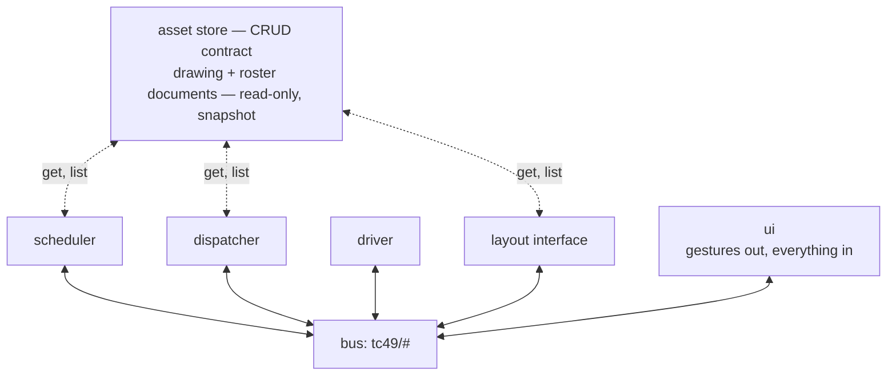

# System

How the app is organized: four components — asset store, scheduler, dispatcher,
driver — plus the external **layout interface** and the **UI**. They
communicate over an event bus and an asset CRUD contract. This page defines
those contracts.

To implement one component you need this page and at most one internals doc
([dispatcher/INTERNALS.md](dispatcher/INTERNALS.md) for the dispatcher).
Nothing here requires another component's internals. Terminology follows
[CONTEXT.md](../CONTEXT.md). The contract decisions are recorded in
[ADR-0008](adr/0008-bus-contract-is-the-mqtt-safe-intersection.md),
[ADR-0009](adr/0009-layout-interface-owns-time.md), and
[ADR-0010](adr/0010-asset-store-serves-coarse-read-only-documents.md).

## Overview

- **Scheduler** — the one writer of requests. It composes a person's gestures
  into requests, and publishes each timetable request on the first boundary
  that has reached its `at`.
- **Dispatcher** — admits requests, chooses routes, and grants moves without
  deadlock ([DISPATCH.md](dispatcher/DISPATCH.md),
  [SAFETY.md](dispatcher/SAFETY.md)).
- **Driver** — turns each granted move into the command that moves the train.
  In the end state it reads the aspect it is handed and decides how fast
  ([ADR-0025](adr/0025-a-signal-is-what-the-dispatcher-tells-the-driver.md)).
- **Layout interface** — the boundary to whatever runs the track. Sensor
  readings and the grant boundary come out; turnout and throttle commands go
  in. A simulator implements it in milestone 1, a hardware adapter later.
- **Asset store** — serves the drawing a layout derives from and the
  railroad's roster. It is not on the bus, because it answers queries and the
  bus does not.
- **UI** — the panel, and a throttle later. It watches the bus and writes
  **gestures** under `tc49/ui/*`. A gesture is not a request: it names a train
  and where to put it, and the scheduler composes the request
  ([ADR-0036](adr/0036-the-scheduler-is-an-app-the-panel-is-a-view.md)).

These are **roles, not implementations**. Each names a boundary that different
implementations can sit behind unchanged. The simulator and a hardware adapter
publish the same layout topics, and a future scheduling UI or freight
generator publishes the same schedule topics as the milestone-1 scheduler.

One cycle of the machine:

1. The layout interface publishes the boundary.
2. The scheduler releases the requests that have come due.
3. The dispatcher runs its grant phase over everything buffered since the
   previous boundary and publishes granted moves. It publishes `align` for
   each, so the route is set before anything moves.
4. The driver turns each grant it sees into a `move`.
5. The layout interface executes both and reports occupancy, which the
   dispatcher buffers for the next boundary.

The trace tap watches all of it.

## The bus

Components talk to each other by publishing JSON events on named topics and
subscribing to the topics they care about. In milestone 1 the bus is a Python
object inside one process. MQTT replaces it later.

That swap only works if nothing depends on behaviour MQTT does not have, so
the bus promises only what MQTT also promises, even where the in-process
version could easily do more
([ADR-0008](adr/0008-bus-contract-is-the-mqtt-safe-intersection.md)).

The bus promises:

- **Per-topic FIFO** — events that one writer sends on one topic are
  delivered in the order it sent them. Nothing more is promised: no order
  between two writers, and none between two topics. Each topic has a single
  writer, below.
- **Fan-out** — every subscriber whose subscription matches the topic gets the
  event, independently of the others.
- **At-least-once delivery** — the bus may deliver the same event twice, so a
  consumer must handle a repeat without changing its answer.
- **State topics keep their last value** — a subscriber that connects late is
  given the most recent value published on a state topic. MQTT calls these
  retained messages.
- **MQTT topic names** — levels separated by `/`, with `+` and `#` as
  wildcards in a subscription.

The bus does not offer the following. Each would be easy to add in process,
and is left out because code that came to depend on it would break the day
MQTT arrives:

- no request that returns an answer,
- no confirmation that an event was delivered,
- no ordering between one topic and another,
- no replay of past events to a late subscriber, apart from the last value on
  a state topic,
- no queue that grows without limit.

A component that needs an answer to a question does not use the bus. The asset
store answers questions, and exists for that reason.

**Four rules govern the topics listed in the next section.**

1. **Single writer.** Exactly one role publishes on a given topic, a role
   being `layout`, `schedule`, `dispatch`, `drive` or `ui` rather than a
   particular process. With a single writer, that writer's own order is the
   topic's order, and a reader can see which component is responsible for a
   topic by reading the topic's name.

   A role can have more than one copy running: two browser tabs are two copies
   of `ui`. Several copies may publish on an event topic, as long as no
   consumer depends on which copy published first. They must not publish on a
   state topic. A state topic keeps only the last message, and a publisher has
   to supply the whole value, so a copy that knows about one train replaces
   what another copy knew about the rest
   ([ADR-0035](adr/0035-a-topic-has-one-writing-role.md)).
2. **A topic is either an event topic or a state topic, never both.** An event
   topic reports something that happened, and is never replayed. A state topic
   holds a current value, of which only the last one published survives. Every
   topic is declared as one or the other, and a state topic says so in its name
   (`.../state/<name>`).
3. **Prefix-filter consumption.** Each consumer subscribes with a small fixed
   set of prefix filters under `tc49/`, written with `+` and `#`, rather than
   naming individual topics.
4. **Any source.** The bus does not authenticate a publisher: a topic's role
   says who *should* write it, not who can. A consumer therefore validates
   every payload it reads and never raises on one — a payload proves nothing
   about its sender
   ([ADR-0034](adr/0034-the-bridge-enforces-the-topic-the-dispatcher-the-payload.md),
   [ADR-0035](adr/0035-a-topic-has-one-writing-role.md)). What a failed read
   is worth is the consumer's own rule: an answer where the payload carries an
   id, a drop where it does not, and `state/power` failing towards `off`
   ([#181](https://github.com/rails49/control/issues/181)).

**The inventory is open.** A new topic, a new *optional* field on an existing
payload, or a new value in an enum whose readers declare a fallback
(CONTEXT.md) is a compatible change: one communication issue
(docs/agents/issue-tracker.md), and a consumer built before it keeps working,
because a consumer ignores fields it does not recognize. Removing, renaming
or repurposing a field or a topic, or making an optional field required,
breaks consumers and needs the stronger argument. A field can leave and come
back the same way: `at` was dropped from the request and returns, if it does,
as one communication issue once its requirements are understood. An added
field still changes the trace, so recorded fixtures regenerate — a cost each
addition pays, not breakage.

**How milestone 1 implements the bus.** One thread and one queue. `publish()`
adds the event to the queue and returns. A loop takes events off the front and
delivers each one to its subscribers, in the order they subscribed. An event
published inside a handler goes to the back of the queue, so it is delivered
after everything already waiting.

Delivery order therefore depends only on the order of publishes and
subscribes, which is what makes a replayed run produce a byte-identical trace
([ARCHITECTURE.md](ARCHITECTURE.md#tests)). It also means an event published
while handling boundary `N` is never delivered before the handling of `N` has
finished, which is the same-boundary causality the contract refuses: MQTT
would never deliver it any sooner.

**The last value of a state topic survives a restart.** Given a file, the bus
loads it at startup and rewrites it whenever any `tc49/*/state/*` value
changes. It writes a temporary file in the same directory and renames it over
the target, so an interrupted write leaves the previous file intact.

This belongs to the bus rather than to any app, because it is what an MQTT
broker does with retained messages. An app that restarts finds its own last
value waiting on its own state topic, exactly as it will from the broker in
milestone 2. Whether to use that value is each app's own decision, and they
differ: the dispatcher takes back its train placement and the scheduler its
facing, the dispatcher's queue is not restored, and no request id ever
resumes ([ADR-0033](adr/0033-a-request-id-is-unique-not-meaningful.md)). Given
no file the bus keeps no values, so `bench` and `sweep` are unaffected.

**Reaching the bus from a browser.** Until the bus is a real broker, a browser
connects to a WebSocket relay ([ui/PANEL.md](ui/PANEL.md#implementation)).
Every `tc49/#` event is sent to every client as one JSON frame,
`{"topic": …, "payload": …}`.

A client may publish only on the `tc49/ui` topics — `request_wanted`,
`reversal_wanted`, `run_wanted` and `placement_wanted` — and each frame it
sends is published as the event its topic names. That list is not written down
twice: it is every `tc49/ui` row of the inventory below, which is also what a
broker will grant a page once the relay is gone.

**A client names the railroad it wants in the socket path**,
`ws://host:port/<railroad>`. A browser reaches it as `/live/<railroad>`, and
the proxy in front removes the `/live` prefix ([DEPLOY.md](DEPLOY.md)). A
client hears that one railroad and no other. The relay outlives the railroad
it relays. Naming one it is not currently running starts that one, and closes
any client still connected to the previous one. Naming one that does not exist
returns an error frame and closes the connection, leaving the running railroad
alone. The path is not a topic, so none of this changes what a client may
publish.

**A browser cannot publish a request.** `tc49/schedule/request_submitted` is
refused like any other topic that is not one of the four above. A browser
publishes gestures and the scheduler turns them into requests, so "only the
scheduler writes requests" is something the relay checks rather than an
intention
([ADR-0036](adr/0036-the-scheduler-is-an-app-the-panel-is-a-view.md)). Any
other frame — a topic not on the list, or JSON that is not
`{topic, payload}` — is answered with an `{"error": …}` frame and never
reaches the bus.

The relay adds no topics and no payload fields. A frame is exactly the event
it carries, so the inventory below is its whole schema. When MQTT arrives the
browser speaks MQTT over WebSocket to the broker and the relay is deleted.

**On connect the relay sends the last value of every state topic**, before any
new event and in the same frame format. These are the frames the client would
have received had it been connected earlier. This is the last-value delivery
the bus already promises a late subscriber, and what a broker gives a client
as soon as it subscribes; a relay that left it out would promise less than the
bus it stands in for. The relay is not composing a description of the run
([ADR-0032](adr/0032-a-joining-client-is-served-the-runs-retained-state.md)).

**The relay checks the topic and never the payload.** A broker enforces which
topics a client may publish on, so that check survives the relay's deletion. A
broker does not check payloads, so payload checking belongs where it will
still be after the relay is gone: the dispatcher, when it admits a request.
The dispatcher never raises an exception on anything that arrives from the bus
([ADR-0034](adr/0034-the-bridge-enforces-the-topic-the-dispatcher-the-payload.md)).

## Event inventory

A topic is named `tc49/<role>/<leaf>`. The role comes first because it is the
role that publishes there: `layout`, `schedule`, `dispatch`, `drive` or `ui`.
Naming topics this way means rule 1 can be checked by reading the name,
`tc49/layout/*` keeps its meaning when hardware replaces the simulator, and a
UI that wants everything the dispatcher says subscribes to `tc49/dispatch/#`.

A leaf names something that has happened, in the past tense. There are two
exceptions. The two commands, `align` and `move`, are imperative, because a
command is sent before what it asks for happens. And `boundary` is a noun,
naming a beat rather than a change. `align` sits under `dispatch` because the
dispatcher publishes it: setting the route is the dispatcher's job, and moving
locomotives is the driver's
([ADR-0022](adr/0022-a-symbol-carries-its-hardware-address.md)).

**Adding a `tc49/ui` event row lets a browser publish on that topic.** The
list of topics a client may publish on is read off this table rather than
written down a second time, so a new `tc49/ui/<leaf>` event topic is writable
from any page the day its row is added, and that is the same permission a
broker's ACL will carry once the relay is gone
([ADR-0034](adr/0034-the-bridge-enforces-the-topic-the-dispatcher-the-payload.md)).

That is intended. A topic under `ui` is one that a person's page writes, which
is what the role means
([ADR-0035](adr/0035-a-topic-has-one-writing-role.md)). The throttle a person
drives with is the case it is right for
([#124](https://github.com/rails49/control/issues/124),
[#148](https://github.com/rails49/control/issues/148)): it arrives as a
`tc49/ui` leaf and has to be writable. A topic under `tc49/ui` that a page
should not write is under the wrong role, and belongs to the role that may
write it.

| Topic | Kind | Publisher | Meaning |
| --- | --- | --- | --- |
| `tc49/layout/boundary` | event | layout | the grant beat, numbered |
| `tc49/layout/block_occupied` | event | layout | a detector saw a block fill |
| `tc49/layout/block_vacated` | event | layout | a detector saw a block empty |
| `tc49/layout/state/power` | state | layout | whether a train may move at all ([ADR-0041](adr/0041-the-layout-says-whether-a-train-may-move-and-the-run-holds-when-it-may-not.md)) |
| `tc49/schedule/request_submitted` | event | scheduler | a request, composed and released |
| `tc49/schedule/state/exhausted` | state | scheduler | the timetable has run dry |
| `tc49/schedule/state/facing` | state | scheduler | the end each train would depart through |
| `tc49/ui/request_wanted` | event | UI | a gesture: the request minus the id and depart the scheduler owns |
| `tc49/ui/reversal_wanted` | event | UI | turn a train around where it stands |
| `tc49/ui/run_wanted` | event | UI | hold the run or release it |
| `tc49/ui/placement_wanted` | event | UI | where a train actually is ([ADR-0039](adr/0039-a-train-may-be-off-the-layout.md)) |
| `tc49/dispatch/request_admitted` | event | dispatcher | admission accepted it, with what survived pruning |
| `tc49/dispatch/request_rejected` | event | dispatcher | admission refused it, and why |
| `tc49/dispatch/request_completed` | event | dispatcher | the train arrived |
| `tc49/dispatch/route_chosen` | event | dispatcher | the route a launch fixed |
| `tc49/dispatch/move_granted` | event | dispatcher | one transit authorised |
| `tc49/dispatch/grant_refused` | event | dispatcher | a grant blocked, and by what |
| `tc49/dispatch/lock_granted` | event | dispatcher | resources claimed for a train |
| `tc49/dispatch/lock_released` | event | dispatcher | resources released |
| `tc49/dispatch/train_placed` | event | dispatcher | a placement accepted, the standing lock moved with it |
| `tc49/dispatch/train_removed` | event | dispatcher | a train taken off the layout |
| `tc49/dispatch/state/run` | state | dispatcher | held or running ([ADR-0037](adr/0037-the-run-is-held-or-running-and-held-blocks-commitment.md)) |
| `tc49/dispatch/state/aspects` | state | dispatcher | every signalled end's aspect |
| `tc49/dispatch/state/allocation` | state | dispatcher | the run's whole picture |
| `tc49/dispatch/state/disputed` | state | dispatcher | where the detectors contradict the placement ([#153](https://github.com/rails49/control/issues/153)) |
| `tc49/dispatch/align` | command | dispatcher | set the route: throw these points |
| `tc49/drive/move` | command | driver | take the train across |

| Consumer | Filter(s) |
| --- | --- |
| Scheduler | `tc49/layout/boundary`, `tc49/dispatch/#` **and** `tc49/ui/#` |
| Dispatcher | `tc49/layout/#`, `tc49/schedule/request_submitted` **and** `tc49/ui/#` |
| Driver | `tc49/dispatch/move_granted` |
| Layout interface | `tc49/drive/+`, `tc49/dispatch/align` **and** `tc49/dispatch/train_placed` / `train_removed` |
| Trace tap | `tc49/#` |

Two things the inventory has to keep true:

- **A leaf name is unique across all topics.** The trace records the leaf
  alone in its `event` field, so two topics sharing a leaf could not be told
  apart there.
- **A consumer subscribes by prefix filter, not by list** (rule 3). Each
  filter names a role, as the scheduler's three do. What matters is the shape
  rather than the number, and no consumer names individual topics. The
  layout interface is the one exception
  and stays the only one. It acts on one named command and on the two
  placement facts, and subscribing to the whole `dispatch` role would mean
  discarding most of what it heard. It also counts the commands it was sent,
  which is how it knows when it is quiet.

**What a payload carries.** Events are tied together by the request id, and
no event repeats what another has already said. An event in a request's life
carries the id and only what is *new*: `request_rejected` leaves out `depart`
and `dest`, which a reader can take from `request_submitted`, while
`request_admitted` carries the surviving ends and `pruned`, which are new.

`lock_granted` and `lock_released` carry `train` rather than the id, because
the utilization metric groups by resource. `request_completed` carries no
latency: the dispatcher has no clock to measure one, so metrics works it out
from the boundary numbers the trace stamps. `grant_refused` carries one
`{resource, holder}` entry for each candidate route that was blocked, which is
one entry when a fixed route advances and up to `k` at a launch. That is what
lets the stall report of
[BENCHMARKS.md](bench/BENCHMARKS.md#termination) be derived from the trace
rather than stored.

### Payload schemas

Every payload is a JSON object. The listings give each topic's fields in the
trace's canonical key order, which `tc49.lib.inventory` fixes. Every field is
**required unless marked *optional***; an enum's values are the field's whole
vocabulary, and which way an unreadable one falls is declared with it
(CONTEXT.md). Names are strings throughout: a **train** as the roster names
it, a **block** as the layout names it, a **block end** as `<block>.<A|B>`,
and a **transit** either qualified as `<connection>.<transit>` or split into
its two names, as each topic states.

#### `layout`

- `tc49/layout/boundary` — `boundary`: integer, the boundary number,
  strictly increasing; what lets a consumer ignore an at-least-once
  duplicate.
  [ADR-0044](adr/0044-the-boundary-period-is-real-time-and-the-fast-clock-is-out-of-the-control-path.md)
  adds `clock`, fast seconds since the session started; decided but published
  by no binding yet, so its row lands with the implementation.
- `tc49/layout/block_occupied`, `tc49/layout/block_vacated` — `block`: the
  block a detector reported on. Anonymous: no train field, because a detector
  cannot name one.
- `tc49/layout/state/power` — `power`: enum `on`, `stopped` or `off`. An
  unreadable payload reads as `off`: dropping it would mean *not* holding the
  run, over track whose state could not be read.

#### `schedule`

- `tc49/schedule/request_submitted` — `id`: opaque unique string
  ([ADR-0033](adr/0033-a-request-id-is-unique-not-meaningful.md)); `train`;
  `depart`: the block end the train departs through; `dest`: list of arrival
  block ends, at least one.
- `tc49/schedule/state/exhausted` — `exhausted`: boolean, `true` once the
  last timetable request has gone out.
- `tc49/schedule/state/facing` — `facing`: map of train to the block end it
  would depart through.

#### `ui`

Browser-writable, which is where rule 4 bites hardest: each payload is read
defensively, and one that fails the read is dropped.

- `tc49/ui/request_wanted` — `train`; `dest`: list, each entry a block or a
  block end, a bare block meaning either end.
- `tc49/ui/reversal_wanted` — `train`.
- `tc49/ui/run_wanted` — `run`: enum `held` or `running`; any other value is
  dropped. The ordinary-shutdown drain adds `draining`
  ([#123](https://github.com/rails49/control/issues/123)).
- `tc49/ui/placement_wanted` — `train`; `block`: block name, or `null` for
  off the layout. The key's presence is load-bearing: a payload without
  `block` fails the read, while an explicit `null` is a positive statement
  ([ADR-0039](adr/0039-a-train-may-be-off-the-layout.md)).

#### `dispatch`

- `tc49/dispatch/request_admitted` — `id`; `dest`: the arrival ends that
  survived pruning; `pruned`: list of `{end, reason}`, `reason` one of
  `no_fit`, `no_entry`, `unreachable`.
- `tc49/dispatch/request_rejected` — `id`; `reason`: enum `malformed`,
  `unknown_train`, `unknown_block`, `no_origin`, `wrong_origin`, `no_fit`,
  `no_entry`, `unreachable` — the set is `tc49.lib.rejection`, and the UI's
  copy of it is generated.
- `tc49/dispatch/request_completed` — `id`.
- `tc49/dispatch/route_chosen` — `id`; `route`: list alternating block and
  transit names, starting and ending on a block, a single block for the
  degenerate already-there case; `k_tried`: integer, candidate routes
  examined, `0` for the degenerate case.
- `tc49/dispatch/move_granted` — `id`; `train`; `transit`: qualified
  `<connection>.<transit>`; `into`: the block entered; `aspect`: enum `stop`,
  `caution` or `clear`
  ([ADR-0025](adr/0025-a-signal-is-what-the-dispatcher-tells-the-driver.md)).
- `tc49/dispatch/grant_refused` — `id`; `reason`: enum `unsafe`, `held` or
  `transit_conflict`; `obstacles`: list of `{resource, holder}` — the block
  or transit that blocked a candidate, and the train holding it.
- `tc49/dispatch/lock_granted`, `tc49/dispatch/lock_released` — `train`;
  `resources`: list of blocks and transits.
- `tc49/dispatch/train_placed` — `train`; `block`.
- `tc49/dispatch/train_removed` — `train`.
- `tc49/dispatch/state/run` — `run`: enum `held` or `running`; a reader drops
  an unreadable value (CONTEXT.md). `draining` arrives with the drain
  ([#123](https://github.com/rails49/control/issues/123)).
- `tc49/dispatch/state/aspects` — `aspects`: map of signalled block end to
  aspect. An end nothing ever leaves does not appear.
- `tc49/dispatch/state/disputed` — `trains`: sorted list of trains standing
  in a block that reads clear; `blocks`: sorted list of blocks reading
  occupied with nothing claiming them. Both empty unless the run is held.
- `tc49/dispatch/state/allocation` — `trains`: map of train to standing
  block; `crossing`: map of crossing train to its transit; `locks`: map of
  resource to holding train; `requests`: list of
  `{id, train, depart, dest, route}` in admission order, `route` *optional*
  — present once the route is committed.
- `tc49/dispatch/align` — `connection`; `transit`: bare name within the
  connection; `points`: list of `{addr, position}`, `position` enum `closed`
  or `thrown`; `[]` where nothing needs throwing.

#### `drive`

- `tc49/drive/move` — `train`; `connection`; `transit`: bare name, the
  grant's qualified transit split; `into`: the block entered.

## Time

**The layout interface owns time**
([ADR-0009](adr/0009-layout-interface-owns-time.md)). It publishes
`tc49/layout/boundary`; the four app components only subscribe. This keeps
every one of them clock-free — the dispatcher never learns which boundary it
is on.

In milestone 1 the simulator advances only when the bus queue is empty. That
is the simulator pacing its own loop, not something the bus contract promises.
Advancing means: run the pending commands, publish the sensor events they
caused, and **then** publish the boundary. A beat's sensors go out before the
boundary itself, so the grant phase the boundary starts already has them in
its buffer. Publishing the boundary first would delay every grant by one.

The component that publishes the boundary can change without the contract
changing. The contract is named for what it needs, the **boundary**. `tick` is
the simulator's name for its own beat, and "one transit per beat" describes
how the simulator behaves rather than how the model treats time
([ADR-0027](adr/0027-the-tick-is-the-simulators-grant-boundary.md)).

**On the physical railroad the period is a fixed span of real time**, 500 ms
by default and set per railroad. It is *not* scaled by the railroad's fast
clock, described below. A `move` expires after two boundaries
([ADR-0040](adr/0040-a-cross-expires-and-an-unfinished-one-stops-the-train.md)),
so the period decides how much delay the system tolerates. Choose it so that
two boundaries are comfortably longer than the worst case for a cascade of
messages, because a slow message still has to arrive as a live one.

`layout` publishes the boundary whenever it is running, including a held run
and dead rails. A boundary is therefore a liveness pulse as well as a grant
edge, and its stopping is what a watchdog reads
([ADR-0044](adr/0044-the-boundary-period-is-real-time-and-the-fast-clock-is-out-of-the-control-path.md)).

**The boundary event is what the dispatcher grants on.** There is no second
event. On each boundary the scheduler publishes the requests that have come
due, the dispatcher runs its grant phase over the sensor events buffered since
the previous boundary
([DISPATCH.md](dispatcher/DISPATCH.md#time-model)), and the driver takes the
granted moves forward. Because the bus delivers from one queue, anything
published in reaction to boundary `N` arrives after the dispatcher has
finished handling boundary `N`, so it is granted at `N+1`. That is the
one-boundary skew the dispatch model's no-same-boundary-handoff rule
describes.

**The boundary carries its number; nothing else does.** The payload is a
counter, produced in order by the topic's single writer. The number is
needed because delivery is at-least-once: a consumer counting bare boundary
events would advance twice on a duplicate, while a numbered one lets it ignore
a repeat. That argument is not the simulator's — every binding numbers its
boundary, a hardware adapter included. No other event carries a boundary
field. The trace tap stamps each event it records with the last boundary
number it has seen, which is deterministic in milestone 1 because the tap sees
every event in delivery order.

**It also carries the fast clock.** `clock` is the railroad's operating time,
running faster than real time: the wall clock multiplied by a configured
factor, given as fast seconds since the session started. The same publisher
produces it, so a consumer reads the value off the event rather than working
one out, and no app keeps a clock of its own. It runs freely and can be set,
and its multiplier and start time are part of a railroad's configuration.

**Nothing in the control path reads it.** It feeds scheduling and scenery. It
never feeds dispatch and never feeds safety, so a train that is late is late
and nothing follows from it
([ADR-0044](adr/0044-the-boundary-period-is-real-time-and-the-fast-clock-is-out-of-the-control-path.md)).
The simulator has no wall clock to scale, so it advances the fast clock by a
fixed amount per tick and a replayed run stays byte-identical.

## Asset store

The store holds the documents a run is built from, behind a CRUD contract
that says nothing about how they are kept
([ADR-0010](adr/0010-asset-store-serves-coarse-read-only-documents.md)). In
milestone 1 the contract is bound to a Python library over the YAML files of
[DRAWING.md](store/DRAWING.md) and [LAYOUT.md](store/LAYOUT.md). A REST
binding later fits under the same names and verbs, and the contract does not
change.

- **Three document types** — `drawing`, `roster` and `scenario` — each
  fetched and stored whole. Symbols, wires, trains and requests live inside a
  document and cannot be addressed on their own. A layout is **derived** from
  a drawing at `get` rather than being a document type of its own
  ([ADR-0015](adr/0015-drawing-is-the-source-of-truth.md)), so a railroad has
  one committed description and not two.
- **A scenario belongs to the harness and is not served over HTTP** —
  `tc49 bench` and `tc49 live --scenario` read one off disk through the
  library binding, and no browser can reach one
  ([#171](https://github.com/rails49/control/issues/171)). The two document
  types a run is built from are the other two.
- **A railroad owns its roster** — the trains it has, each with a name and a
  length, kept beside its drawing and under the same name
  ([ADR-0039](adr/0039-a-train-may-be-off-the-layout.md)). A railroad with no
  roster file owns no trains yet, which is the state a drawing made this
  morning is in. Being on the roster is what makes a train **known**, and a
  person's placement is what puts it on the rails. A train nothing places
  comes up **off the layout**. **The drawing and the roster are the whole of
  what a run is built from** (#171).
- **A name is the id** — `crossover-yard` for a railroad and its roster, and
  `crossover-yard/meet`, qualified by layout, for one of the harness's
  scenarios. The verbs are `get`, `put` (create or replace a whole document),
  `delete` and `list` (all railroads, or the scenarios of one). There is no
  partial update.
- **Components only read** — the scheduler, dispatcher, driver and layout
  interface call `get` and `list` and nothing else. Writing belongs to
  authoring tools. What is true during a run is on the bus and what happened
  is in the trace, so a scenario that changed when it was run would no longer
  be a fixture a benchmark could repeat.
- **Read once at startup** — assets do not change while a run lasts. The
  contract has no way to announce a change and the bus carries no
  asset-change event, so editing an asset means starting a new session. A
  change to the track plan partway through a run would invalidate routes the
  dispatcher had already committed to and locks it already held.
- **The store validates and consumers derive** — `get` never returns an
  invalid document. The store checks the schema, and the references a document
  makes: that a scenario's layout exists, that the blocks it names exist, and
  that a connection's endpoints are real block ends. It checks at whichever
  verb the document came in through. `put` rejects an invalid document, and
  the milestone-1 YAML binding runs the same validator at `get`, because its
  documents are hand-authored files that never passed through `put`. The
  layout derived from a drawing is validated too, which catches a bug in the
  derivation. A mistyped end is then reported when the document loads rather
  than as a `KeyError` partway through a run. Everything else is derived by
  the consumer: the conflict matrix by inversion
  ([ADR-0006](adr/0006-conflicts-declared-by-inversion.md)), terminal blocks,
  arrival-end expansion and fit pruning.

## Component footprints

Each component in terms of the contracts above: what it reads from the store,
what it subscribes to, what it publishes, and the responsibility that accounts
for exactly that much and no more.

### Scheduler

*Reads* the layout. *Subscribes* `tc49/layout/boundary`, `tc49/dispatch/#`
and `tc49/ui/#`. *Publishes* `request_submitted` and the `state/exhausted`
and `state/facing` last-value topics.

The scheduler is the **one writer of requests**. It has three sources: a
timetable, whose requests go out as their `at` is reached; a person gesturing
on the panel; and, later, a generator inventing traffic. Those are three
sources inside one scheduler, not three publishers
([ADR-0028](adr/0028-the-scheduler-knows-where-trains-stand.md),
[GOALS.md](GOALS.md#scheduling)). Which of them a run has is configuration
rather than a rule: `tc49 live` is given no timetable at all
([ADR-0036](adr/0036-the-scheduler-is-an-app-the-panel-is-a-view.md)).

**`at` is a point on the fast clock.** On the wire it is fast seconds since
the session started, which only increases, compares directly and does not wrap
at midnight. In a document a person writes it as a time of day, and the
scheduler converts it when the document loads, the way it expands arrival ends
below
([ADR-0044](adr/0044-the-boundary-period-is-real-time-and-the-fast-clock-is-out-of-the-control-path.md)).
Milestone 1 still binds it as a **boundary count**, which means nothing to a
timetable or to the person writing one. That binding goes when the physical
railroad arrives ([MILESTONE-1.md](MILESTONE-1.md#scope)).

From a timetable request the scheduler does one thing: it expands the arrival
ends, `to: [yard_e]` becoming `yard_e.A, yard_e.B`, which is *syntax* and
needs no layout. From a **gesture** it supplies the two fields the gesture
leaves out, the id and the departure end. It makes each request's **id** from
a single counter, in the timetable's order (`<train>-1`, `<train>-2`), which
is what byte-identical replay requires. The id means nothing to a consumer and
only has to be unique
([ADR-0033](adr/0033-a-request-id-is-unique-not-meaningful.md)). A run
carrying gestures makes no claim about that order, and a benchmark run
receives no gestures. The id is never derived from a clock.

It **holds facing**, which is scheduler state
([ADR-0019](adr/0019-facing-is-scheduler-state.md)). A train's facing starts
at the placement the dispatcher accepts for it. The scheduler then carries it
forward from the end each `move_granted` was entered by, and from the
departure end of a committed route, and publishes it on a state topic that
every view reads to draw the train's direction arrow
([ADR-0032](adr/0032-a-joining-client-is-served-the-runs-retained-state.md)).
Keeping that up to date is why the scheduler reads the layout: `move_granted`
names a transit and the block entered but not the end entered through, so the
ends a transit joins have to come from somewhere.

It **checks nothing**. Every check of whether a request makes sense — whether
the departure end is consistent, the `no_fit` and `no_entry` pruning, whether
the destination can be reached — belongs to the dispatcher at admission, so
one component decides feasibility rather than two. A gesture naming a train
that is not idle is composed and submitted like any other, and is answered
`wrong_origin` or queued.

A gesture it cannot compose into a request it **drops**. A gesture is the
first thing a browser writes and carries no id, so there is nothing to address
an answer to, and the frame is already a line in the trace
([ADR-0034](adr/0034-the-bridge-enforces-the-topic-the-dispatcher-the-payload.md)).
Like the dispatcher, it never raises on a bus payload.

When the last timetable request has gone out it sets `exhausted`, which is
how milestone 1 knows the run is over. Where a **`state/facing` value survived
a restart** it adopts that value, and a train the value does not name has no
facing until it is placed.

### Dispatcher

*Reads* the layout and the railroad's **roster**: train lengths for the
admission fit check, and the whole of what makes a train **known**
([ADR-0039](adr/0039-a-train-may-be-off-the-layout.md)).

A run is built from a railroad, and nothing in a railroad places its trains
(#171), so a run comes up **held** with an **empty layout** and each train
arrives on a person's `placement_wanted`. The roster cannot come off the bus.
Sensors are anonymous, so the lock table the dispatcher recovers identity from
has to be seeded before the first sensor event, and `request_submitted`
carries no length.

Where a **`state/allocation` value survived a restart** the placement comes
from it instead. Its `trains` and `crossing` are adopted before the standing
locks are published. Lengths still come from the roster, and `locks` and
`requests` are not adopted at all, so the lock table is rebuilt with one block
per train and the queue comes back empty.

Placement is decided **one train at a time**. A train the picture does not
name starts where the document says. Where that is a block the picture already
stands another train in, the contested block goes to the train with nowhere
else to stand. The other falls back to its own starting block. Where that is
taken too, it comes up placed nowhere at all and is shown as a train with no
block ([ADR-0039](adr/0039-a-train-may-be-off-the-layout.md)).

*Subscribes* `tc49/layout/#`, `tc49/schedule/request_submitted` and
`tc49/ui/#`. *Publishes* the ten `tc49/dispatch/*` events, plus `state/run`,
`state/aspects`, `state/disputed` and `state/allocation`. The last of those is
its picture of the run, written out from the lock table whenever it changes,
so a client that joins an idle railroad has something to draw
([ADR-0032](adr/0032-a-joining-client-is-served-the-runs-retained-state.md)).

**The run is held or running**, on `state/run`. The dispatcher publishes it
from its constructor, so a client that joins is served a value rather than
left to read one out of an absence. A session starting fresh publishes
`running`. One that came up on a restored picture publishes `held`, because
that picture says where the last session believed the railroad was rather than
where it stands now.

A person moves it with `tc49/ui/run_wanted`. While it is `held` the dispatcher
**commits nothing**: the grant phase applies the sensors it has buffered and
then stops, so no route is chosen, no move granted and no lock taken, while
admission goes on accepting and queuing. A move already granted still
completes and releases its locks. A hold stops new commitments and does not
stop a train that is already moving, and nothing on the bus retracts a `move`
already sent. Every signalled end shows `stop` for as long as the hold lasts.
Releasing sets `run` and nothing else; the next boundary grants
([ADR-0037](adr/0037-the-run-is-held-or-running-and-held-blocks-commitment.md)).

**The layout can hold it too.** A `tc49/layout/state/power` value that is
anything but `on` sets `run` to `held`, along the path a person's gesture
takes: nothing further is committed, and no signalled end goes on showing
`clear` over track with no power in it. Whether the value is `stopped` or
`off` makes no difference here.

Power returning to `on` releases nothing: a person releases the hold. A
`run_wanted` of `running` is **dropped** while power is anything else, because
releasing onto track with no power in it would strand the next train the way
the first was stranded. A hold is honoured whatever the power is doing
([ADR-0041](adr/0041-the-layout-says-whether-a-train-may-move-and-the-run-holds-when-it-may-not.md)).

**It alone reads `tc49/ui/placement_wanted`**, a person saying where a train
actually is. Only the dispatcher knows whether a block is free, so a second
reader would have to agree with it on every precondition. Three preconditions
hold whichever way the gesture points: the run is **held**, the train is
known, and the train has no request in flight. A gesture that fails one of
them is dropped without an answer, and is in the trace.

Naming a **block** puts the train there. The block has to exist, fit the
train, and be free of every claim: no lock on it, and not on a committed
route, which under `Incremental` are not the same set. Where the train stands
now is not a precondition at all. A train adopted with no placement is exactly
the one a person has to say something about, and it has no standing lock to
move, only one to take. Having accepted, the dispatcher moves the train's
standing lock and publishes `train_placed`. The scheduler reads that to carry
facing into the new block, and the layout interface to move the train under
it.

Naming **`block: null`** takes the train off the layout
([ADR-0039](adr/0039-a-train-may-be-off-the-layout.md)). It is one gesture
that works in both directions, because putting a locomotive on the track and
lifting it off are the same act with a different destination. The train leaves
`block_of`, whatever it held is released as one `lock_released`, and
`train_removed` says so. The scheduler drops its facing on it and the layout
interface forgets it.

This is not deletion: the train stays on the roster and can be placed again. A
train with a request in flight cannot be lifted off, that being the same
precondition, so the way out of a derailment partway through a route is to
release the hold and let the train run. The key is read for **presence**: an
explicit `null` says nowhere, and a frame that has lost the field is refused
rather than read as a `null`.

**While held it publishes what the detectors dispute**, on `state/disputed`:
the trains its own placement stands in a block the layout reports clear, and
the blocks the layout reports occupied with nothing claiming them. At power-up
every detector reports at once and anonymously, which is the moment a restored
placement is least trustworthy. Naming the two contradictions means a person
checks a handful of trains rather than walking the whole railroad.

The set **resolves nothing**, because no sensor says *which* train it saw. A
person ends each entry with a `placement_wanted`, and the set empties as they
do. Only blocks the layout has actually reported on take part. **Silence is
not a clear reading**, so a binding that reports no occupancy at all disputes
nothing rather than disputing the whole railroad. A train the picture says is
crossing takes no part either, standing in no block. Releasing the hold with
entries outstanding is allowed, the person deciding rather than the check, and
it empties the set: once the run is running, the dispatcher's placement is
what its sensors have just told it
([#153](https://github.com/rails49/control/issues/153)).

It is also the **only component that checks a payload**. A browser can publish
anything on a topic it may write, and once the relay is deleted nothing stands
in front of it, so the dispatcher never raises on a bus payload. A request
naming a train or a block that does not exist is answered `unknown_train` or
`unknown_block`. One naming a train that is on the roster but stands on no
block is answered `no_origin`, off the layout being a place a train can be
([ADR-0039](adr/0039-a-train-may-be-off-the-layout.md)). One that carries a
readable id but is otherwise not a request is answered `malformed`. One with
no readable id is dropped, there being nothing to address an answer to, and it
is in the trace already because it was published
([ADR-0034](adr/0034-the-bridge-enforces-the-topic-the-dispatcher-the-payload.md)).

The rule covers what the **layout** publishes too, for a second reason. No
page writes those topics, but the binding is another process, and a bug in it
must not take the dispatcher down once the bus is no longer in one process.
The two observations fail in opposite directions. A `state/power` payload that
cannot be read counts as one of the "not `on`" cases and holds the run;
dropping it would mean *not* holding, over track whose state could not be
read. An occupancy frame that cannot be read is dropped: it is a reading
nobody made, so the block stays one the layout has said nothing about, and
silence is not a clear reading
([#181](https://github.com/rails49/control/issues/181)).

The dispatcher's semantics are [DISPATCH.md](dispatcher/DISPATCH.md) and
[SAFETY.md](dispatcher/SAFETY.md); its internals are
[dispatcher/INTERNALS.md](dispatcher/INTERNALS.md).

At this boundary it is **entirely asynchronous**. Requests arrive as events,
and everything that happens to a request is announced as an event:
`request_admitted`, `request_rejected` (at admission, or at the first attempt
to launch), `request_completed`. The request id is what ties the events
together and what identifies a duplicate, which is dropped. A request stating
a departure block its train is not standing in gets one of those answers,
`wrong_origin`, rather than raising, because the submitter may be a browser
([ADR-0021](adr/0021-a-bad-request-is-answered-not-raised.md)).

Sensor events are **buffered until the boundary** and then treated as a set,
with the canonical grant order applied to the whole of it. What is granted
therefore depends on the contents of that set and never on the order the
events arrived in. Under MQTT a sensor that arrives late is handled at the
next boundary, which delays a grant rather than producing a wrong one.

The aspect of every signalled block end goes on the `state/aspects` state
topic, republished whenever any of them changes. Signal heads, the panel and a
person driving by eye all read it, not only the automated driver, and a
subscriber that connects late needs the whole picture rather than the next
change
([ADR-0025](adr/0025-a-signal-is-what-the-dispatcher-tells-the-driver.md)). An
end nothing ever leaves carries no signal and does not appear.

Each granted move is published as its own `move_granted` event, separate from
the `lock_granted` record: the move is what the driver acts on, and the record
of locks feeds the utilization metric. A `FullRoute` launch locks a whole
route in one grant while granting one move. At startup the dispatcher
publishes a `lock_granted` for the standing lock of every train its lock table
came up seeded with, because the trace has to carry the initial occupancy or
the utilization metric cannot see idle trains.

### Driver

*Reads* nothing. *Subscribes* `tc49/dispatch/move_granted`. *Publishes*
`move`.

The driver is a **translator that holds no state and knows nothing of the
layout**: for each granted move it immediately publishes `move`, which is the
grant restated as a command. Setting the route belongs to the dispatcher, which
publishes `align`
([ADR-0022](adr/0022-a-symbol-carries-its-hardware-address.md)), so a grant is
all the driver needs in order to act.

The grant carries the aspect and the driver ignores it. Turning an aspect into
a speed would need `move` to carry a speed and transits to take time, both of
which milestone 1 leaves out
([ADR-0025](adr/0025-a-signal-is-what-the-dispatcher-tells-the-driver.md),
[MILESTONE-1.md](MILESTONE-1.md)). The grant payload already carries every
field `move` needs, which is why the driver holds no state and reads no
assets.

It does not subscribe to the boundary. The N+1 skew is a property of the
boundary, and waiting for a boundary here as well would land grants at N+2. A
**human driver** takes its place by reading the same grants as a display and
publishing nothing, sensors remaining the sole truth, and a component that
drives realistically later grows behind the same topic.

### Layout interface

*Reads* the layout. *Subscribes* `tc49/drive/+`, `tc49/dispatch/align` and
`tc49/dispatch/train_placed`. *Publishes* the boundary, the sensor events and
`state/power`.

The layout interface is where the system meets the track: **commands in,
observations out**, and it owns time. What it publishes is exactly what
hardware can produce: anonymous occupancy sensors, track power and the
boundary. It never says which train it saw, because a detector cannot report
that. The dispatcher recovers identity from its own lock table.

Commands name a **transit** rather than a piece of hardware. An `align` names
a connection and a transit, and carries the points that transit needs as
address-and-position pairs, so an adapter throws what it is told and holds no
table of its own. Those pairs come from the layout, derived from the addresses
in the drawing
([ADR-0031](adr/0031-the-layout-carries-the-points-a-transit-needs.md)),
rather than being kept by an adapter.

One **obligation** comes with them: the layout interface must not act on a
`move` before the `align` that names the same transit. The two commands have
two publishers and the bus promises no ordering between topics, so nothing
upstream can guarantee the route is set before the train moves. Starting a
train onto points that have not thrown is a collision, so the duty has to sit
somewhere, and this is the only component that sees both commands.

How the obligation is met is the binding's own business: the simulator gets it
for nothing by batching commands to its tick, and a hardware adapter pairs
them.

On the physical railroad the layout interface is the core app `layout`, and
hardware sits under it by address, as thin translators speaking a device-level
vocabulary on the bus
([ADR-0043](adr/0043-the-layout-interface-is-a-core-app-and-hardware-hangs-under-it-by-address.md)).
The control loop that carries out a `move` — throttle up, watch the detector,
stop — stays private hardware configuration.

The milestone-1 **simulator** applies `align` and `move` at the next tick,
and it owns pacing and termination: it stops advancing when the scheduler is
`exhausted` and a tick produced no commands
([BENCHMARKS.md](bench/BENCHMARKS.md#termination)). That stop rule is
milestone-1 pacing rather than part of the bus contract, and a hardware
adapter never terminates at all.

Sensor events report moves only. Initial occupancy is never published: the
dispatcher's standing locks come from its own placement, and the occupancy
topics are event topics, facts that happened, not state.

**Track power** is the one observation that is not a sensor. `state/power`
says whether a train may move at all: `on`, `stopped` or `off`. The binding
always publishes it from its constructor, so a joining client is served a
value rather than left to read one out of an absence
([ADR-0032](adr/0032-a-joining-client-is-served-the-runs-retained-state.md)).

`stopped` is an emergency stop and `off` is the supply removed. The difference
matters to the person recovering and not to the dispatcher, which holds the
run on either
([ADR-0041](adr/0041-the-layout-says-whether-a-train-may-move-and-the-run-holds-when-it-may-not.md)).
There is no command to change power. Today a person switches it on by hand,
and an emergency stop is a hardwired contact rather than a message. The
milestone-1 **simulator** publishes `on` and never changes it, simulated track
being always live (ADR-0030).

`train_placed` is the one thing besides a `move` that moves a train, and what
a binding does with it is its own business. The simulator stands in for a
train that would simply be where a hand left it, so it is told where the hand
put it. It is not a command: nothing is buffered, and no boundary moves.

It comes with an **assumption** about the sensor stream that milestone 1 makes
and does not yet enforce: every sensor event explains a move the dispatcher
granted. The dispatcher recovers train identity from its lock table, so a
`block_occupied` that no grant accounts for — a hand putting a locomotive on a
detected block, or a train pushed while the power was off — is not something
it can read, and it raises rather than guessing.

The simulator publishes no sensors for a placement, which is what makes the
gesture safe today. On a layout that detects occupancy the dispatcher will
have to be told what an unexpected sensor means, and that is still open. Track
power
([ADR-0041](adr/0041-the-layout-says-whether-a-train-may-move-and-the-run-holds-when-it-may-not.md))
answers what to do with the observation and not what to do with the assertion,
so a `block_occupied` that no grant accounts for still raises at the next
boundary. The **dispute check** is not that answer either: it records every
reading as it arrives, explained or not, and compares them, and comparing
commits nothing. What the *boundary* then does with a reading no grant
accounts for is the part still open.

### Asset store

*Serves* the CRUD contract above. It is not on the bus: it publishes nothing
and subscribes to nothing. That is why it exists as a second contract —
components need answers to queries, and the bus has no request and reply.

### Beyond milestone 1

The contracts above are what milestone 1 builds, and they are not final.
[GOALS.md](GOALS.md) describes the whole system. Three decisions still to come
will extend these contracts, and they are listed here so that no footprint
above is read as the last word. A fourth has already landed: the scheduler
reads the layout and subscribes to `tc49/dispatch/#`, spent early on holding
facing rather than on a generator
([ADR-0036](adr/0036-the-scheduler-is-an-app-the-panel-is-a-view.md)).

| Growth | Why | Where |
| --- | --- | --- |
| `move` carries a **speed** | the driver decides how fast; the layout interface keeps throttle-up-watch-the-detector-stop, where the braking curve and detector geometry live | same |
| The scheduler **invents traffic** | continual generated traffic has to name an idle train and a reachable destination, which is what it now reads the layout for; the dispatcher stays the single feasibility authority | [ADR-0028](adr/0028-the-scheduler-knows-where-trains-stand.md) |
| The boundary event's cadence comes from a **clock**, transits vary in length | `tick` is the simulator's beat behind the boundary, not the model's unit of time | [ADR-0027](adr/0027-the-tick-is-the-simulators-grant-boundary.md) |

None of the three adds a role, a writer or a query. Each lands on a topic
that already exists, or on a state topic under a role that already writes
there, so the single-writer rule, the split between event and state topics,
and the prefix-filter rule all stand unchanged.

One earlier change did not manage this, and is worth naming because the same
claim was once made of it. Taking a person's gesture off a page added the `ui`
role, a topic and an inbound path, and rule 1 had to be restated in terms of
roles rather than components before two browser tabs were admitted at all
([ADR-0035](adr/0035-a-topic-has-one-writing-role.md)). The split between
event and state topics came through untouched, and was what showed where the
problem was.

Locking two blocks ahead instead of one
([ADR-0026](adr/0026-two-blocks-ahead-is-full-speed.md)) is not in the table,
because it is not a contract change: it is a parameter of the incremental
strategy behind the seam of
[ADR-0005](adr/0005-seam-at-locking-strategy.md).

## The trace

The trace is a **tap on the bus**: a subscriber to `tc49/#` that writes one
JSONL line for each event delivered, in delivery order, which is deterministic
under the milestone-1 bus. There is no separate channel for tracing. The
events the trace records are the events the components exchange, so a UI later
subscribes to exactly what the trace has already shown to be enough.

Each line is flat: `{"boundary": …, "event": …, …payload}`. `event` is the
topic's leaf, which the inventory keeps unique. `boundary` is stamped by the
tap from the last boundary number it observed, or `0` for an event delivered
before the first boundary event, such as the standing locks published at
startup. The keys are always in the same order — `boundary`, `event`, then the
event's fields in inventory order — which is what lets two runs be compared
byte for byte ([ARCHITECTURE.md](ARCHITECTURE.md#tests)).

A payload field the inventory does not list raises, which is a promise about
what the **apps** write. That strictness is the harness checking app
discipline against the inventory, not consumer behaviour — a consumer ignores
an unknown field (the openness rule) — and it holds while everything deploys
in lockstep. The tap becomes tolerant when apps deploy independently, or a
newer publisher would take an older tap down. On the topics a client writes, the tap records what
it was given: the inventory's fields in order, then anything else, and a
payload that is not an object under `payload`. That line is the whole record
of a frame the dispatcher drops
([ADR-0034](adr/0034-the-bridge-enforces-the-topic-the-dispatcher-the-payload.md)).

`metrics(trace)` depends on nothing but the trace, and **every metric is
derived from recorded events**. Makespan comes from the `request_admitted` and
`request_completed` stamps and latency from the same pair, utilization from
the span between `lock_granted` and `lock_released`, parallelism from the
`move` commands per boundary, and the stall report from the last
`grant_refused` of each request that never completed. An event that stops
being published therefore breaks a metric and fails a test rather than going
unnoticed. The derivations live in [bench/METRICS.md](bench/METRICS.md).
