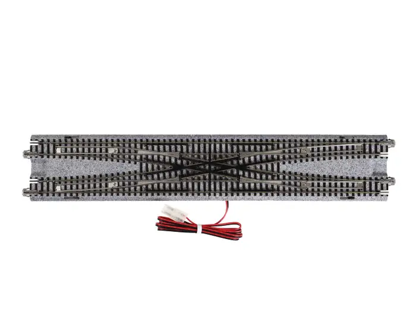

# Dispatch

The dispatcher accepts requests from the scheduler — as events on the bus
([SYSTEM.md](../SYSTEM.md#dispatcher)) — and tries to satisfy them in
the shortest time possible. It is **online** — it commits to decisions without
knowing future requests — and is the research core of this project: deadlock
avoidance at high throughput. Terminology follows [CONTEXT.md](../../CONTEXT.md).

## Semantics

- **Admission** — a request is rejected if no arrival end survives: none
  is a block the train fits, none is an end any route can enter through, or —
  settled at the first launch attempt, from the origin — none is reachable. A
  request stating a departure block its train is not standing in is rejected
  too. All other requests are accepted and queued.
- **Fixed routes** — a route is chosen when the train starts moving and never
  changed; only its locks are incremental
  ([ADR-0002](../adr/0002-fixed-route-per-request.md)).
- **No reversal** — routes are strict pass-throughs; terminal blocks occur
  only as endpoints ([ADR-0001](../adr/0001-no-reversal-within-a-route.md)).
- **Event-driven** — the dispatcher reacts to bus events and never reads a
  clock — it never even learns the tick number
  ([SYSTEM.md](../SYSTEM.md#time)) — so a simulator and a physical layout drive
  it the same way.

### Requests

A request is `(train, departure end, arrival ends, arrival tick)`. The train is
named explicitly — its origin block follows from where it stands — and the
departure end fixes the first transit. The **arrival ends** are a set, and any
one of them satisfies the request; the dispatcher commits to one when it
chooses the route ([ADR-0007](../adr/0007-requests-name-a-set-of-arrival-ends.md)).

Both ends name the end the train **crosses**: `claro_1.B` as a departure means
it leaves through `B`, and `airolo_2.A` as an arrival means it enters through
`A` and comes to rest with its leading end toward `B`. The arrival end is
therefore the end of the route's final transit, and constraining it is how a
scheduler says which way round the train must finish — a fact the reversing
loop makes real, since turning a train costs a second request rather than
being free.

Naming both ends of one block says "either way round" and is exactly the
looser request this model had before. Naming ends on several blocks says the
thing a station actually offers: more than one track will take this train.

**Admission is decided in two stages**, because the two halves of the old rule
need different information:

- At admission — on receipt of the request event — arrival ends are pruned if
  the block cannot fit the train, or if the end appears in no connection — a
  terminal block's dead end, which no route can ever enter through. Both are
  facts about the layout and the train, so both are decidable the moment the
  request arrives. A stated departure block is checked here too, against where
  the train actually stands: the scheduler is layout-blind, so every
  feasibility check is the dispatcher's ([SYSTEM.md](../SYSTEM.md#scheduler)).
  A disagreement rejects the request — reason `wrong_origin` — rather than
  raising, since the submitter may be a stale browser
  ([ADR-0021](../adr/0021-a-bad-request-is-answered-not-raised.md)). A request
  naming no block, as a chained working does, can state no disagreement.
- At the first launch attempt, arrival ends not reachable from the origin are
  pruned. This needs the origin block, which for a chained working is not known
  until its predecessor completes — so `request_rejected` can also be
  published at the first launch attempt, and rejection is not purely an
  admission-time answer.

Either stage rejects the request if it empties the set. The admission stage
records what it dropped, with reasons, on `request_admitted`
([SYSTEM.md](../SYSTEM.md#event-inventory)) — that is where an authoring
slip shows up, so a mistyped end is visible at a known tick instead of silently
narrowing the experiment. The launch stage records nothing unless it rejects,
because a prune that leaves candidates standing changes nothing observable: the
chooser simply has fewer routes to order, and `route_chosen`'s `k_tried`
already says how many it examined.

A request naming the train's current block is accepted with an empty route,
whichever end that arrival names. Whether a request is degenerate is decided
at the **first launch attempt**, alongside reachability — it depends on the
origin block, which for a chained working is unknown until the predecessor
completes. The launch commits an empty route and completes in the same grant
phase, moving nothing and locking nothing, so the request's latency is the
one-tick admission-to-scan skew every request pays. An empty route has no
final transit for the end to constrain, and the dispatcher holds no facing to
check it against — facing is scheduler state it never sees
([ADR-0019](../adr/0019-facing-is-scheduler-state.md)) — so this is the one
case where the arrival end is vacuous. Treating it as degenerate rather than as an error
keeps the admission rule free of special cases.

A request may be pending for a train that is already active on an earlier
request; chained workings make this routine. It needs no mechanism — an active
train is not idle, so its next request simply cannot launch yet.

### Route selection

The route chooser is a **pluggable strategy**. Milestone 1 shipped a pure
topology ordering; #33 made it congestion-aware. The chooser:

1. Consider routes to **every** surviving arrival end, merged into one list.
   The arrival ends are unordered and equally acceptable, so the ordering below
   decides between them; the request states no preference among them.
2. Consider only routes whose every block fits the train.
3. Order by transit count — which is tick count, since every transit costs one
   tick regardless of length.
4. Break ties on congestion: the number of route blocks beyond the origin that
   are locked by another train — idle holders included — or lie on the
   committed remaining route of another active train.
5. Break remaining ties on the lexicographically smallest block-id sequence,
   so repeated runs are bit-identical.

`k` is a single budget over that merged list, not a budget per arrival end, so
it keeps its plain meaning: how many alternatives a launch may try before
staying pending.

Step 4 is what keeps equidistant candidates from concentrating. Arrival ends
on parallel tracks of one station tend to tie at step 3 — a station is reached
by the same line whichever of its tracks the train ends on — and before #33
the lexicographic tie-break alone decided which `k` got tried, so every train
tried the same smallest-id tracks first. That bias was measured twice: as the
`route-blindness` counterexample (ARCHITECTURE.md, property 3) and as an
outright stall of `gotthard/saturation` authored at `|dest| = 6`
([BENCHMARKS.md](../bench/BENCHMARKS.md#the-k-axis)).

The congestion count is a function of the dispatcher's live state, so the
ordering is `(layout, state)` and stays deterministic: the tested
byte-identical-traces property is untouched. The committed-route part of the
count is what restores to `Incremental` the signal `FullRoute`'s up-front
locks gave the next launch for free: under `FullRoute` a committed route is
locked and already counted, under `Incremental` only the first increment is.
Congestion is a tie-break, never an additive cost, so a congested shorter
route still outranks a clear longer one; steering around congestion onto
longer routes stays `k`'s job.

There is no dedupe rule. An earlier draft deduped candidates by resource set,
on the grounds that a route entering the destination at `A` and one entering at
`B` were one option spelled twice. Under arrival-end sets they are two
different answers the caller explicitly asked for — and the rule could never
have fired as written anyway, since a simple route is determined by its
resource set.

### Queue discipline

Greedy, with aging. At **every** grant phase the dispatcher scans pending
requests and launches each whose conditions hold, skipping the rest that
round. Unconditionally: the first launch of a run follows an admission, not a
release, so a scan gated on released resources would never start the batch
workload. Skipping a scan when nothing was released *and* nothing was
admitted since the previous phase is a valid optimization, not a semantic
rule.

The scan order is most-refused first, admission order among equals (#34;
[ADR-0012](../adr/0012-the-pending-scan-ages-by-refusal-count.md) records why
plain arrival order starved through-traffic). Aging gives a starved request
first claim on whatever just freed. The refusal count is dispatcher state,
never wall-clock, so the order stays deterministic; a train's chained
workings keep their order for free, since an untried later working has no
refusals and a later seq. The ordering key remains an explicit policy point:
it only chooses which *safe* launch is tried first, and could change again
without touching the safety core.

Starvation is thereby bounded in practice, not prevented in principle: max
per-request latency remains the detector. Starvation is not deadlock; see
[SAFETY.md](SAFETY.md).

### Launch and completion

Occupancy is a **standing lock** — every train always holds the lock on the
block it stands in, moving or parked, requested or not. Launching is therefore
not "taking a lock on the train's own block"; it is the safety layer granting
the request's first increment: the first transit plus the second block under
incremental locking, or the whole route under the full-route baseline.

**The queue does not filter on arrival occupancy.** A request whose arrival
blocks are occupied is scanned like any other; whether it launches is the
safety check's answer, not the queue's. The two cases differ: an *idle*
occupant is a permanent obstacle and the launch is refused until it leaves, an
*active* occupant that has begun moving no longer counts as holding the block
([SAFETY.md](SAFETY.md#state)). Keeping that distinction out of the queue is
what keeps the avoidance layer the single place deadlock is reasoned about.
With a set of arrival ends the refusal is rarer but unchanged in kind: the
launch waits only when *every* candidate is refused, not merely the first.

A request completes on the tick its final transit finishes: the trailing
transit and origin block release, and the train parks holding only its standing
lock. Latency is completion tick − arrival tick.

## Time model

Time is synchronous discrete **ticks**: each tick, every moving train
completes one transit into its next block. Travel time within blocks is
ignored, and so is transit length — the long return loop and a station ladder
both cost one tick. The tick's ownership and mechanics belong to
[SYSTEM.md](../SYSTEM.md#time): the layout interface publishes the tick event,
and the dispatcher — which never learns the tick number — treats each tick
event as its **grant boundary**. What follows is the dispatcher's semantics
at that boundary. An event-driven clock with real traversal times can replace
ticks later without changing the dispatcher.

**Buffer until the boundary.** Sensor events arrive as atomic facts and are
buffered; the tick event triggers the grant phase, which treats everything
buffered since the previous tick as a **set**. Grants are a pure function of
that set, never of the order events happened to arrive — and under a future
MQTT transport a straggling sensor is simply processed at the next boundary:
a deferred grant, conservative and safe, never an unsafe one.

**One tick still produces the three phases**, now as the cascade the tick
event causes rather than a loop written out: the layout executes the previous
grant phase's commands and reports the moves (`block_occupied(new)`,
`block_vacated(old)` — the origin block and transit release atomically); the
scheduler's due requests arrive and are admitted on receipt; the grant phase
runs over the buffered set. Everything published in reaction to one tick is
handled at the next, so grants take effect one tick after the releases that
enabled them.

**Lock footprint.** A train moving from `X` through `T` into `Y` holds
`{X, T, Y}` for the move and releases `X` and `T` atomically on arrival. `T`
and `Y` are granted together, which is what makes a transit never held across a
wait — the premise the whole deadlock argument rests on.

**Grant order** — within the grant phase, active trains first (by request
arrival tick, tie-break train id), then pending launches in the aging order
of the queue discipline above.
Draining work in progress before admitting new holders favours makespan and
mirrors the progress argument of [SAFETY.md](SAFETY.md): advancing the head of
the witness ordering is always safe, while launching adds a resource holder.
Because the grant phase takes the whole buffered set, this order never depends
on the order sensors happen to fire.

**No same-tick handoff.** A lock released by the moves reported at tick `n` is
grantable in tick `n`'s grant phase, but the grantee's cross command executes
at tick `n+1`. A convoy
therefore starts with a one-tick stagger and then flows at one block per train
per tick — the backward-propagating start wave real trains have. Minimum
latency is the one-tick admission-to-scan skew plus one tick per transit;
the degenerate request's launch-and-complete is the zero-transit case.

**Sensors are anonymous.** The layout interface reports only
`block_occupied(block)` and `block_vacated(block)`, with no train identity —
the least a block-occupancy sensor can be asked to produce. The dispatcher
recovers identity from its own lock table, which already records the grantee of
every block. This is what lets a simulator and a physical layout drive the
dispatcher the same way.

## Locking

1. **Full-route locking** (baseline) — lock every block and transit of a route
   before the train moves; unlock each behind the train. Trivially
   deadlock-free, low throughput. Serves as the benchmark yardstick.
2. **Incremental locking** (research core) — lock only what the train needs to
   advance: usually its current block plus the next transit and block.
   High throughput, but naive incremental locking deadlocks — e.g. two trains
   entering a section of two facing blocks with no other connections between
   them each wait forever for the other to depart. The deadlock-avoidance
   layer that prevents this is the central problem; see
   [SAFETY.md](SAFETY.md).
3. **Transit concurrency** — a connection declares which pairs of its transits
   are `concurrent`; every other pair conflicts
   ([ADR-0006](../adr/0006-conflicts-declared-by-inversion.md)). A crossing that
   declares its two straight transits concurrent therefore accepts two trains
   at once on them, but only one on either crossing transit. Transits are also
   self-exclusive, so head-on use is excluded without declaring anything. A
   grant succeeds when the transit is unlocked and no currently-locked transit
   at that connection conflicts with it — an instantaneous admissibility test
   at the grant, not part of the deadlock check.

   

## Research

The [survey](../research/deadlock-avoidance-survey.md) assessed known theory
against this model — banker's-style safety checks (applicable because routes
are fixed), resource-allocation graphs and cycle detection, deadlock avoidance
in AGV systems, Petri-net approaches, and railway zone control. The resulting
choice is a route-aware banker's safety check
([ADR-0003](../adr/0003-route-aware-bankers-safety-check.md)); the check itself
and its deadlock-freedom argument are in [SAFETY.md](SAFETY.md).

## Metrics

Benchmarks feed the dispatcher a fixed list of requests and report the four
metrics below; the suite that produces them is [BENCHMARKS.md](../bench/BENCHMARKS.md),
and each metric is computed as a pure function of the event trace
([bench/METRICS.md](../bench/METRICS.md)).

- **Makespan** (headline) — ticks from first arrival until the last request
  completes.
- **Per-request latency** — completion − arrival; mean and max (catches
  starvation).
- **Resource utilization** — fraction of ticks each block/transit is occupied
  or locked, over the whole run (tick 0 through the trace's final tick).
- **Cross commands per tick** — instantaneous parallelism.
