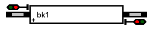
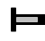
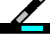
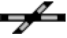
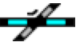
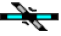
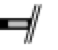

# Layout editor

Design for the visual layout editor, decided in #41 and settled in detail
here. Second phase of the UI work, after derivation
([DRAWING.md](../store/DRAWING.md)) and before the [panel](PANEL.md).
Terminology follows [CONTEXT.md](../../CONTEXT.md).

Prototype railways use signal boxes (*Stellwerke*) to display track occupancy
and related state; model railroads mimic them. The editor creates and edits
the drawings those displays render.

RocRail supplies an editor and display, but it is closed source, assumes
control of the layout, and its editor is unpleasant to use, orienting
diagonal pieces in particular. Layouts need editing rarely, so keeping the
editor simple at the expense of some convenience is the design choice
throughout; the panel, which is used constantly, is where polish goes.

## What it is for

Drawing a railroad is the easy half. The hard half is knowing that the picture
means what you think it means, because what the dispatcher runs is not the
picture but the netlist derived from it, and the interesting part of that
netlist is which movements may run at the same time.

Airolo makes the point. Its WX310 is drawn the standard way, four turnouts and
a crossing, and derivation composes 19 transits and 33 concurrent pairs out of
them. Nobody can confirm 33 pairs by reading them. So the editor shows the
derived netlist beside the drawing and, for any transit, the way it takes and
the reason it excludes each other transit. That is the feature the rest of the
editor exists to serve.

## Canvas

The canvas is a grid of squares, and the grid is not negotiable. A symbol
occupies one or more whole squares; each square is free or occupied by exactly
one symbol. Pins sit at the centres of square sides, which is why symbols
rotate in 90 degree steps and flip. Diagonal running comes from wires at
angles, not from rotating symbols.

A free-standing pin sits at a face centre like any other pin. Being on a
boundary it occupies no square, so a bend may sit against an occupied one.

Zoom and pan are the SVG `viewBox`.

## Palette

The placeable symbols, with their semantics defined in
[DRAWING.md](../store/DRAWING.md#symbols):

| Symbol | | Notes |
| --- | --- | --- |
| Block |  | shows occupancy on the panel; carries a signal and a sensor at each end |
| Terminal |  | deliberate track end |
| Turnout |  | |
| Crossing |  | |
| Single slip |  | |
| Double slip |  | |
| Portal |  | paired by label |

Signals and sensors are not palette entries. Every block has both at both
ends, so there is nothing to place.

Crossings and slips come in several appearances, because wires meet a symbol
at whatever angle their pins give them and a crossing drawn for legs at 0 and
15 degrees is not a rotation of one drawn for 15 and 30. All appearances of a
kind share one footprint and one pin set, so choosing one is a property in the
right-click dialog rather than a row of palette tiles, and choosing one can
never resize a symbol or collide with a neighbour.

The generic connection symbol is not placed and not drawn. It has no fixed pin
set to place, migration is over, and its last user is Gotthard's Claro east,
which is to be redrawn from real symbols.

## Drawing wires

Clicking a pin starts a wire: a wireline follows the pointer, softly snapped
to multiples of 15 degrees, with a click on a pin overriding the snap. The
snap is an aid for laying parallel track, not a rule; a wire takes whatever
angle its two pins give it. Clicking empty canvas places a free-standing pin,
a bend, and continues; clicking a pin that can accept the wire ends it.

Dropping a symbol so that one of its pins lands on another's is the fast way
to join them, and it writes a real wire of zero length. Turnouts are usually
built this way. What it does not do is make position meaningful: the wire is
in the file, so dragging the symbol away later stretches the wire instead of
breaking the connection.

Wire geometry is decorative. Wires must not cross symbols or other wires, but
the rule is enforced by warning, never by rejecting the edit: an overlap is a
misleading picture, not a wrong layout, so the offending segments are
highlighted and listed, and derivation proceeds. Rejecting edits would mean
collision detection fighting every drag.

## Editing

Left click selects; drag moves; mouse rubber-band or shift-click selects
groups. Moves rubber-band the wires: an endpoint attached to a moved pin
stays attached and stretches, and a wire whose both owners move translates
rigidly, so a move can never change the derived layout. Rotate, flip, and
delete apply to the selection, from a right-click menu with key bindings.

Deleting a symbol deletes its wires, and the pins at their far ends go red.

Undo and redo are snapshot-based: the drawing is a small document, so every
mutation pushes a copy. Copy and paste is not supported; it opens id and
portal-label questions that rare layout editing does not justify.

### Properties

The right-click dialog edits a symbol's name, and per kind: a block's length,
display label and sensor ids; a crossing's or slip's appearance; a symbol
leg's transit name.

A block's key is a short stable id and its label is its real name, `Zürich HB
Gleis 1`. The id prefixes every transit id in a trace, so it is worth keeping
short and worth not renaming; the label is free to change.

Transit names are set on a symbol's legs, which is how the drawing stores them
and how they behave: a name written on a turnout's straight leg is taken by
every derived transit that runs through it. Naming a leg and watching which
transits in the netlist pane pick the name up is the explanation. A transit
that crosses two named legs is refused, and the finding says which two.

### Junctions

A junction is a connected group of non-block symbols, which is exactly what
derivation computes, so the editor computes it too rather than asking. Wire a
crossing to a turnout and they become one tinted region with one name. That
region is worth looking at in its own right: a stray wire that merges two
throats into one junction is visible as one region where you expected two,
long before it shows up as a wrong concurrency pair.

Names are minted, `j1`, `j2`, and written into the drawing at once, so a
junction always has a valid name and nothing interrupts a sketch. Renaming is
one click on the region, and worth doing when the junction earns a name,
because the name heads its section in the netlist and prefixes every transit
id through it.

Deleting a symbol can split a junction in two, and wiring two together merges
them. A minted name is re-minted silently on both sides; nobody is reading
`j7`. A name someone typed stays on both halves, which derivation refuses as
a duplicate, and the findings list says so. Choosing which half is Airolo is
not the editor's decision to make.

A wire joining two blocks directly is a connection too
([DRAWING.md](../store/DRAWING.md#a-wire-between-two-blocks)). Its name is
minted the same way, nothing is drawn for it, and it can be renamed from the
wire's own menu.

## Inspecting the netlist

The derived netlist sits beside the canvas and redraws as you edit. It is the
same content `tc49 layout show` prints: blocks, and per connection its
transits with their two block ends and its concurrent pairs.

Selecting a transit lights its way on the canvas, symbol by symbol and leg by
leg, and lists every other transit at that connection as either concurrent or
excluded, naming the symbol they share. *Exclusive because both take `sw16`*
is a claim about the drawing that can be checked by looking at it. Selecting a
symbol gives the inverse: every transit through it, split into those that can
run together and those that cannot.

Derivation refusing is shown the same way, at the edit that caused it.

## Validation

Findings are listed in one panel:

- pins with one connection, and unpaired portal labels: save allowed,
  derivation refused;
- duplicate connection names after a split, and transits naming themselves
  from two symbol legs: save allowed, derivation refused;
- overlaps of wires with symbols or wires: warning only.

Editing and running the same railroad at once is not prevented. The store
snapshots at startup, so a run in progress keeps the layout it began with and
an edit lands for the next one.

## Scenario editing

Placing trains is dragging onto blocks; train length is set in the same
properties dialog that sets block length, keeping the flat
`{length: n, at: block}` scenario shape. The composed loco-and-car roster of
[GOALS.md](../GOALS.md) is deferred; the `trains:` key is unchanged either
way.

## Implementation

TypeScript, pnpm, Lit and Shoelace, at `ui/` in the repo root. The drawing
surface is SVG in the DOM: hit-testing, hover and selection come from pointer
events, live state is a CSS class toggle. Gotthard is a few hundred elements,
far below where SVG struggles.

Diagram libraries (JointJS, GoJS, React Flow) were considered and rejected:
their value is auto-routing and free-form graph models, the first deliberately
absent here and the second replaced by seven fixed symbols, and each brings
its own document model to fight. Canvas engines pay off at thousands of
animated elements, not a few hundred static ones. What the editor needs, grid
snap, a wireline preview, class toggles, `viewBox` zoom, is smaller than any
library's learning curve.

**The front end knows no topology.** Pin degrees, junction membership, the
derived layout and the explanations all come from one endpoint that takes the
current document and returns them. TypeScript owns placement, geometry,
mutation and rendering, and nothing else. A second implementation of the
union-find would eventually disagree with the first, and it would disagree
inside the tool whose job is to be believed.

The server is the store's own HTTP face, `src/tc49/store/server.py`: list
drawings, read one, write one, derive, explain. It belongs to the store
because every one of those is a store operation, which keeps
`tests/system/test_app_boundaries.py` intact. The panel later adds a bus
bridge alongside it ([PANEL.md](PANEL.md#implementation)).

Symbol pins and transits are generated into `ui/src/symbols.generated.ts` from
the library in `drawing.py`, with a test asserting the generated file is
current, so a renamed pin is a TypeScript compile error rather than a wrong
drawing. Artwork stays hand-written against those names.

### Tests

The editor's document, symbols and placements and wires and undo snapshots, is
a plain TypeScript module with no DOM, and that is where the Vitest tests are.
It is the layer where a bug is invisible on screen and corrupt in the file: a
move that detaches a wire, an undo that half-restores. Lit components stay thin
enough that there is little in them to test, and one grows a test when it grows
logic. No browser automation for now.

On the Python side: the endpoints, `explain()`, and a round trip asserting a
loaded and saved drawing keeps its comments.

## Order of work

The first cut is what the netlist needs: place, move, rotate, flip, wires,
junction regions, leg naming, the live netlist, the inspector, red pins, undo.
Scenario editing, portals, group selection and overlap warnings come after.
None of them can change a derived netlist, which is why they wait.

No committed drawing has any placement and there is no auto-layout, so each
railroad is drawn once by hand: `facing-pair` first at five symbols, then
`crossover-yard` at fifteen because its scissors crossover is the derivation
that DRAWING.md leans on hardest, then `single-track-meet`, then Gotthard at
thirty-six symbols and forty-four wires. Each drawn railroad is checked by
deriving it and comparing against the layout derived from the committed file.
Structure should match exactly; transit names will differ wherever a `names:`
override has not been re-entered.

Gotthard is last because Claro east has to be drawn from real symbols to be
drawn at all, and that is #35: the netlist and the hand-written layout
disagree about its geometry. It is a topology change rather than a drawing
one, and it lands on its own, with the trace churn reviewed. Settling it is
the first real use of the editor.
