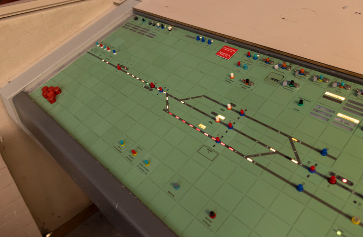
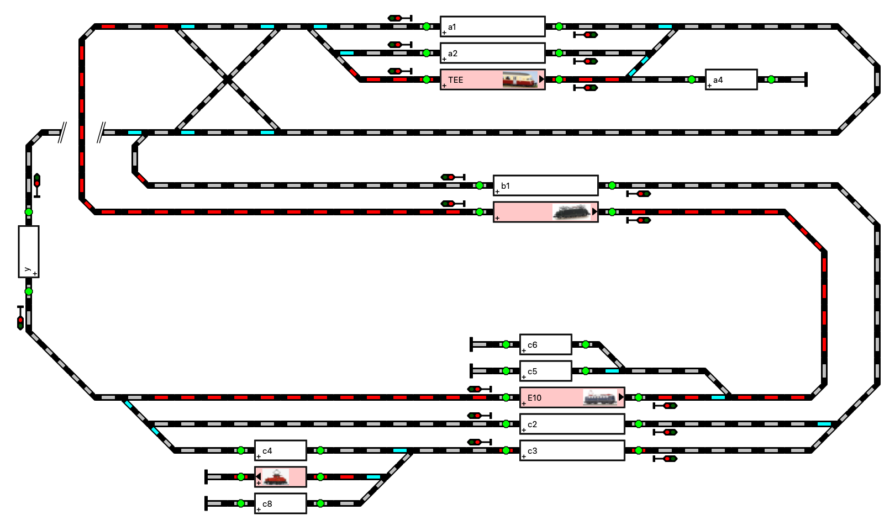
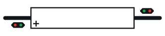
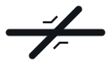
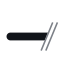
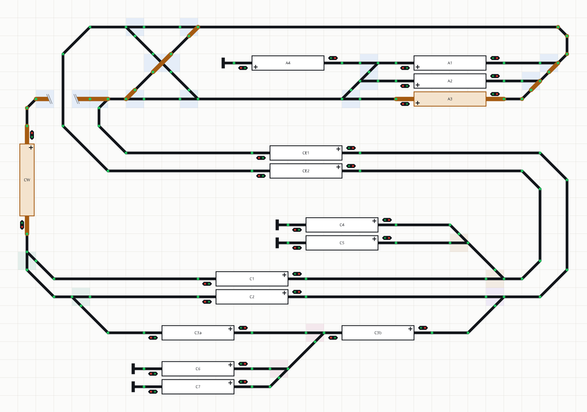

# Layout editor

Design for the visual layout editor, decided in #41 and settled in detail
here. Second phase of the UI work, after derivation
([DRAWING.md](../store/DRAWING.md)) and before the [panel](PANEL.md).
Terminology follows [CONTEXT.md](../../CONTEXT.md).

Prototype railways use signal boxes (*Stellwerke*) to display track occupancy
and related state; model railroads mimic them. The editor creates and edits
the drawings those displays render.

RocRail supplies an editor and display, but it is closed source, assumes
control of the layout, and its editor is unpleasant to use, orienting
diagonal pieces in particular. Layouts need editing rarely, so keeping the
editor simple at the expense of some convenience is the design choice
throughout; the panel, which is used constantly, is where polish goes.

The same railroad in this editor. Track is black and a block's rectangle white,
and every pin is drawn.

## What it is for

Drawing a railroad is the easy half. The hard half is knowing that the picture
means what you think it means, because what the dispatcher runs is not the
picture but the netlist derived from it, and the interesting part of that
netlist is which movements may run at the same time.

Airolo makes the point. Its WX310 is drawn the standard way, four turnouts and
a crossing, and derivation composes 19 transits and 33 concurrent pairs out of
them. Nobody can confirm 33 pairs by reading them. So the editor can show the
derived netlist beside the drawing and, for any transit, the way it takes and
the reason it excludes each other transit.

That was once the feature the rest of the editor existed to serve. It is now a
debugging view, opened when something looks wrong rather than kept on screen
while drawing: enough railroads have been drawn that derivation is trusted
([ADR-0024](../adr/0024-the-drawing-shows-its-own-faults.md)). What the editor
is for day to day is the drawing itself, and everything wrong with a drawing is
marked on the drawing.

## The band

A band across the top of the page, above the controls, naming what is open and
saying what is going on outside the drawing. The panel wears the same one
(`tc-header`, [PANEL.md](PANEL.md#implementation)), both pages having the same
two things to say: which railroad is on screen, and what is wrong that is not
the author's doing.

It names the drawing, or says plainly that none is open, and marks it with a
dot while it holds edits the store has not been given. That state had no
indicator at all before: it was inferrable only from the Save button being
enabled, which is a control's affordance doing a status line's job, and #85
took that button off the screen entirely.

**The store not answering reads here.** That is what is wrong that is not the
author's doing; what the author has to fix is marked on the drawing
([Validation](#validation)). A name no drawing can wear is the one refusal that
joins it: it is typed at a prompt that is gone by the time it is refused, and
nothing on the canvas is wrong ([Files](#files)).

Beside it, one coarse indicator: this drawing derives, or it does not. It names
no fault and counts nothing, the canvas being where you find out where. A drawing
with an overlap or a turnout still lacking an address leaves it clean, both
being drawings that derive
([ADR-0024](../adr/0024-the-drawing-shows-its-own-faults.md)).

The band names the page it is on and links to the other, which is the whole of
the navigation. The editor and the panel are separate entries and separate
apps ([ADR-0016](../adr/0016-the-panel-is-a-scheduler.md)) and nothing here
merges them.

It costs about 2rem off a full-height grid, and that is accepted: the rows
become the band, the bar, and the work.

## The bar

Under the band, a menu bar: `File`, `Edit` and `View` at the left, and the zoom
and fit buttons pinned at its right end. Every command the editor has is in it,
with the key that does the same thing printed beside the item.

    File   New…  ·  Open ▸ (the drawings, ✓ on the open one)  ·  Save ⌘S
           ·  Save As… ⇧⌘S  ·  ──  ·  Export SVG…
    Edit   Undo ⌘Z  ·  Redo ⇧⌘Z  ·  ──  ·  Rotate R  ·  Flip F  ·  Delete ⌫
           ·  ──  ·  Properties…
    View   Zoom in +  ·  Zoom out −  ·  Fit 0  ·  ──  ·  Netlist N

**Open is a submenu, not a dialog.** Layouts are edited rarely, so the list of
drawings is short and stays short, and a submenu is one gesture where a dialog
is three. The drawing that is open is ticked, and the tick is all that entry
is: choosing it closes the menu as any item does and changes nothing else
(#101). Re-reading the open drawing would throw away whatever has been drawn
since, which is a lot to ask of a click that looks like it does nothing.

**New… and Open show no key.** Chrome keeps `⌘N` for a new window; it never
reaches the page and cannot be `preventDefault`ed, and `⌘O` is unreliable for
the same reason. A blank is better than a binding the browser eats. `⌘S` and
`⇧⌘S` are the editor's.

**Zoom and fit stay one click.** They are pressed constantly while drawing and
`View ▸ Zoom in` is three clicks for what is now one, so those three are also
icon buttons at the right end of the bar. Undo and redo are not: `⌘Z` and
`⇧⌘Z` are known, and the `Edit` menu is where they are read.

**Sliding along the bar reads the next menu.** With one menu down, the pointer
crossing onto a neighbouring title puts that menu down, as every menu bar does,
and the click the hand lands there afterwards is absorbed — it neither closes
what the hover just opened nor re-opens it (#100). A second click closes it.
With no menu down, the pointer crossing the bar opens nothing.

**While a menu is down, the bare keys are the menu's.** `r`, `f`, `n`, `0`,
`+`, `-`, Delete and Backspace do not reach the canvas, and Escape closes the
menu rather than clearing the selection. That is the same bug as a key typed
into a dialog field reaching the canvas, one of the six of `ddbefb2..feb1fae`,
wearing a menu.

**A shortcut is not a bare key.** `⌘S` and `⌘Z` are printed beside the items
they duplicate, so with `File` down `⌘S` takes the menu up and saves, the same
as clicking the item that just taught it. Swallowing it would leave the key the
menu names doing nothing while Chrome's own `⌘S` offers to save the page over
the app.

What is dead and what is alive is not the bar's to decide. Save is dead with
nothing open or nothing to write, Rotate, Flip and Delete are dead on an empty
selection, Properties on anything but one symbol that has some, Undo and Redo
at the ends of the snapshot stack, Open with no drawing to open, Export SVG…
with nothing to export. Those rules
are `model/commands.ts` with a test and no DOM, which is the rule
[below](#tests): the model owns the document, a component owns the DOM, and a
rule that is neither is a module in `model/`. The keyboard asks the same module
the bar does, so an item and the key beside it cannot come to mean different
things. One switch turns the command into the verb it runs, and its default arm
assigns the id to a `never`, so a command added to the union without an arm
fails to compile rather than drawing a live item that does nothing (#102).

Export SVG… writes the drawing to a file; what it writes is under
[Files](#files).

## Canvas

The canvas is a grid of squares, and the grid is not negotiable. A symbol
occupies one or more whole squares; each square is free or occupied by exactly
one symbol. Pins sit at the centres of square sides, which is why symbols
rotate in 90 degree steps and flip. Diagonal running comes from wires at
angles, not from rotating symbols.

**The squares are not ruled. While a wire is in flight the face centres are
marked instead.** A grey dot sits on every centre of a square side: that is
where every pin sits, and it is exactly where a wire can land a bend, so the
marks and the landing sites are the same set. They are drawn between the click
that starts a wire and the one that ends it and at no other time, that being
when the question is asked; the sheet is otherwise bare.

Ruled lines marked the square corners, which are the one class of point no pin
can occupy and no wire can reach. No shift of a ruled grid could have fixed
that — pins fall on both families of side centre, the ones a whole step across
and half a step down and the ones the other way about, and no one translation
carries both onto the crossings of a square grid. The dots read as a brick
pattern rather than a scatter: along any row they are one square apart, and
the next row is half a square across and half a square down.

A free-standing pin sits at a face centre like any other pin. Being on a
boundary it occupies no square, so a bend may sit against an occupied one.

Placing and dragging keep that invariant. A drop that would cover an occupied
square places nothing, and the ghost says so before the drop by tinting the
squares in the way. A drag of the selection holds its last legal offset while
the pointer is over an obstacle, and follows the pointer again once the offset
is clear.

Rotate and flip are not constrained, since a turned symbol has a different
footprint and can land on a neighbour. An overlap is marked instead, on the
squares that are shared, in the quieter of the two weights, since it derives
fine ([Validation](#validation)). It is computed from the
drawing rather than raised by the action, so it reads the same after an undo or
after opening a file that already had one.

Zoom and pan are the SVG `viewBox`: the wheel zooms about the pointer and the
middle button pans. Both directions of the wheel were there from the start and
neither was findable, so the bar carries a minus and a plus beside Fit and the
keyboard has `+`, `-` and `0`.

A bend is placed by the same two keys as any other symbol, `at` naming a cell
and `rot` turning its one pin onto a face of it
([DRAWING.md](../store/DRAWING.md#geometry)). That makes a bend's `rot` its
orientation rather than a turn, so dragging one cannot translate by whole cells
the way every other symbol does: it would only ever reach faces of the
orientation it was born with. A bend dragged alone snaps to the nearest face
instead, `rot` and all. In a selection of several it translates rigidly with
the rest, where the whole-cell rule is the one that applies.

No committed drawing has any placement, so opening one deals its symbols into
rows to be dragged from. That is not auto-layout and says nothing about the
topology; it is an ordinary edit, undone like any other and saved only if the
drawing is saved.

## Palette

A symbol is dragged out of the palette onto the canvas. There is no armed tool
and no mode: nothing about the editor's state changes what the next click on
the canvas means, which was the trouble with arming a tile — the screen said
the tile was pressed, and nothing said the next click would put a turnout
where you were only trying to select.

The symbol follows the pointer as a ghost drawn on the grid, at the cell it
would land on, in the artwork it will be placed in. Its footprint centres on
the pointer; `at` names a whole cell, so an even-width footprint lands half a
square off, which is as close as the grid allows. Nothing is drawn while the
pointer is off the canvas, there being nowhere to place it there.

`r` turns the ghost and `f` flips it, the same two keys that turn and flip a
selection. The orientation is sticky: it carries into the next drag, whatever
the kind, because a rotated run of turnouts should cost one keypress for the
run and not one for each of them. The tiles keep showing the symbol at 0
degrees; the ghost shows the truth the moment it is grabbed. Escape, Delete and
the right button abandon the drag.

A portal is placed as a pair. Dropping one puts its mate straight back in
flight, wearing the same label and turned 180 degrees, so the next click lands
the far end. The turn suits track that vanishes and continues the same way
somewhere else, whose two mouths face opposite; `r` turns it for the drawings
that do not. Nothing is asked and nothing is armed: the mate is the same ghost
under the same three keys, and the pair is one undo step, so undo takes both
halves back and undo mid-flight takes the first half and the ghost together.
Abandoning the mate leaves one portal, which is a fault marked on the drawing
rather than an error ([ADR-0020](../adr/0020-a-portal-is-placed-as-a-pair.md)).

Tiles carry no names. Each kind is drawn one way, so the drawing is the name,
and the title attribute has the word for anyone who wants it.

The tiles are laid out in three groups, in the order of the table below: the
block by itself; the six symbols track crosses or divides at, two to a row so
that the pairs — the two slips, the two 90 degree crossings — sit side by
side; and the two ends of a drawing, where track stops and where it leaves the
sheet. Space between the groups is the only thing telling them apart. A
heading would be the only word in the palette, naming a category the symbols
already show. The block takes a whole row rather than half of one: its 6x1
tile is as wide as the pane allows, and halving it would draw it smaller than
every other symbol when the tiles are all at one grid square.

The placeable symbols, with their semantics defined in
[DRAWING.md](../store/DRAWING.md#symbols). The images are the tiles themselves,
all at one grid square, so a symbol's width here is its footprint; the
dimensions below are normative.

| Symbol | | Notes |
| --- | --- | --- |
| Block |  | shows occupancy on the panel; carries a signal and a sensor at each end |
| Turnout |  | |
| Crossing |  | |
| Single slip |  | |
| Double slip |  | |
| 90° crossing |  | upright, two straight routes |
| 90° crossing, diagonal |  | the same at 45 degrees |
| Terminal |  | deliberate track end |
| Portal |  | paired by label; placed as a pair |

Signals and sensors are not palette entries. Every block has both at both
ends, so there is nothing to place.

The generic connection symbol is not placed and not drawn. It has no fixed pin
set to place, migration is over, and since Claro east was redrawn from real
symbols (#58) it has no users left at all.

### Units and colours

One grid square is the unit G. Every dimension on the canvas is a fraction
of G, so the drawing scales as one piece; the size of G on screen is the
`viewBox` zoom and is not stored. Track and wire width is W = f·G with
f = 0.15. The fractions and the colours are named constants in one
TypeScript module, the colours as CSS custom properties; configuring the
look is editing that module, not a settings UI.

Track is drawn solid, never patterned: wires run at any angle, so a pattern's
spacing would vary with direction. A track stroke ends in a round cap and pins
are round, so track joins seamlessly at any wire angle; a wire meeting a fixed
45 degree leg at another angle reads as a rounded bend, not a kink.

Track that ends inside another shape is cut instead, because a round cap would
bulge past a buffer bar or a portal's mouth. Where the end is square the cap is
butt; where it is oblique the stroke is clipped, so the stub still lights and
still widens like any other track rather than reading as a solid.

The signal, the tick, the buffer bar and the portal's mouth are proportioned
against the grid square rather than against W. They are marks the size of a
tile, not track that widens with it, so their fractions are of G and stay that
way.

Colours follow the editor's mode. In edit mode track is black and a block's
rectangle is white, and a signal shows all its lamps lit. Run mode, out of
scope for now, recolours by toggling classes: track by route reservation, a
block's rectangle by occupancy, and a signal by dimming the lamps its aspect
does not light, whichever aspect the dispatcher says
([ADR-0025](../adr/0025-a-signal-is-what-the-dispatcher-tells-the-driver.md)).
An aspect is a set of lamps rather than one of them, so the class goes on the
signal's group and never on a lamp.

### Pins

Pins are circles of diameter W. In edit mode every pin is drawn: green when
satisfied, red otherwise, straight from `/review`'s `red_pins` — the front
end computes no topology. In run mode pins are not drawn and track reads as
continuous.

### Symbol geometry

Coordinates in G, origin at the top left of the unturned footprint, pins on
face centres as always. Rotations and flips give the other orientations.

**Block**, 6×1, pins at `(0, 0.5)` and `(6, 0.5)`. A centred rectangle
4G×0.8G, border 0.3W, filled white in edit mode, and a 1G track stub on each
side. The label, the block's name or the train parked in it, is
centred in the rectangle; sensors are not drawn and everything else lives in
the right-click dialog. A plus at the rectangle's lower corner on side A marks
that side, drawn at the rectangle's own 0.3W.

The label turns with the block but not inside its artwork: a horizontal block
reads upright and a vertical one bottom to top, at both quarter turns and
under a flip, so a label is never upside down and never mirrored. Which end is
A is the plus's business, not the label's. It is drawn at 0.50G, or at
whatever smaller size makes it fit the rectangle's long side — that being the
width it has to fit whichever way the block stands. The size is estimated from
the name's length rather than measured, since measuring means a second render
pass to read a number the label is already laid out from, and a label a few
percent smaller than it had to be is invisible where a render loop is not.
There is no floor: a name long enough to shrink past legibility is drawn small
rather than clipped, because the zoom rescues small text and nothing rescues
text that is not there.

Each stub carries a signal centred on it, unless nothing ever leaves that end:
a chamfered plaque 0.75G by 0.22G floating 0.09G clear of the track, holding
three lamps 0.11G across at a pitch of 0.22G, with 0.10G of margin at each
end. There is no mast. The A signal hangs below the track, on the left of a
train leaving through A, as the SBB places signals. The B signal is the A
signal turned 180 degrees about the block's centre, above the track with its
lamps in the opposite order, which keeps the symbol point symmetric and makes
rotation and flip read naturally.

**The lamps are ordered by distance from the block's rectangle**: green
furthest, red between, amber nearest. That is the Swiss head — green, red,
amber from the top — laid on its side with its top pointing away from the
block. Distance from the rectangle is the only way to say it that survives a
rotation, a flip and the 180 degrees between the two signals of a block; a
plaque lying along the track has no top of its own.

The plaque grew only in the middle. Its width across, its 0.09G chamfers and
its 0.09G clearance of the track are the two-lamp plaque's, and so are the
lamp pitch and the end margins: `2 x 0.22 + 0.11 + 2 x 0.10` is the 0.75G. At
0.5G from the pin it spans 0.125G to 0.875G of a 1G stub, clear of both the
pin and the rectangle. These numbers were settled by looking at the built run
mode, which is what the earlier draft of this page deferred them to.

**An end nothing leaves carries no signal.** A siding's blind end — Claro 4's
B end, which runs into a buffer stop — could only ever show red, and a signal
that can never clear is furniture. Which ends those are is read off the
derived layout: an end appears in a transit or it does not, joints being
transits too, so no topology is computed here. The plaque and every lamp are
omitted rather than dimmed, a dim signal being an aspect and there being no
signal there to show one.

An end goes dark only once its pin is satisfied. An unwired end is in no
transit either, but it is unfinished rather than blind, and a block whose
signals vanished the moment it was dropped — the palette tile and the ghost
having just shown both — would read as a fault in the drawing rather than a
fact about it. A drawing that does not derive is no answer at all, and every
signal stays.

**Terminal**, 1×1, pin at `(0, 0.5)`. A track stub from the pin to a
vertical bar 0.6G tall and 1.2W wide: the buffer stop. The stub is cut square
at both ends. At the bar the cut keeps it from bulging past it; at the pin the
pin covers the cut in edit mode and the incoming wire's round cap covers it in
run mode.

**Turnout**, 1×1. `toe` at `(0, 0.5)`, `straight` at `(1, 0.5)`,
`diverging` at `(0.5, 0)`. Both roads leave the toe: the straight road runs
to the east pin, the diverging road is a 45 degree stub to the top pin. This
is the only 1×1 geometry with a 45 degree leg ending on a face centre, and a
wire continuing at 45 degrees reaches the next row's track line in half a
square, which is how turnouts stack between parallel station tracks.

**Crossing and slips**, 2×1. Route `a` is the horizontal, `a1` at
`(0, 0.5)` to `a2` at `(2, 0.5)`; route `b` is the 45 degree diagonal, `b1`
at `(0.5, 1)` to `b2` at `(1.5, 0)`. They cross at `(1, 0.5)`, the face
centre the two squares share, so the crossing is exactly two turnouts toe to
toe, the second rotated.

All three kinds share this artwork. A slip adds a tick, the road it has and a
plain crossing has not: two straight strokes, one parallel to each of the two
legs the road joins, offset 0.22G from each leg's centreline and meeting where
those two offset lines cross. Arms about 0.14G, hairline weight, square ends,
no flare. The tick sits in the obtuse sector between the two legs, the only
pair a slip road can join, so where it is says which road exists: one for the
single slip (`a1`–`b2`), both for the double.

A lit transit lights exactly the track it traverses: each route is drawn as
two half-strokes meeting at the crossing, so a through route lights its two
halves and a slip lights its entry half, its tick, and its exit half.

**90° crossings.** `crossing_90`, 1×1: two straight routes through the four
face centres, horizontal and vertical. `crossing_90d`, 2×1: the same
crossing drawn diagonally, a symmetric X of two 45 degree routes, `(0.5, 1)`
to `(1.5, 0)` and `(0.5, 0)` to `(1.5, 1)`, crossing at `(1, 0.5)`. They are
two kinds, not two appearances of one, because their footprints and pin
positions differ; a symmetric X through the centre of a square footprint
would need corner pins, which is why the diagonal one is 2×1.

**Portal**, 1×1, pin at `(0, 0.5)`. A track stub whose end is cut at 22
degrees from vertical, and two grey hairlines at that same angle beyond it,
each about 0.53G long: the first crosses the track's centreline at the cut, the
second 0.09G further out.

A portal whose label pairs with nothing wears that label, drawn in red beside
its mouth: 0.30G text, upright at every rotation, beginning at `(1.2, 0.5)` of
the symbol's own coordinates — past the mouth, on the side no wire lands. The
end nearest the mouth is the end that sits on the point, so the label runs
outwards however long it is instead of back across the artwork it marks. The
fit takes the mark into its bounds as well as the pins: a portal's one pin is
on the side away from its mouth, so the outermost thing in a drawing can be
the very mark that wants looking at.

The mark is the label because a lone portal is otherwise invisible twice over —
nothing says it is unpaired and nothing says which label it is looking for — so
the mark names the string to type at the other end
([ADR-0020](../adr/0020-a-portal-is-placed-as-a-pair.md)). Which portals wear
one is `/review`'s answer, not the editor's.

A block's label is the only text a *correct* drawing carries. Nothing else is
named on the canvas, a paired portal and a junction region included; a name is
read in the properties dialog and in the netlist pane. The unpaired portal's
label is a fault mark rather than a name the symbol wears, and it goes away
when the label pairs.

Each kind has exactly one appearance; diagonal legs are always 45 degrees.
The former `angle` property that picked between appearances is removed
(no committed drawing used it), and with it the appearance row in the
properties dialog.

## Drawing wires

Clicking a pin starts a wire: a wireline follows the pointer and ends where
the click would land it — on the pin under the pointer, or on the face centre
a bend would take, which is one of the dots. The line is therefore a statement
about the drop rather than about the mouse. It was once pulled onto multiples
of 15 degrees as an aid for laying parallel track, but the drop always used
the raw pointer, so the angle drawn could be half a square out from the one
the wire got; a wire takes whatever angle its two pins give it. Clicking empty
canvas places a free-standing pin, a bend, and continues; clicking a pin that
can accept the wire ends it.

Dropping a symbol so that one of its pins lands on another's is the fast way
to join them, and it writes a real wire of zero length. Turnouts are usually
built this way. What it does not do is make position meaningful: the wire is
in the file, so dragging the symbol away later stretches the wire instead of
breaking the connection.

Wire geometry is decorative. Wires must not cross symbols or other wires, but
the rule is enforced by warning, never by rejecting the edit: an overlap is a
misleading picture, not a wrong layout, so the offending segments are
highlighted and listed, and derivation proceeds. Rejecting edits would mean
collision detection fighting every drag.

## Editing

Left click selects; drag moves; mouse rubber-band or shift-click selects
groups. Moves rubber-band the wires: a wire carries no geometry and is drawn
straight between its two pins, so an endpoint attached to a moved pin stays
attached and stretches, a wire whose both owners move translates rigidly, and a
move cannot change the derived layout. Rotate, flip, and delete apply to the
selection, from a right-click menu with key bindings; each selected symbol
turns about its own cell rather than the selection turning as a block.

`r`, `f` and Delete are the whole verb set, so the page carries no bare verb
*button*: a button that duplicates a key it does not teach is a button doing
nothing.

That rule is about buttons, not menus. A menu names the key beside each item,
which is where a shortcut is conventionally learnt, so every verb lives in one
— the right-click menu here, and the [bar](#the-bar) — and a line under the
palette heading covers the drag, which has no menu to hang one on. Cut wire
does not move: no menu that reads the selection can act on a wire, so the
editor keeps both menu systems deliberately.

Click and drag mean different things on a pin, and which one it is is settled
by whether the pointer moves. A click starts or ends a wire; a drag past a few
pixels takes hold of the bend instead. Drawing a wire is click-then-click
rather than a drag, so the threshold cannot steal one.

Deleting a symbol deletes its wires, and the pins at their far ends go red.

A wire is cut from its own right-click menu, which is the only way to delete
one: a wire has no symbol to select, so no keystroke can take it, and the
verbs above all read the selection. Cutting leaves both pins a wire short and
so red, which is what says where the track now stops. The menu offers the cut
only where no symbol is under the pointer, since a symbol's own wires pass
within a hair of its pins — an abutted one has no length at all — and a click
on a turnout is a question about the turnout.

Undo and redo are snapshot-based: the drawing is a small document, so every
mutation pushes a copy. Copy and paste is not supported; it opens id and
portal-label questions that rare layout editing does not justify.

### Properties

The right-click dialog edits, per kind: a block's name, length and sensor ids, a
portal's label, and a turnout's or a slip's address.

**A name is typed only where a person has to say it out loud**
([ADR-0023](../adr/0023-internal-names-are-minted-and-hidden.md)). That is a
block, which the operator names and the bus carries, and a portal label, which
is how a pair of mouths is known to be a pair. Every other name (a turnout, a
slip, a crossing, a pin, a terminal) is minted, hidden, and read in the netlist
pane when it is wanted at all. A turnout was once named on the grounds that it
"has a motor the bus will address"; the bus addresses `addr`, not the key
([ADR-0022](../adr/0022-a-symbol-carries-its-hardware-address.md)), so one
handle on a point is enough and the drawing keeps the one hardware answers to.

A kind left with nothing to set opens no dialog: an empty modal is worse than
none, so a pin, a terminal and a fixed crossing are offered only the transforms.
New names are minted short — `b1`, `sw1`, `n1`, `e1`, `p1` — a key being read in
the wire list far more than anywhere else.

A block's key is its only name: the one drawn in the block, read in the
netlist, and prefixed to every transit id in a trace. That is why it is minted
short and why renaming one is a real change. **A name the drawing already has is
refused here, where it was typed**, rather than reported afterwards: the dialog
stays open and says so. The dialog is the only place a name is typed, so it is
the only place a collision can be made, and a refusal read across the screen was
telling the author about a keystroke they had just made.

Transit names are not edited here. A drawing can still write one on a symbol's
leg and derivation honours it — a name on a turnout's straight leg is taken by
every derived transit that runs through it, and a transit crossing two named
legs is refused, naming both ([DRAWING.md](../store/DRAWING.md)). The dialog
does not offer it: a derived transit is named for the two block ends it joins,
and those names carry the context. Dropping the field is what leaves a fixed
crossing with nothing to set at all.

### Junctions

A junction is a connected group of non-block symbols declaring at least one
transit, which is exactly what derivation computes, so the editor computes it
too rather than asking. Wire a crossing to a turnout and they become one
junction.

**A junction is read in the netlist pane, not tinted on the canvas.** Its name
heads its section there, above the symbols it is drawn from, so a stray wire
that merges two throats shows as one section listing both. Every junction was
once tinted as a region on the sheet, which put shading behind half the
symbols in a drawing while nothing was wrong; the same merged throat is one
section where you expected two, read rather than seen.

A junction in trouble was tinted too: a name another connection also wore, or
two its own symbols disagreed about. No gesture types a connection name, so no
gesture can make that clash, and the tint goes with it
([ADR-0023](../adr/0023-internal-names-are-minted-and-hidden.md)). Colour on the
canvas still means something is wrong; what it means it about is now a pin, a
label, a symbol or a way ([Validation](#validation)).

A region was never named. A junction drawn from one symbol is named after that
symbol, so a name written over the region sat beside the symbol and read as a
label the symbol carried — which is what the canvas reserves for a block.

**A connection's name is nobody's to type.** Names are minted, `j1`, `j2`, and
written into the drawing at once, so a junction always has a valid name and
nothing interrupts a sketch. Minting happens the moment `/review` says which
junctions exist, and folds into the snapshot of the edit that caused it, so one
action stays one undo step. There is no rename anywhere: a connection is not a
thing hardware answers to, so its name is bookkeeping the editor keeps for
itself, and the netlist pane is where it is read for debugging.

**Opening a drawing re-mints every connection name it carries.** A name already
written in one is not honoured: it is replaced before the first review is
drawn, and the drawing is marked as holding unsaved edits, because it does.
That is what makes a name clash impossible rather than rare: a typed name is
one an edit can merge with another, and choosing which half is Airolo is not
the editor's decision to make. Gotthard's `airolo` stays in the file's comments
and in the netlist pane's section headers, under its minted replacement
([ADR-0023](../adr/0023-internal-names-are-minted-and-hidden.md)). Nothing about
the format changes: a `connection` key is still written and still read, so a
hand-written railroad still loads and still derives.

Deleting a symbol can split a junction in two, and wiring two together merges
them. Either way names end up where derivation refuses them, and either way
the editor settles it. A split re-mints on both sides; a merge collapses to the
lowest minted name already on the junction, so what the diff shows is the other
names coming off. There is never a decision in it: every name being chosen
between is one the editor minted, the load pass leaving no other kind. What
tells a minted name from a typed one is the shape of the name itself, `j` and
digits being one the editor made and anything else one a person typed. The load
pass reads that rule to decide what to replace, and is the only place it is
still needed.

A wire joining two blocks directly is a connection too
([DRAWING.md](../store/DRAWING.md#a-wire-between-two-blocks)). Its name is
minted the same way and settled the same way, and nothing is drawn for it.

## Inspecting the netlist

The derived netlist sits beside the canvas and redraws as you edit. It is the
same content `tc49 layout show` prints: blocks, and per connection its
transits with their two block ends and its concurrent pairs.

**It is opened from `View ▸ Netlist` or by `N`, and closed by default.** Shut,
its column is not declared at all and the drawing has the width, and the item
is dead while no drawing is open — there is nothing derived to consult then,
and the key is dead with it (#90). Shutting the pane unlights whatever transit
was chosen in it, that being the only thing that could unlight one.

It stays a panel and not a popup: its whole advantage over `tc49 layout show`
in a terminal is that clicking a transit lights its way on the drawing, and a
modal over the canvas hides the thing being checked
([ADR-0024](../adr/0024-the-drawing-shows-its-own-faults.md)).

Selecting a transit lights its way on the canvas, symbol by symbol and leg by
leg, and lists every other transit at that connection as either concurrent or
excluded, naming the symbol they share. *Exclusive because both take `sw16`*
is a claim about the drawing that can be checked by looking at it. Selecting a
symbol gives the inverse: every transit through it, split into those that can
run together and those that cannot.

`A3_B__CW_A` lit: out of Airolo's track 3, across the throat, into Claro west.
That throat is the one the opening counts 19 transits and 33 concurrent pairs
at; its connection is `j1`, minted
([ADR-0023](../adr/0023-internal-names-are-minted-and-hidden.md)).

Derivation refusing is shown the same way, at the edit that caused it.

## Files

A drawing is a file, `layouts/<name>.drawing.yaml`, so it persists and is
shared through git like everything else in the repo (#64). `File ▸ New…`
asks for a name up front and opens an empty canvas under it; nothing is
written until the first Save, so an abandoned start leaves no file. Save As…
writes the open drawing, unsaved edits included, under a new name at once, and
Save targets that name from then on; the file under the old name keeps its
last-saved state, which is how a test variant forks from a committed railroad.
Both refuse a name a drawing already has, and a name no file can wear;
overwriting one deliberately is opening it and pressing Save. The refusal reads
in the band ([The band](#the-band)) rather than asking again — the prompt is
gone by then, and asking is one click away — and it goes on the next accepted
edit. Deleting or renaming a file stays in git, where
it is reviewable.

**Unsaved edits are not discarded silently.** Opening another drawing and
starting a new one both throw away whatever has been drawn since the last
Save, so with the band's dot showing they ask first (#101). It is a dialog,
the one the properties are edited in, rather than a native `confirm` the page
cannot style. Declining leaves the editor exactly as it was — the same drawing,
the same edits, the same dot, the same undo history — because the question
comes before anything is read or reset, `New…` asking for its name only once
the edits have been given up. Accepting opens what was asked for. With nothing
to lose nothing is asked, and the question does not offer to save first: Save
is one key away, and discarding or cancelling is the whole of it. While it is
up the keyboard is the dialog's, as it is under an open menu: Escape declines
it and no bare key reaches the canvas behind it.

`File ▸ Export SVG…` downloads the open drawing as a standalone SVG named for
it (#86). The picture is the canvas's own markup, cloned rather than composed
a second time, so the file is what the screen shows and cannot drift from it.
The plate at the top of this page is that export.

Three things change on the way out. The frame is the whole drawing, however
the canvas happens to be panned, and the sheet is redrawn to that frame.
Whatever is only a gesture in progress is left out: the landing marks, a wire
in flight, the rubber band, the ghost, the selection highlight. So the same
drawing exports to the same bytes whatever is under way.

The colours and widths live in the canvas's stylesheet inside its shadow root,
so a clone alone renders as unstyled black. `canvasStyles` itself is inlined at
the top of the document, with the palette written onto the `svg`, a file having
no host to inherit it from. Embedding the object the canvas renders with, and
not a copy of the rules, is what keeps the file and the screen in step.

The file is the user's and not the repo's: a Blob behind an `<a download>`, no
store round trip and no new endpoint. Editor only; the panel's own image is a
screenshot and PANEL.md wants nothing here.

## Validation

**Faults are marked on the drawing, not listed beside it**
([ADR-0024](../adr/0024-the-drawing-shows-its-own-faults.md)). A text list is
how a computer says what it found; a person drawing a railroad finds it by
looking, and half the old panel restated a mark the canvas already carried: a
red pin is called that because the canvas draws it red.

| Fault | Mark | Derives? |
| --- | --- | --- |
| A pin short of a wire | the pin, red | no |
| A portal label worn by other than two | the label, red ground | no |
| Derivation refused | the offending way, lit red along its path | no |
| A turnout or slip with no `addr` | the symbol, quiet mark | yes |
| Symbols sharing a square | the shared squares, quiet mark | yes |

Red is what stops derivation; the quieter mark is what derives but is
unfinished. An overlap is cosmetic, and a drawing with no addresses is a valid
layout nobody can drive yet. Without the split, an unaddressed turnout on a
busy layout would look as urgent as a broken one. Saving is allowed throughout.
The band carries the same distinction coarsely, one indicator saying only
whether the drawing derives ([The band](#the-band)).

The two quiet marks share a weight and not a shape. An overlap is about the
squares, so the squares are tinted; a missing address is about the symbol, so
the symbol is ringed — a dashed outline round the squares it covers, which
leaves the artwork the ring is about legible under it. A fixed crossing has no
motor, takes no address
([ADR-0022](../adr/0022-a-symbol-carries-its-hardware-address.md)), and is
never ringed. Whether an address is the right one is not knowable here, so
having none at all is the whole of the check, and it is read off the open
drawing rather than from `/review`: the ring goes on the keystroke that types
one.

A refusal is a way, not a sentence. `/review` reports the first `ValueError`
derivation raises, of twelve; five are typed-connection-name faults that can no
longer occur ([ADR-0023](../adr/0023-internal-names-are-minted-and-hidden.md)),
three restate a mark the canvas already carries, and two are reachable only from
hand-written yaml. The two left are both statements about a way: the way out of
a block end leads back into that same block, or two transits at one connection
derive one name. The editor lights that way in red with the machinery the
netlist pane already uses to light a transit — every leg of it and both its
block ends, in the red that means derivation stopped rather than the colour a
chosen transit wears. Two ways light where two of them derive one name:
neither is the offender.

The way is walked where derivation refuses and comes back with the review
([DRAWING.md](../store/DRAWING.md)), never parsed out of the sentence. A
refusal about anything else is about a symbol, which already carries its own
mark, and lights nothing.

A name the drawing already has is refused in the properties dialog, where it was
typed, and is never a fault of the drawing at all ([Properties](#properties)).
A name no *drawing* can wear is typed at a prompt instead, so its refusal reads
in the band ([The band](#the-band)) — the one thing here said in words.

Two states are prevented at the gesture that would otherwise create
them, rather than only reported once created. A wire in flight does not outlive
the pin it started from (#74), and a portal is placed as a pair, so neither a
stranded bend nor a lone portal accumulates unnoticed. Prevention stops at
placement: deleting one portal of a pair still strands the other, and that is
left to the mark on the canvas, being a deliberate act
([ADR-0020](../adr/0020-a-portal-is-placed-as-a-pair.md)).

Editing and running the same railroad at once is not prevented. The store
snapshots at startup, so a run in progress keeps the layout it began with and
an edit lands for the next one.

## Scenario editing

Placing trains is dragging onto blocks; train length is set in the same
properties dialog that sets block length, keeping the flat
`{length: n, at: block}` scenario shape. The composed loco-and-car roster of
[GOALS.md](../GOALS.md) is deferred; the `trains:` key is unchanged either
way.

## Implementation

TypeScript, pnpm, Lit and Shoelace, at `ui/` in the repo root. The drawing
surface is SVG in the DOM: hit-testing, hover and selection come from pointer
events, live state is a CSS class toggle. Gotthard is a few hundred elements,
far below where SVG struggles.

Dragging a symbol out of the palette is pointer events too, not the HTML drag
and drop API, which cannot do it: during a native drag the browser owns the
keyboard, so `r` and `f` never arrive and Escape is spoken for, and the drag
image is one static bitmap, so a ghost cannot turn. The palette and the canvas
are sibling shadow roots and see none of each other's pointer stream, so the
editor shell listens on the window and routes.

The pending placement — the kind and its orientation — lives on the editor
document beside the half-drawn wire, which is the same sort of thing: a gesture
that has said something about the document and not yet written it. Where the
pointer is stays with the canvas and dies with the gesture. That split is what
puts the centring, the footprint a turn transposes, and the refusal over an
occupied square in the tested layer rather than in a component.

The bar's icons are inline SVG, one per command, drawn on a 16 unit square in
`ui/icons.ts`. Shoelace's `sl-icon` fetches from a CDN at runtime unless a base
path is registered, and the editor has to work on the railroad's own network.
The map is keyed by `CommandId` and exhaustive, so a command declared without a
glyph is a compile error; it lives beside the drawings rather than beside the
declarations because a glyph is a `lit` template and `model/` imports no
`ui/`.

Diagram libraries (JointJS, GoJS, React Flow) were considered and rejected:
their value is auto-routing and free-form graph models, the first deliberately
absent here and the second replaced by seven fixed symbols, and each brings
its own document model to fight. Canvas engines pay off at thousands of
animated elements, not a few hundred static ones. What the editor needs, cell
snap, a wireline preview, class toggles, `viewBox` zoom, is smaller than any
library's learning curve.

**The front end knows no topology.** Pin degrees, junction membership, the
derived layout and the explanations all come from one endpoint that takes the
current document and returns them. TypeScript owns placement, geometry,
mutation and rendering, and nothing else. A second implementation of the
union-find would eventually disagree with the first, and it would disagree
inside the tool whose job is to be believed.

The server is the store's own HTTP face, `src/tc49/store/server.py`, started
with `tc49 serve`. It belongs to the store because every one of its routes is
a store operation, which keeps `tests/system/test_app_boundaries.py` intact:

    GET  /drawings              the railroads there are
    GET  /drawings/<name>       one drawing, as the document it is
    PUT  /drawings/<name>       save it, keeping what the file says
    POST /review                what a drawing means, derived and explained

`review` takes a document rather than a name, because the interesting drawing
is the one being edited: unsaved, and often not yet derivable. It answers with
the red pins, the unpaired portal labels with the portals wearing each, the
junctions as symbol groups each carrying the name its connection takes, the
joints — the ways from one block end to another crossing no connection symbol,
with the wires that may carry a name — the derived layout, its explanation,
the refusal where there is one, and the way or ways that refusal is about
where it is about one. A drawing with a red pin is the normal
state mid-edit, so that comes back as a refusal inside a 200; only a document
that will not load at all is a bad request. Whatever is wrong with a drawing,
the editor reads a status and a reason rather than losing the connection.

A label is unpaired when it is not worn by exactly two portals: worn once, and
worn three times or more, are one fault, because a label pairs exactly two.
The refusal names one label and stops, so the list is what tells the editor
about all of them at once rather than one per fix.

A junction and a joint each report a `name`, `null` where the drawing has not
settled one, and `names`, what the drawing actually writes. That is what tells
the two unnamed cases apart: nothing written is a name to mint, and several
written is a disagreement someone typed, which the editor leaves alone.

A component that declares no transit is not a junction, so the terminal
capping a block end is not tinted as one.

A drawing that still has a generic connection symbol has to open, so the editor
draws it as a box with the pins it declares and no turnout detail. It stays off
the palette, having no fixed pin set to place.

The panel later adds a bus bridge alongside it
([PANEL.md](PANEL.md#implementation)).

Symbol pins and transits are generated into `ui/src/symbols.generated.ts` from
the library in `drawing.py` by `tc49 generate`, with a test asserting the
committed file is current, so a renamed pin is a TypeScript compile error
rather than a wrong drawing. Alongside them go the palette, the rotations, and
the leg-to-position table a motorised kind declares
([DRAWING.md](../store/DRAWING.md#hardware-ids)), which come from the same
declarations. Artwork stays hand-written against those names.

### Tests

The editor's document, symbols and placements and wires and undo snapshots, is
a plain TypeScript module with no DOM, and that is where most of the Vitest
tests are. It is the layer where a bug is invisible on screen and corrupt in the
file: a move that detaches a wire, an undo that half-restores. No browser
automation for now.

A component is not exempt. The model owns the document, a component owns the
DOM, and anything that is neither is a module in `model/` with a test, whichever
file calls it: a rule deciding what a gesture means, what a menu applies to,
which keystroke belongs to the canvas, which command is dead.

This section used to say that Lit components stay thin enough that there is
little in them to test, and that one grows a test when it grows logic. Five of
the six bugs fixed in `ddbefb2..feb1fae` were in `ui/src/ui/`: keys typed into a
dialog field reaching the canvas, a junction overlay reading as a symbol's own
label, a right-click menu drawn empty, no way to cut a wire at all, and a joiner
headed as a connection in the netlist pane. Four of the five were fixable in a
layer that had a seam or could be given one, which is where `keys.test.ts` and
`menu.test.ts` come from. The fifth, the junction overlay, is the only bug of
the six that landed without a regression test, and it is the one that lived
entirely in `tc-canvas.ts`.

Nothing in that component was reachable from a test: every pointer handler
began by converting pixels to grid squares through `getScreenCTM`, which
happy-dom does not implement. The pointer-gesture machine — press, drag, band,
pan, and the right-click rules — is now `model/gesture.ts` (#63). It takes the
editor per call and answers with an outcome the component maps onto rendering
and events; the component keeps the pixel conversion and the viewBox, and
`gesture.test.ts` drives the rules from grid points.

The same happened to the shell. `tc-editor.ts` had grown a drawing lifecycle —
new, open, save, save as, the names it refuses, and the `/review` it re-asks on
every edit — that six test files could only reach by mounting the component,
stubbing `fetch` and `window.prompt`, and casting through it to its private
`Editor`. It is now `model/filing.ts` (#105), which owns what is open, whether
it is saved, what the store last said, and what went wrong: files and review
together, because a refusal and the unsaved dot are written from both and
splitting them puts the pair back in the shell. It takes the store as a
dependency so a test hands it a fake rather than forging an HTTP answer, and
takes the editor per call as `Gesture` does. The prompt stays in the component,
a modal question being the DOM's; the component asks and `Filing` vets what
came back.

On the Python side: the endpoints, `explain()`, and a round trip asserting a
loaded and saved drawing keeps its comments.

## Order of work

The first cut is what the netlist needs: place, move, rotate, flip, wires,
junction regions, leg naming, the live netlist, the inspector, red pins, undo.
Scenario editing, portals, group selection and overlap warnings come after.
None of them can change a derived netlist, which is why they wait.

No committed drawing has any placement and there is no auto-layout, so each
railroad is drawn once by hand: `facing-pair` first at five symbols, then
`crossover-yard` at fifteen because its scissors crossover is the derivation
that DRAWING.md leans on hardest, then `single-track-meet`, then Gotthard at
thirty-six symbols and forty-four wires. Each drawn railroad is checked by
deriving it and comparing against the layout derived from the committed file.
Structure should match exactly; transit names will differ wherever a `names:`
override has not been re-entered.

Gotthard was last because Claro east had to be drawn from real symbols to be
drawn at all, and that was #35: the netlist and the hand-written layout
disagreed about its geometry. It landed on its own as #58, a topology change
rather than a drawing one, with the trace churn reviewed. The tiles won, and
what they showed is that the station's east end is two throats rather than
one.
